# 计算机图形学学习大纲

> 简要说明本文的核心内容和目标

本文档提供计算机图形学的完整学习路线图，涵盖从数学基础、图形学基础、图形API、光栅化原理、着色器编程、光照与材质、纹理映射、几何曲线、全局光照、渲染技术到GPU计算的全方位知识体系。

## 学习路线图

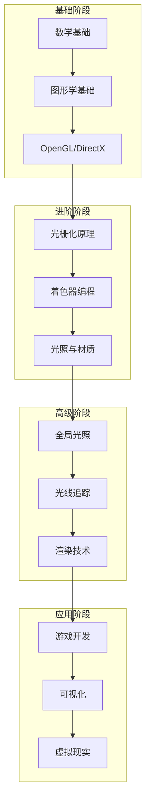

---

## 一、数学基础

### 1.1 线性代数
- 向量与矩阵运算
- 矩阵变换（平移、旋转、缩放）
- 正交矩阵与行列式
- 特征值与特征向量

### 1.2 几何基础
- 直线与平面方程
- 球面、圆柱、圆锥等基本形体
- 曲线与曲面
- 包围盒（Bounding Box）

### 1.3 微积分
- 偏导数与梯度
- 曲线的切线与法线
- 曲面的参数化

### 1.4 概率与统计
- 蒙特卡洛方法
- 随机采样
- 概率分布函数

---

## 二、图形学基础

### 2.1 颜色与视觉
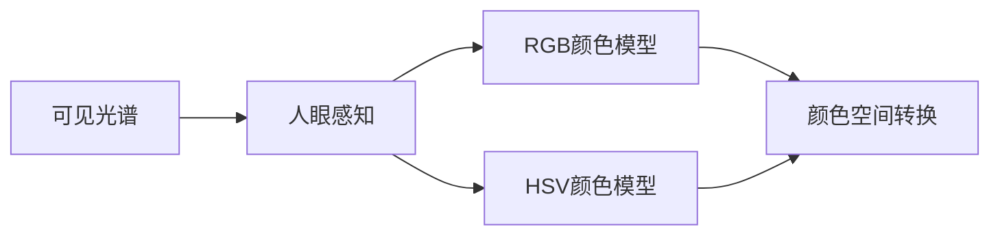

- 颜色模型（RGB、HSV、CMYK）
- 颜色空间（sRGB、Adobe RGB）
- 伽马校正
- 色调映射

### 2.2 坐标系统
- 世界坐标、局部坐标
- 观察坐标（视图坐标系）
- 屏幕坐标
- 坐标变换流程

### 2.3 变换与投影
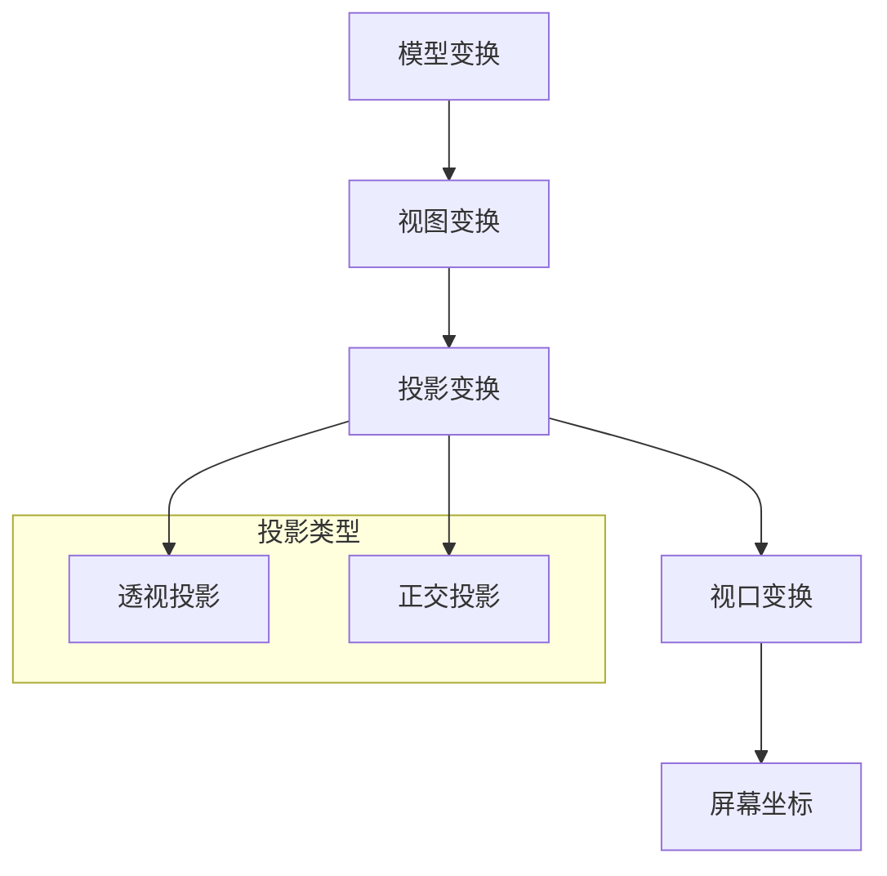

- 刚体变换
- 仿射变换
- 透视投影
- 正交投影

---

## 三、图形API与编程

### 3.1 OpenGL
- 渲染管线架构
- 顶点缓冲对象（VBO）
- 着色器（GLSL）
- 纹理绑定与采样

### 3.2 DirectX
- Direct3D 核心概念
- HLSL 着色器语言
- 资源管理
- 多线程渲染

### 3.3 Vulkan / WebGPU
- 现代化API设计
- 显式同步机制
- 描述符集合

---

## 四、光栅化原理

### 4.1 顶点处理
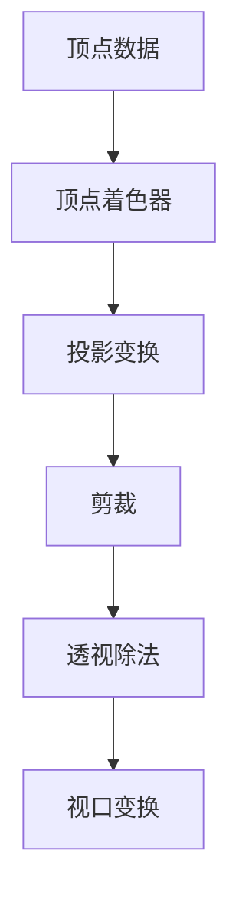

- 顶点属性传递
- 逐顶点光照计算
- 顶点着色器编程

### 4.2 图元装配
- 点、线、三角形
- 图元重启
- 贝塞尔曲线绘制

### 4.3 光栅化
- 扫描线算法
- 重心坐标插值
- 抗锯齿技术
  - MSAA、FXAA、TAA

### 4.4 片元处理
- 片元着色器
- 深度测试与模板测试
- 混合操作

---

## 五、着色器编程

### 5.1 着色器基础
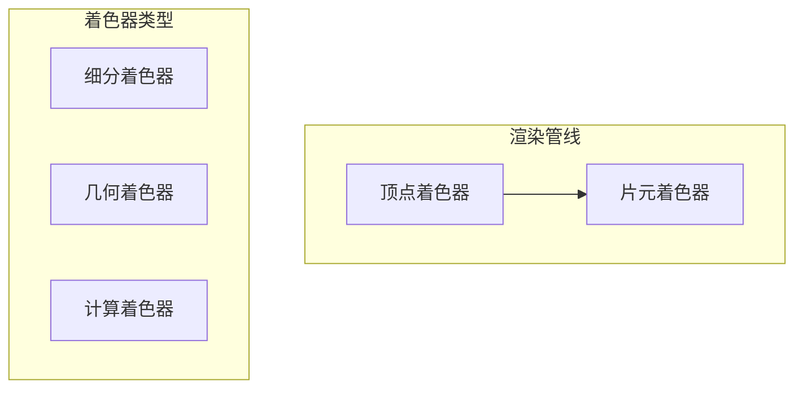

- 统一变量与属性
- 纹理采样
- 输出结构

### 5.2 常用着色技术
- Phong光照模型
- PBR（基于物理的渲染）
- 法线贴图
- 视差映射
- 环境映射

---

## 六、光照与材质

### 6.1 光照模型
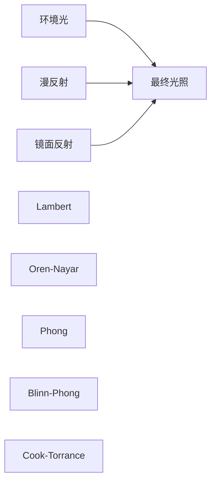

- 环境光、漫反射、镜面反射
- Lambertian 模型
- Phong / Blinn-Phong 模型
- PBR BRDF

### 6.2 阴影
- 阴影映射（Shadow Mapping）
- 方差阴影映射（VSM）
- 屏幕空间阴影（SSAO）
- 柔和阴影

### 6.3 材质系统
- 金属度/粗糙度工作流
- 漫反射与高光分离
- 各向异性材质

---

## 七、纹理映射

### 7.1 基础纹理
- 2D纹理映射
- 纹理坐标变换
- 纹理过滤（最近、线性、Mipmap）
- 纹理环绕模式

### 7.2 高级纹理
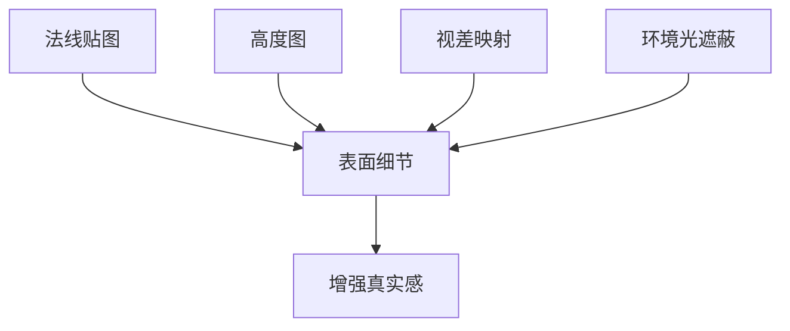

- 法线贴图
- 高度图与视差映射
- 环境光遮蔽贴图（AO）
- 立方体映射

### 7.3 纹理合成
- 程序化纹理
- 噪声函数（Perlin Noise、Simplex Noise）
- 分形噪声

---

## 八、几何与曲线

### 8.1 参数曲线
- 贝塞尔曲线
- B样条曲线
- NURBS
- De Boor 算法

### 8.2 参数曲面
- 贝塞尔曲面
- B样条曲面
- 网格生成

### 8.3 细分曲面
- Loop 细分
- Catmull-Clark 细分
- 蝴蝶细分

---

## 九、全局光照

### 9.1 光线追踪基础
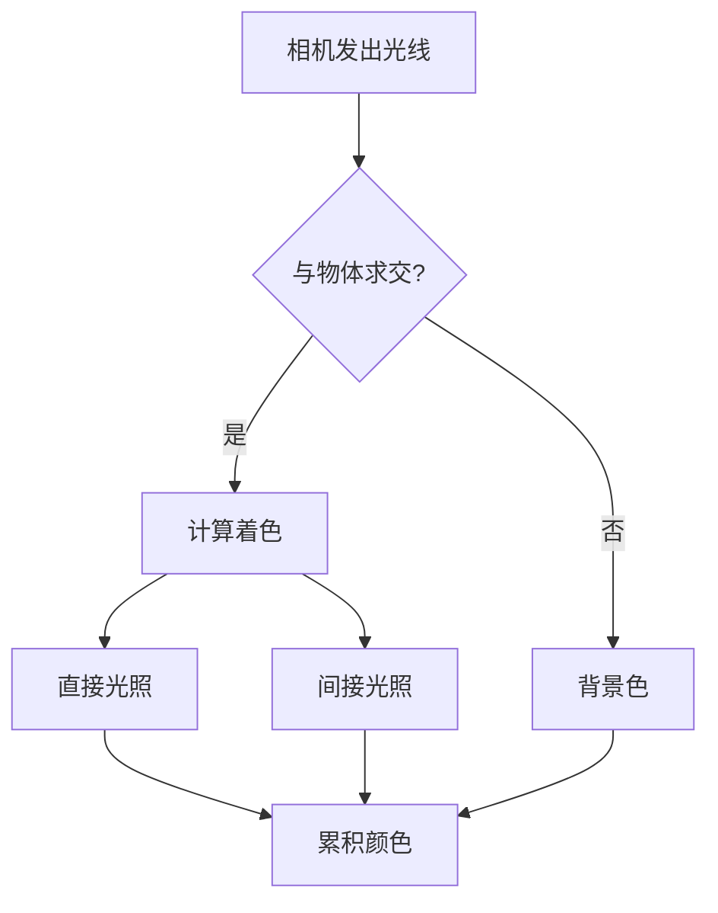

- 光线-物体求交
- 递归光线追踪
- 阴影光线

### 9.2 全局光照算法
- 路径追踪
- 光子映射
- 辐射度算法
- Metropolis 光线传输

### 9.3 采样技术
- 蒙特卡洛积分
- 重要性采样
- 低差异序列
- 降噪技术

---

## 十、渲染技术

### 10.1 延迟渲染
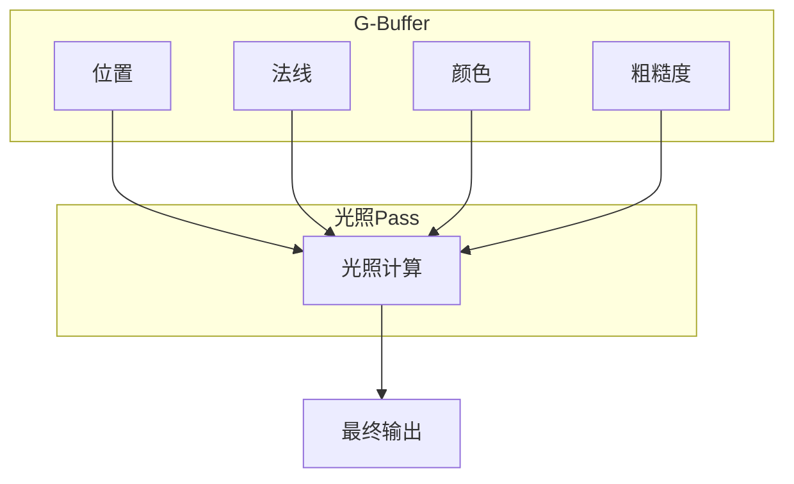

- G-Buffer 结构
- 延迟光照
- Forward+ 渲染

### 10.2 基于物理的渲染
- 迪士尼 BRDF
- 能量守恒
- 金属度/粗糙度工作流
- IBL（基于图像的光照）

### 10.3 体积渲染
- 体积光照
- 参与介质
- 光线步进算法

---

## 十一、物理模拟

### 11.1 物理基础
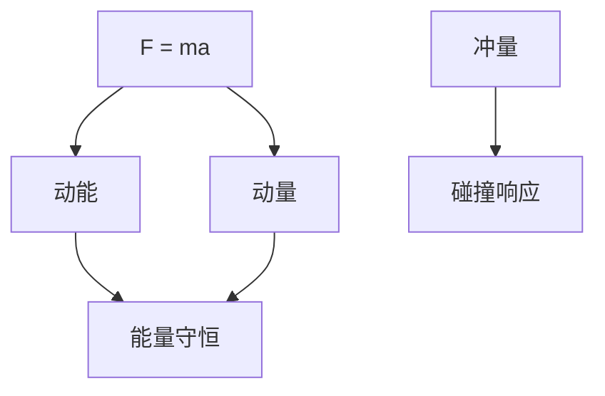

- 牛顿三大定律
- 能量守恒与动量守恒
- 冲量与碰撞响应
- 摩擦力与阻尼

### 11.2 质点弹簧系统
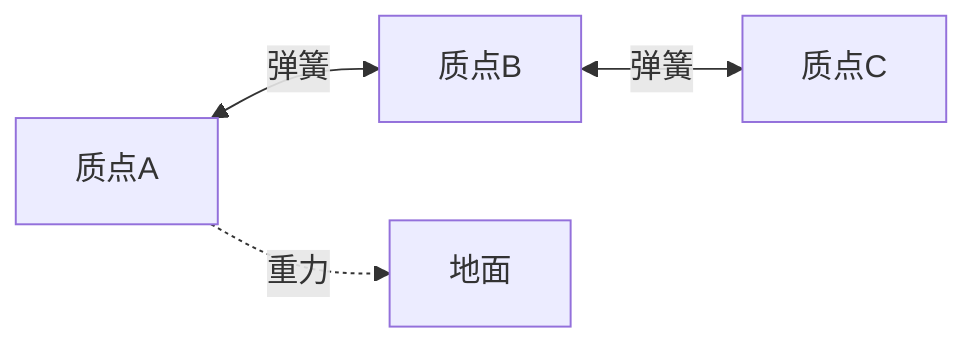

- 胡克定律 (F = -kx)
- 弹簧-阻尼系统
- 质点网络与布料模拟
- 断裂与撕裂效果

### 11.3 粒子系统
- 粒子发射与生命周期
- 力场影响 (重力、风力)
- 粒子-粒子交互
- GPU 粒子加速结构

### 11.4 刚体模拟
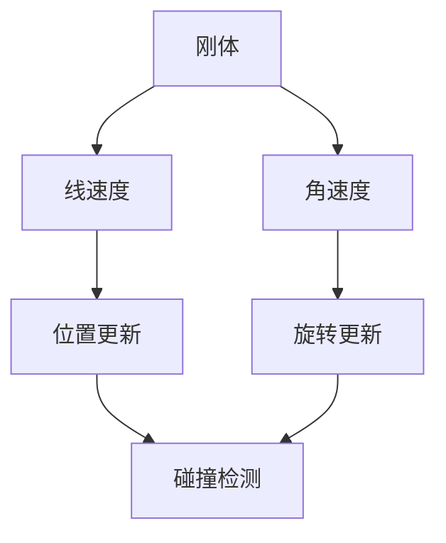

- 刚体动力学
- 转动惯量与扭矩
- 碰撞检测 (AABB, OBB, SAT)
- 碰撞响应与约束

### 11.5 数值积分方法
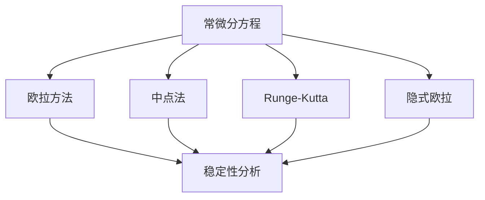

- 欧拉方法 (显式/隐式)
- 中点法与自适应步长
- Runge-Kutta 方法 (RK4)
- 位置/速度 Verlet 积分

### 11.6 约束系统
- 距离约束
- 铰链约束
- 关节约束 (关节链)
- 软约束与硬约束

### 11.7 运动学
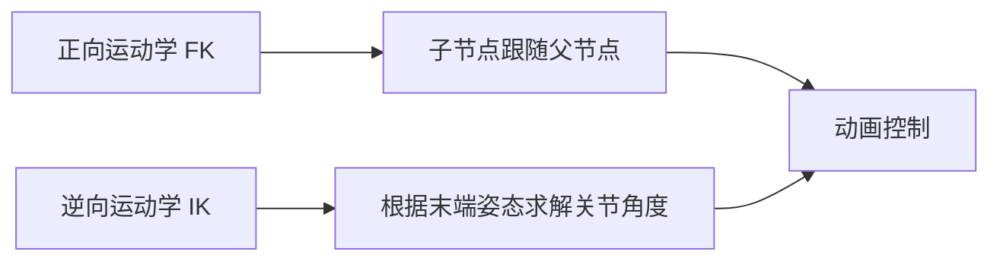

- 正向运动学 (Forward Kinematics)
- 逆向运动学 (Inverse Kinematics)
- 雅可比矩阵求解
- 约束优化方法

### 11.8 高级物理模拟
- **毛发模拟**: 连续体动力学
- **流体模拟**: SPH, Navier-Stokes
- **破碎模拟**: 断裂力学, Voronoi 碎片
- **车辆物理**: 悬架, 轮胎模型

### 11.9 物理引擎实践
- Unity Physics / PhysX / Bullet
- 刚体组件与碰撞体
- 关节与约束配置
- 触发器与射线检测

---

## 十二、GPU 计算

### 11.1 计算着色器
- 并行计算模型
- 原子操作
- 共享内存

### 11.2 通用GPU计算
- GPU 粒子系统
- 物理仿真
- 深度学习加速

---

## 十三、图形优化

### 13.1 性能优化
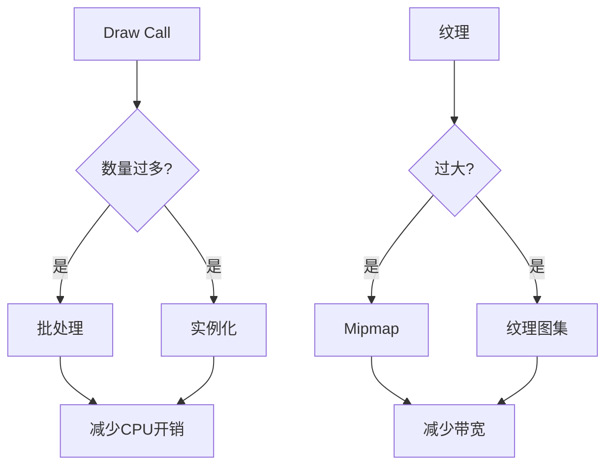

- 批处理与实例化
- 遮挡剔除
- 层级细节（LOD）
- 着色器优化

### 13.2 内存优化
- 纹理压缩
- GPU 内存管理
- 资源池化

---

## 十四、应用领域

### 14.1 游戏开发
- 游戏引擎架构
- 实时渲染管线
- 动画系统
- 物理集成

### 14.2 科学可视化
- 数据可视化
- 体绘制
- 科学计算可视化

### 14.3 虚拟现实
- VR 渲染要求
- 注视点渲染
- 畸变校正

### 14.4 计算机视觉与图形融合
- SLAM
- 神经渲染（NeRF）
- 深度学习超采样

---

## 学习资源推荐

### 经典教材
| 书籍 | 作者 | 难度 |
|------|------|------|
| 《计算机图形学：原理及实现》 | 唐荣锡 | 入门 |
| 《Real-Time Rendering》 | Tomas Akenine-Möller | 进阶 |
| 《Physically Based Rendering》 | Matt Pharr, Greg Humphreys | 高级 |
| 《GPU Pro》系列 | Wolfgang Engel | 实践 |
| 《Game Physics》 | David Eberly | 物理入门 |
| 《Foundation of Physically Based Modelling》 | Ronald Fedkiw | 高级 |

### 在线课程
- MIT 6.837 Computer Graphics
- UCSD CSE 167 Computer Graphics
- GAMES101 现代图形学

### 开源项目
- Vulkan 样例
- SwiftShader
- Filament 渲染引擎

---

## 学习计划建议

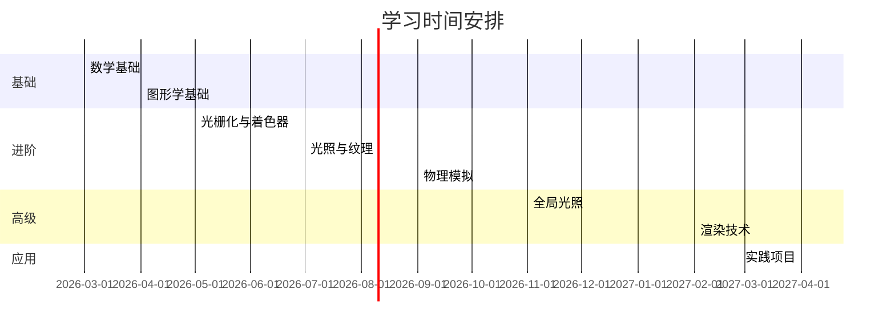

> **建议**：每完成一个模块，建议配合对应的编程实践加深理解。

---

## 相关链接

- [[../02_Knowledge/02_Framework/Unity图形学/00_Unity图形学基础]]
- [[../02_Knowledge/03_Tools/Unity/00_Unity]]
- [[../02_Knowledge/01_Language/Csharp/Csharp_并行编程]]

## 参考文献

- [Real-Time Rendering](https://www.realtimerendering.com/)
- [Physically Based Rendering](https://pbr-book.org/)
- [GAMES101 现代图形学](https://games-cn.org/games101/)
- [MIT 6.837 Computer Graphics](https://ocw.mit.edu/courses/6-837-computer-graphics-fall-2012/)
