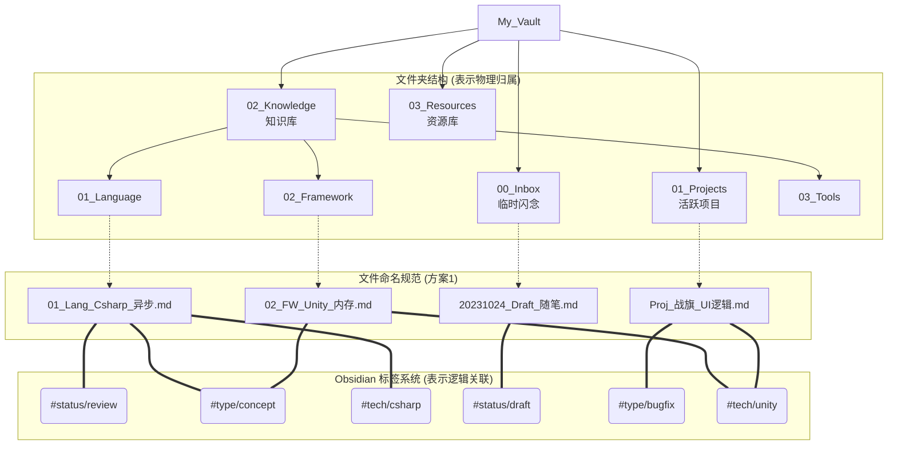

# 笔记统一命名与分类方案 (MOC + PARA 混合架构)

基于目前的 `My_Vault` 目录结构（MOC + PARA + 数字前缀），为了保证后续笔记整理的高效性与一致性，这里提供几种统一的命名规范和 Obsidian 标签分类方案。

## 一、 文件命名规范方案

### 方案 1：数字前缀 + 类别缩写 + 核心主题（推荐）
保持全局一致性，通过数字确保排序，通过缩写快速识别归属，最后是清晰的中文主题。

**格式**：`[数字序号]_[类别缩写]_[具体主题].md`

* **示例**：
  * `01_Lang_Csharp_异步编程.md` (在 `02_Knowledge/01_Language` 下)
  * `02_FW_Unity_内存管理策略.md` (在 `02_Knowledge/02_Framework` 下)
  * `03_Tool_Neovim_配置指南.md` (在 `02_Knowledge/03_Tools` 下)
  * `Proj_战旗_UI框架设计.md` (在 `01_Projects` 下，项目文件可不带数字，用前缀区分)

### 方案 2：时间戳 + 动作/状态 + 主题（适合Inbox/日志）
主要用于未分类的草稿、日志或者每日记录。

**格式**：`[YYYYMMDD]_[状态]_[主题].md`

* **示例**：
  * `20231024_Draft_关于AI辅助编程的思考.md`
  * `20231025_Todo_战旗项目战斗系统重构.md`

### 方案 3：纯中文层级描述法（最自然，但排序依赖系统）
舍弃数字前缀，直接用“父级-子级-主题”的方式命名，适合搜索，但不易固定顺序。

**格式**：`[大类]-[小类]-[主题].md`

* **示例**：
  * `Unity-内存管理-加载顺序.md`
  * `Csharp-多线程-Task使用指南.md`
  * `CheatSheet-Git-常用命令.md`

---

## 二、 Obsidian 标签 (Tags) 分类系统

建议采用**维度组合**的方式，避免标签泛滥。标签应该说明文件的“状态”、“类型”或“跨领域关联”，而不是重复文件夹已经表达的分类。

### 1. 状态维度 (Status)
用于标记笔记的成熟度和需要采取的行动。

* `#status/draft` - 草稿，尚未完成的记录
* `#status/review` - 需要复习或补充完善的内容
* `#status/done` - 已完成，可作为稳定知识参考
* `#status/todo` - 待办事项
* `#status/archived` - 已过时或废弃，但保留存档

### 2. 内容类型维度 (Type)
用于标记这篇笔记的具体文体。

* `#type/moc` - Map of Content，索引页/导航页
* `#type/concept` - 概念解释、原理解析
* `#type/tutorial` - 教程、Step-by-Step 指南
* `#type/cheatsheet` - 速查表、代码片段
* `#type/bugfix` - 问题记录与解决方案
* `#type/resource` - 外部链接、书籍笔记、视频总结

### 3. 主题/技术栈维度 (Topic/Tech)
跨越文件夹体系的强关联标签。例如某个项目里用到了 Unity，可以打上这个标签。

* `#tech/unity`
* `#tech/csharp`
* `#tech/linux`
* `#tech/ai`

---

## 三、 结合命名与标签的架构图览

下面通过 Mermaid 图表展示该架构是如何协同工作的：



## 四、 实施建议

1. **文件夹与标签不重叠**：如果文章已经在 `02_Knowledge/01_Language/Csharp` 目录下，就不需要再加 `#csharp` 标签，除非这是一篇放在 `01_Projects` 里的项目复盘笔记，但其中涉及到了 C# 技巧，此时加 `#tech/csharp` 标签就有意义了。
2. **渐进式重命名**：不要试图一次性重命名所有现有笔记。可以通过 Obsidian 的搜索功能，按目录分批进行。
3. **设置模板**：在 `88_Templates` 中创建对应的模板文件（例如概念模板、BugFix模板），把常用的 Frontmatter (YAML) 标签预设好。例如：

```yaml
---
aliases: [别名1, 别名2]
tags:
  - type/concept
  - status/draft
date: {{date}}
---
```