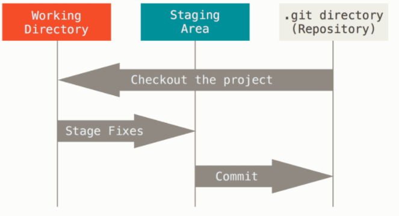
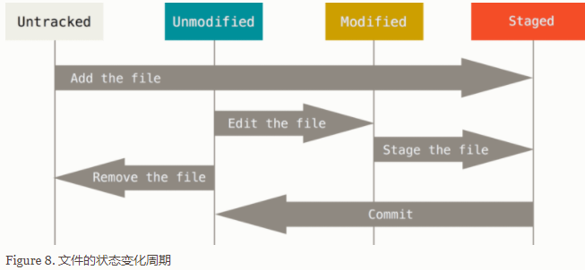

# git

feature

* delta-base基于差异的版本控制
* 本地执行
* 通过hash来保证完整性
* 只添加数据

## 三种状态

+ committed：已安全的保存到数据库中
+ modified:修改了但是没保存到数据库中
+ staged：对修改做了标记，可以包含在下次提交的快照中



**流程**

1. 在工作区中修改文件。
2. 将你想要下次提交的更改选择性地暂存，这样只会将更改的部分添加到暂存区。
3. 提交更新，找到暂存区的文件，将快照永久性存储到 Git 目录。

## 起步

**配置文件**

1. `/etc/gitconfig` 文件: 包含系统上每一个用户及他们仓库的通用配置。 如果在执行 `git config` 时带上 `--system` 选项，那么它就会读写该文件中的配置变量。 （由于它是系统配置文件，因此你需要管理员或超级用户权限来修改它。）
2. `~/.gitconfig` 或 `~/.config/git/config` 文件：只针对当前用户。 你可以传递 `--global` 选项让 Git 读写此文件，这会对你系统上 **所有** 的仓库生效。
3. 当前使用仓库的 Git 目录中的 `config` 文件（即 `.git/config`）：针对该仓库。 你可以传递 `--local` 选项让 Git 强制读写此文件，虽然默认情况下用的就是它。。 （当然，你需要进入某个 Git 仓库中才能让该选项生效。）

### 第一件事（修改用户信息）

安装完 Git 之后，要做的第一件事就是设置你的用户名和邮件地址。 这一点很重要，因为每一个 Git 提交都会使用这些信息，它们会写入到你的每一次提交中，不可更改：

```console
$ git config --global user.name "John Doe"
$ git config --global user.email johndoe@example.com
```

如果你想使用不同的文本编辑器，例如 Emacs，可以这样做：

```console
$ git config --global core.editor emacs
```

### 获得帮助

若你使用 Git 时需要获取帮助，有三种等价的方法可以找到 Git 命令的综合手册（manpage）：

```console
$ git help <verb>
$ git <verb> --help
$ man git-<verb>
```

## 基础

### 获得git仓库

通常有两种获取 Git 项目仓库的方式：

1. 将尚未进行版本控制的本地目录转换为 Git 仓库；
2. 从其它服务器 **克隆** 一个已存在的 Git 仓库。

两种方式都会在你的本地机器上得到一个工作就绪的 Git 仓库。

**创建git仓库**

```console
$ git init
```

**克隆**

```console
git clone https://github.com/libgit2/libgit2 mylibgit
```

如果你想在克隆远程仓库的时候，自定义本地仓库的名字，你可以通过额外的参数指定新的目录名

### 记录每次更新到git仓库中

你工作目录下的每一个文件都不外乎这两种状态：**已跟踪** 或 **未跟踪**。 已跟踪的文件是指那些被纳入了版本控制的文件，在上一次快照中有它们的记录，在工作一段时间后， 它们的状态可能是未修改，已修改或已放入暂存区。简而言之，已跟踪的文件就是 Git 已经知道的文件。



**检查文件当前状态**

```console
$ git status
On branch master
Your branch is up-to-date with 'origin/master'.
nothing to commit, working directory clean
```

当我们增加一个read文件后

```console
$ echo 'My Project' > README
$ git status
On branch master
Your branch is up-to-date with 'origin/master'.
Untracked files:
  (use "git add <file>..." to include in what will be committed)

    README

nothing added to commit but untracked files present (use "git add" to track)
```

### 跟踪文件

`git add {filename}`

此时使用

```
❯ git status
位于分支 master

尚无提交

未跟踪的文件:
  （使用 "git add <文件>..." 以包含要提交的内容）
	README

提交为空，但是存在尚未跟踪的文件（使用 "git add" 建立跟踪）
❯ git add README
❯ git status
位于分支 master

尚无提交

要提交的变更：
  （使用 "git rm --cached <文件>..." 以取消暂存）
	新文件：   README
```

**暂存已修改的文件**

修改的文件

```
❯ git status
位于分支 master

尚无提交

要提交的变更：
  （使用 "git rm --cached <文件>..." 以取消暂存）
	新文件：   READ2
	新文件：   README

尚未暂存以备提交的变更：
  （使用 "git add <文件>..." 更新要提交的内容）
  （使用 "git restore <文件>..." 丢弃工作区的改动）
	修改：     READ2
```

可以使用`git add `来暂存修改

```
❯ git status
位于分支 master

尚无提交

要提交的变更：
  （使用 "git rm --cached <文件>..." 以取消暂存）
	新文件：   READ2
	新文件：   README
```

**状态简览**

`git status -s`

```console
$ git status -s
 M README
MM Rakefile
A  lib/git.rb
M  lib/simplegit.rb
?? LICENSE.txt
```

- `?? `未跟踪的
- `A`新添加到暂存区中的文件
- `M`修改过的文

**忽略一些文件**

可以在`.gitignore`文件中列出忽略的文件

```console
$ cat .gitignore
*.[oa]
*~
```

第一行告诉 Git 忽略所有以 `.o` 或 `.a` 结尾的文件。一般这类对象文件和存档文件都是编译过程中出现的。 第二行告诉 Git 忽略所有名字以波浪符（~）结尾的文件，许多文本编辑软件（比如 Emacs）都用这样的文件名保存副本。 此外，你可能还需要忽略 log，tmp 或者 pid 目录，以及自动生成的文档等等。 要养成一开始就为你的新仓库设置好 .gitignore 文件的习惯，以免将来误提交这类无用的文件。

文件 `.gitignore` 的格式规范如下：

- 所有空行或者以 `#` 开头的行都会被 Git 忽略。
- 可以使用标准的 glob 模式匹配，它会递归地应用在整个工作区中。
- 匹配模式可以以（`/`）开头防止递归。
- 匹配模式可以以（`/`）结尾指定目录。
- 要忽略指定模式以外的文件或目录，可以在模式前加上叹号（`!`）取反。

所谓的 glob 模式是指 shell 所使用的简化了的正则表达式。 星号（`*`）匹配零个或多个任意字符；`[abc]` 匹配任何一个列在方括号中的字符 （这个例子要么匹配一个 a，要么匹配一个 b，要么匹配一个 c）； 问号（`?`）只匹配一个任意字符；如果在方括号中使用短划线分隔两个字符， 表示所有在这两个字符范围内的都可以匹配（比如 `[0-9]` 表示匹配所有 0 到 9 的数字）。 使用两个星号（`**`）表示匹配任意中间目录，比如 `a/**/z` 可以匹配 `a/z` 、 `a/b/z` 或 `a/b/c/z` 等。

我们再看一个 `.gitignore` 文件的例子：

```
# 忽略所有的 .a 文件
*.a

# 但跟踪所有的 lib.a，即便你在前面忽略了 .a 文件
!lib.a

# 只忽略当前目录下的 TODO 文件，而不忽略 subdir/TODO
/TODO

# 忽略任何目录下名为 build 的文件夹
build/

# 忽略 doc/notes.txt，但不忽略 doc/server/arch.txt
doc/*.txt

# 忽略 doc/ 目录及其所有子目录下的 .pdf 文件
doc/**/*.pdf
```

**查看已暂存和为暂存的修改**

`git diff`

若要查看已暂存的将要添加到下次提交里的内容，可以用 `git diff --staged` 命令。 这条命令将比对已暂存文件与最后一次提交的文件差异：

**提交更新**

每次准备提交前，先用 `git status` 看下，你所需要的文件是不是都已暂存起来了， 然后再运行提交命令 `git commit`：

```console
$ git commit
```

编辑器会显示类似下面的文本信息（本例选用 Vim 的屏显方式展示）：

```
# Please enter the commit message for your changes. Lines starting
# with '#' will be ignored, and an empty message aborts the commit.
# On branch master
# Your branch is up-to-date with 'origin/master'.
#
# Changes to be committed:
#	new file:   README
#	modified:   CONTRIBUTING.md
#
~
~
~
".git/COMMIT_EDITMSG" 9L, 283C
```

可以看到，默认的提交消息包含最后一次运行 `git status` 的输出，放在注释行里，另外开头还有一个空行，供你输入提交说明。 你完全可以去掉这些注释行，不过留着也没关系，多少能帮你回想起这次更新的内容有哪些。

另外，你也可以在 `commit` 命令后添加 `-m` 选项，将提交信息与命令放在同一行，如下所示：

```console
$ git commit -m "Story 182: Fix benchmarks for speed"
[master 463dc4f] Story 182: Fix benchmarks for speed
 2 files changed, 2 insertions(+)
 create mode 100644 README
```

**跳过暂存区**

给 `git commit` 加上 `-a` 选项，Git 就会自动把所有已经跟踪过的文件暂存起来一并提交，从而跳过 `git add` 步骤

```console
git commit -a -m 'added new benchmarks'
[master 83e38c7] added new benchmarks
 1 file changed, 5 insertions(+), 0 deletions(-)
```

**移除文件**

要从 Git 中移除某个文件，就必须要从已跟踪文件清单中移除（确切地说，是从暂存区域移除），然后提交。 可以用 `git rm` 命令完成此项工作，并连带从工作目录中删除指定的文件，这样以后就不会出现在未跟踪文件清单中了。

```console
$ rm PROJECTS.md
$ git status
On branch master
Your branch is up-to-date with 'origin/master'.
Changes not staged for commit:
  (use "git add/rm <file>..." to update what will be committed)
  (use "git checkout -- <file>..." to discard changes in working directory)

        deleted:    PROJECTS.md

no changes added to commit (use "git add" and/or "git commit -a")
```

然后再运行 `git rm` 记录此次移除文件的操作：

```console
$ git rm PROJECTS.md
rm 'PROJECTS.md'
$ git status
On branch master
Your branch is up-to-date with 'origin/master'.
Changes to be committed:
  (use "git reset HEAD <file>..." to unstage)

    deleted:    PROJECTS.md
```

下一次提交时，该文件就不再纳入版本管理了。 如果要删除之前修改过或已经放到暂存区的文件，则必须使用强制删除选项 `-f`（译注：即 force 的首字母）。 这是一种安全特性，用于防止误删尚未添加到快照的数据，这样的数据不能被 Git 恢复。

另外一种情况是，我们想把文件从 Git 仓库中删除（亦即从暂存区域移除），但仍然希望保留在当前工作目录中。 换句话说，你想让文件保留在磁盘，但是并不想让 Git 继续跟踪。 当你忘记添加 `.gitignore` 文件，不小心把一个很大的日志文件或一堆 `.a` 这样的编译生成文件添加到暂存区时，这一做法尤其有用。 为达到这一目的，使用 `--cached` 选项：

```console
$ git rm --cached README
```

`git rm` 命令后面可以列出文件或者目录的名字，也可以使用 `glob` 模式。比如：

```console
$ git rm log/\*.log
```

注意到星号 `*` 之前的反斜杠 `\`， 因为 Git 有它自己的文件模式扩展匹配方式，所以我们不用 shell 来帮忙展开。 此命令删除 `log/` 目录下扩展名为 `.log` 的所有文件。 类似的比如：

```console
$ git rm \*~
```

**移动文件**

### 移动文件

不像其它的 VCS 系统，Git 并不显式跟踪文件移动操作。 如果在 Git 中重命名了某个文件，仓库中存储的元数据并不会体现出这是一次改名操作。 不过 Git 非常聪明，它会推断出究竟发生了什么，至于具体是如何做到的，我们稍后再谈。

既然如此，当你看到 Git 的 `mv` 命令时一定会困惑不已。 要在 Git 中对文件改名，可以这么做：

```console
$ git mv file_from file_to
```

它会恰如预期般正常工作。 实际上，即便此时查看状态信息，也会明白无误地看到关于重命名操作的说明：

```console
$ git mv README.md README
$ git status
On branch master
Your branch is up-to-date with 'origin/master'.
Changes to be committed:
  (use "git reset HEAD <file>..." to unstage)

    renamed:    README.md -> README
```

其实，运行 `git mv` 就相当于运行了下面三条命令：

```console
$ mv README.md README
$ git rm README.md
$ git add README
```

如此分开操作，Git 也会意识到这是一次重命名，所以不管何种方式结果都一样。 两者唯一的区别是，`mv` 是一条命令而非三条命令，直接用 `git mv` 方便得多。 不过有时候用其他工具批处理重命名的话，要记得在提交前删除旧的文件名，再添加新的文件名。
