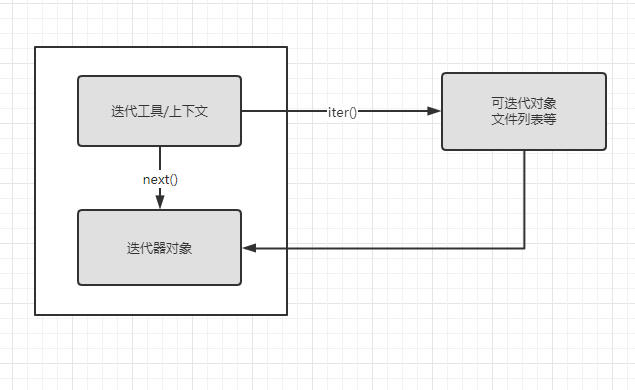

## 11 迭代和推导

### 迭代器

**迭代协议**

举一个文件对象工作的例子

当我们打开文件后

每次调用readline方法，他就会读取下一行

```python
f=open('1.py')
print(f.readline())
print(f.readline())
'''
new = open('data.txt','w')

L=['aaaaaa\n','bbbbbbbbbb','ccccccccccccccc']
'''
```

当达到结尾时，会返回空字符串

同样，有一个`__next__()`方法有相同效果，但是在结尾时会返回错误

这个接口就是迭代协议

`__next__()`会前进到下一个结果，如果在结果的末尾会引发`StopIteration`错误

所以我们可以使用for来迭代

```python
for line in open('1.txt'):
    print(line,end='')
```

同样可以使用readlines()来进行迭代，但是不是最好的方法，因为从内存中来看，它一次性将文件中的内容存储到内存中 ，可能造成内存爆炸，而迭代器一次只读取一行！！！！

同时使用while没有for速度快，因为迭代器内部时通过c来运行的，而while循环内部时通过python虚拟机来运行的

#### 手动迭代：iter和next

为了简化手动迭代代码，提供了一个内置函数next()他会自动的调用`__nexr__()`方法并返回同样的内容

```python
f=open('1.py')
print(next(f))
print(next(f))

```

还要注意一点，for循环开始时，会把迭代对象传入到一个内置函数`iter`，并由此拿到一个迭代器：iter返回的迭代器对象有这所需要的next方法，就是调用内部的`__iter__`方法

#### 完整的迭代协议



- 可迭代对象：迭代的被调对象
- 迭代器对象：可迭代对象的返回结果，在迭代对象中提供值的对象，结束时触发`Stopiteration`异常

模拟for循环

```python
L=[1,2,3]
I=iter(L)
I.__next__()
```

对于文件来说，第一步时不需要的

```python
f=open('1.py')
iter(f) is f#True
```

文件有自己的next方法

列表等内置对象，本身不是迭代器，因此需要iter来启动迭代

#### 其他内置类型可迭代对象

遍历字典，通过对keys()方法获得键的迭代器

在p3中，字典自带一个迭代器

```python
I=iter(D)
next(I)
```

因此可以直接`for key in D`

**os.popen**

shelve和os.poepn返回的结果也是可迭代的

```python
import os
P=os.popen('dir')
P.__next__()
#' 驱动器 D 中的卷是 新加卷\n'
```

注意，popen不支持`next()`但是可以通过调用iter来时它成为一个可迭代对象

### 推导

**列表推导**

```python
[x+10 for x in range(10)]
```

**文件上的列表推导**

我们通常

```python
lines= open('1.txt').readlines()
```

就可以获得一个列表

这样的结果会使每行的结尾有换行符号

因此我们需要在每一行上进行相似的修改

```python
lines=[line.rstrip() for line in lines]
```

它会像for循环一样进行迭代

#### 扩展的列表推导语法

**筛选分句：if**

通过在结尾加上一个以if为开头的语句来进行过滤

如我们想筛选以p为开头的语句

```python
lines=[line.rstrip() for line in open('1.txt').readlines() if line[0]=='p']
```

if语句会检查每个迭代元素的开头相当于一个简化的for循环

```python
[line.rstrip() for line in open('1.txt').readlines() if line.restrip()[-1].isdigit()]
```

**嵌套循环：for**

包含多个for循环，同时每个循环都可以有if，

```python
[ x+y for x in 'abc' for y in 'efg' ]
```

相当于

```python
res=[]
for x in 'abc':
    for y in 'efg':
        res.append(x+y)
```

###  其他可迭代对象

map

extend

zip

### 多遍迭代器，单遍迭代器

range对象本身不是迭代器，需要进行iter才可以进行迭代，但是同时range支持多个迭代器同时使用，同时会记住位置

```python
R=range(3)
I1=iter(R)
next(I1)#0
I2=iter(R)
next(I2)#0
```

相反，zip，map，filter不支持多个迭代器

```python
Z=zip((1,2,3),(1,2,3))
I1=iter(Z)
I2=iter(Z)
next(I1)
next(I2)#(2, 2)
```

之后会详细介绍

简单来说就是，单个迭代器意味着一个对象返回自身，也就是说它生成的对象和map一样

```python
I1 is Z#True
```

> 字典的keys方法返回的不是一个列表，是一个keys对象