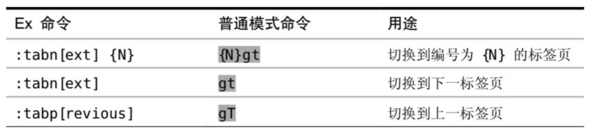
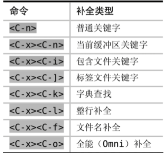

# vim

## 基本模式

* normal模式（**所有其他模式受用`ESC`进入本模式**）
* insert模式
  * a   append
  * i   insert after a line
  * o    open a line below
* 命令模式:在normal中使用`:`
* 可视化模式：在normal中按`v`
* 

## 快速纠错

在insert模式下

`ctrl+h`删除上一个字符

`ctrl+w`删除上一个单词

`ctrl+u`删除当前行

这些命令同样适用于终端命令

`ctrl+b`前进一个字符

`ctrl+f`后退一个字符

## 快速切换insert和normal模式

* 使用`ctrl+[`代替`ESC`
* 在normal模式下使用`gi`可以跳转到最有一次编辑的地方并进入插入模式

## 在单词间移动

* w/W移动到下一个word/WORD开头，e/E下一个word/WORD结尾
* b/B回到上一个word/WORD开头

word:非空白符分割的单词  WORD：以空白符分割的单词

## 行间搜索移动

同一行内快速移动的方式：搜索并移动到该字符

* 使用f{char}可以移动到char上,t移动到插入的前一个字符
* 如果第一次没搜到，可以用 ; / , 继续搜索下一个/上一个
* 使用F可以反过来搜前面的字符

## 水平移动

* 0移动到行首的一个字符，^移动到第一个非空白字符
* $移动到行尾，g_移动到行尾非空白字符
* 日常使用：0和$    同时0 w等于^

## 垂直移动

* 使用()在句子间移动，你可以用:help查看帮助
* 使用{}在段落之间移动

## 翻页操作

* gg/G移动到文件的开头和结尾，可以使用`ctrl+o`快速返回
* H/M/L  跳转到屏幕的HEAD.MIDDLE,LOWER
* `ctrl+u` `ctrl+f`上下翻页（upword/forword）zz把屏幕置为中间

***************************

## 删除操作

* 在normal模式下使用x删除一个字符
* 使用d(delete)配合文本对象快速删除一个单词daw(d around word)
* d和x可以搭配数字来多次执行（3x删除三个字符）
* dt+{char}一直删除到{char}

## 修改操作

* r(replace),c(change),s(substitute)
* normal模式下使用r可以替换字符，s替换并进入插入模式

（{num}r+{char}）替换后面n个字符，(num)s：删除n字符并进入插入模式，R：持续替换，S:整行删除并进入插入模式

* c配合文本可以快速修改

cw:删除单词并插入   caw：删除一个单词并插入

ct{char}：删除到{char}并进入插入模式

## 查询操作

* /后者?进行前向或者反向搜做
* 使用n/N跳转到下一个或者上一个匹配
* 使用*或者#进行但钱单词的向前向后匹配

## 替换命令

使用substitute命令来查找后者替换文本，支持正则表达式

:[range]s[ubstitute]/{pattern}/{string}/[flags]

range表示范围 如:10,20 表示10-20行  ， %表示全部

pattern表示替换的模式  	string为替换的文本

flags：标志位  g(global) 全局范围内执行   c(confirm)表示确认，可以确认或者拒绝修改， n(number)报告匹配到的次数而不替换，可以用来查询匹配的次数

如 % s/qwe/QWE/g 全局的将qwe替换为QWE

PS：u(undo)来撤回操作   `ctrl+R`redo changes

`\<{spring}\>`来准确匹配某个单词

## 多文件操作

三个概念： Buffer  Window  Tab

* Buffer：内存缓冲区
* window：可视化的分割区域
* tab：组织窗口为一个工作区

### Buffer

* vim打开一个文件后回家会加载文件内容到缓冲区
* 之哦胡修改都是针对内存终端缓冲区，不会直接保存文件
* 一直到 :w

* 受用:ls会列举但钱缓冲区，使用:b n跳转到第你个缓冲区
* :bpre :bnext :bfirst :blast
* :b {name} 加上tab补全来跳转

### Window

* 一个缓冲区可以分割多个窗口，每个窗口可以打开不同的缓冲区
* `<ctrl+w>s`水平分割  `<ctrl+w>v`垂直分割或者sp,vs

* `<ctrl+w>`加方向可以在不同window之间跳转

| 命令       | 用途                  |
| ---------- | --------------------- |
| <c-w>=     | 所有窗口等宽登高      |
| <c-w>_     | 最大化活动窗口的高度  |
| <c-w>\|    | 最大化活动窗口的宽度  |
| [N]<c-w>_  | 把窗口高度设为N行     |
| [N]<c-w>\| | 把窗口的宽度设为[N]列 |

### Tab

可以容纳一系列窗口的容器(:h tabpage)

| 命令                   | 用途                               |
| ---------------------- | ---------------------------------- |
| :table[dit] {filename} | 打开新标签页{filename}             |
| <C-w>T                 | 把当前窗口移到一个新的标签页       |
| :tabc[lose]            | 关闭但钱标签页和所有窗口           |
| :tabo[nly]             | 只保留活动标签页，关闭所有其他标签 |

## 对象操作方式

* [number]<command>[text object]
* text object:单词w，句子s，段落p

## 复制粘贴和寄存器

### normal模式

y(yank)  d  p

yiw复制一个单词  

粘贴代码需要进入:set paste  推出:set nopaste

### 寄存器

* 通过"{register}可以指定寄存器，不指定默认使用无名寄存器
* 如"ayiw复制一个单词到寄存器a中
* :reg 可以查看寄存器

* 复制专用寄存器"0
* 系统剪切板  "+

:set clipboard=unnamed 直接复制粘贴系统剪切板

## 宏(macro)

* 使用q来录制，并以q结束
* q{register}选择要保存的寄存器
* 使用@{reg}回放寄存器中保存的一系列命令

## 默认补全

## 配置nvim

配置文件：.config/nvim/init.vim

配置生效    :so[urce]  {file}

