# 响应式布局

## meida查询

```css
@media only screen and (max-width: 1500px){
    
}
```

表示在显示情况下并且下药与1500px的时候会执行以下策略，用来适配不同的机型

可选min-width,max-width,screen

### 引入meida

1. 直接在css中使用
2. 在style中指定media

```html
<style media="(xxxxx)">

</style>
```

3. 在link的时候引入

```html
<link href="css/test.css" rel="stylesheet" media="(xxxx)">
```

## flex弹性布局

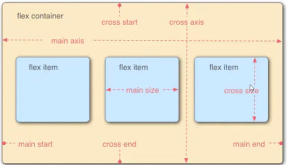

主轴方向的选择

```css
flex-direction:xxx;
```

- row 默认，从左到右
- row-reverse
- column,垂直显示，从上到下
- column-reverse

注：flex布局下，如果内部比外部大，那么就会自动缩小，但是不会自动变大


是否换行

```css
flex-wrap:xxx
```

- nowrap:默认不换行
- wrap：换行换列
- wrap-reverse


合并设置

```css
flwx-flow: <flex-direction> || <flex-wrap>
```

### 剩余空间处理

```css
justify-content
```

- flex-start:默认值,从左到右，紧挨着
- flex-end 从右到左，紧挨着
- center：居中显示
- space-between:平均分布在该行上，两边不留间隔空间
- center-around：平均分布在该行上，两边留有一般的间隔空间

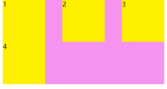

### 交叉轴对齐方式

```
align-items
```

作用，设置每个flex在交叉轴上的默认对齐方式，直接处理单行

- flex-start位于容器开头
- flex-end位于容器结尾
- flex-center居中显示
- strtch：默认元素被拉伸以适应容器

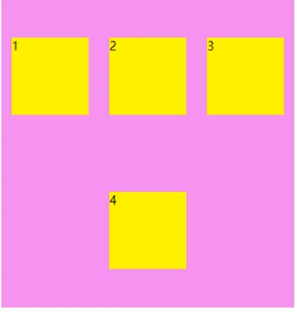

```
align-content
```

作用：直接处理多行

- flex-start位于容器开头
- flex-end位于容器结尾
- flex-center居中显示

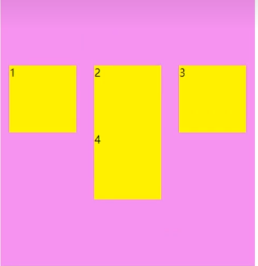

### 其他属性

- flex-baisis:设置弹性盒伸缩基准值(宽度)
- flex-grow:设置弹性盒子的扩展比率，如果不能填充满，有剩余空间，如果大于1则允许扩充，此时数字就是所占的份数

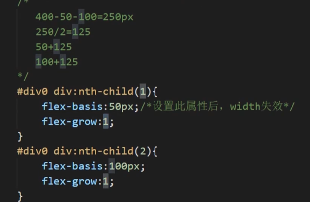

- flex-shrink:设置弹性盒子的缩小比率，0不允许缩小，大于一则同上
- flex：flex-grow，flex-shrink，flex-baisis的简写

这些可以在父类中设置整体，也可以在子类中设置单独的

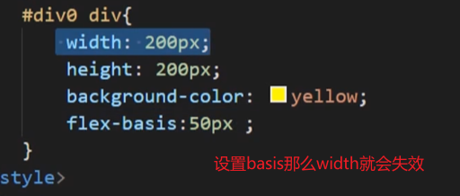

可以是px也可以%

特殊写法

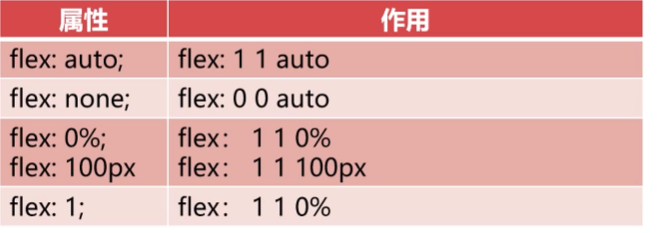

0，0，auto则宽度为width的值

https://www.bilibili.com/video/BV1ov411k7sm?p=12&vd_source=8beb74be6b19124f110600d2ce0f3957

 两个长表单实现密码对齐

https://www.bilibili.com/video/BV1ov411k7sm?p=13&vd_source=8beb74be6b19124f110600d2ce0f3957

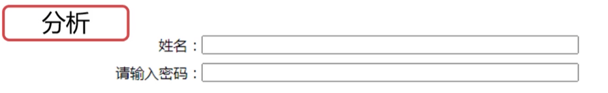

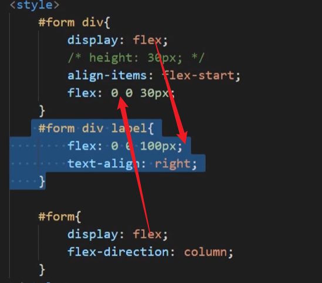

## 常用布局

### rem的用法

概念：相对于根元素的字体大小的单位，如果html的16px那么1rem=16px，

和em的区别：em相对于父字体的单位

普遍的操作概念：通过media来修改字体单位，然后子单位根据父元素来修改自身的宽度

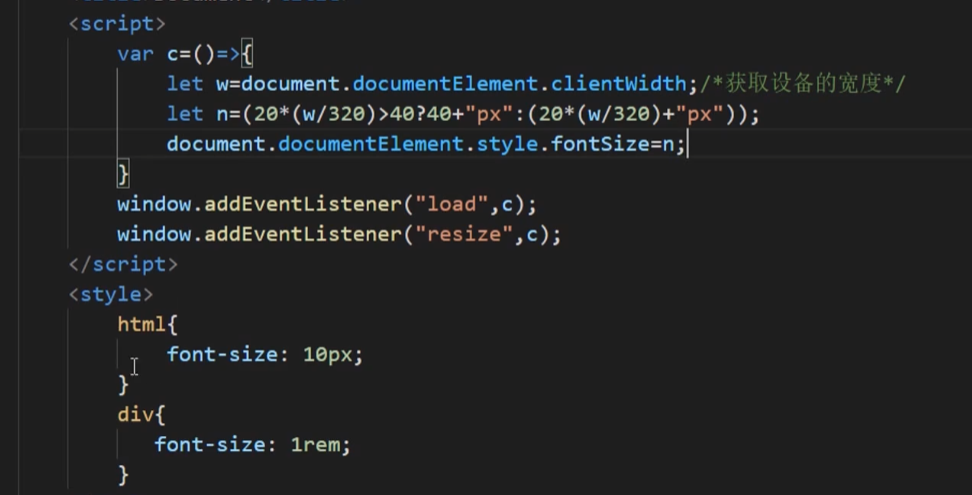

### 自适应布局

不同设备对应不同html，局部自适应

不同设备使用不同的页面或者局部伸缩，

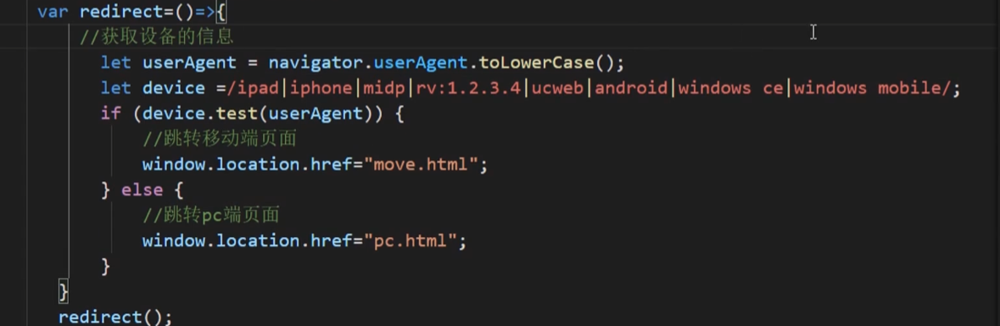

用来判断设备类型

### 响应式布局

https://www.bilibili.com/video/BV1ov411k7sm?p=16&vd_source=8beb74be6b19124f110600d2ce0f3957

## rem弹性布局

为了保证屏幕上不失真，就要根据屏幕宽度做等比例换算

