# 隐马尔科夫模型

### 马尔科夫链

假设状态序列为
$$
x_{t-1},x_{t-2},x_t,x_{t+1}...
$$

一种简化情况
$$
P(x_{t+1}|..,x_{t-1},x_{t-2},x_t) = P(x_{t+1}|x_t)
$$
简单来说就是某一时刻状态转移的概率只依赖于它前一个状态---无记忆性

以股市为例：如果当前时间为牛市，那么之后的状态可能性如下

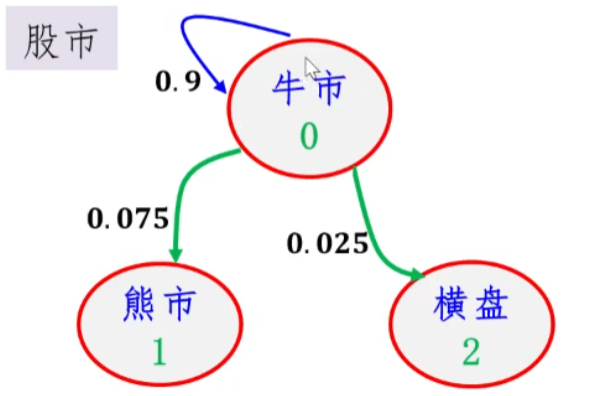

同理其他状态的可能性可以表示为下表，也可成为状态转移矩阵

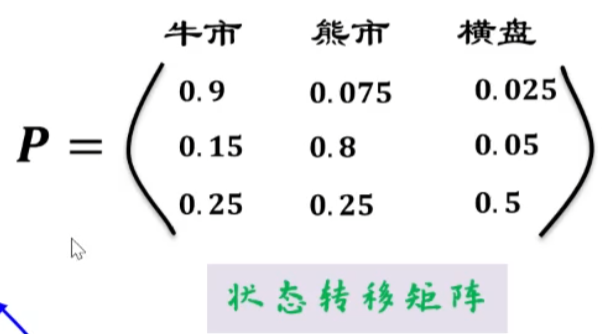

### 隐马尔可夫模型（HMM）

隐马尔可夫模型，HMM：马尔科夫链+一般随机过程

同样以股市为例，但是因为股市是波动的，那么随意下跌和不变也有可能是牛市，其他同理

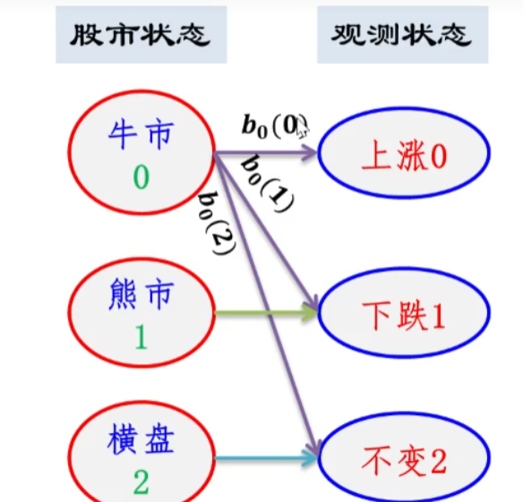

最终结果

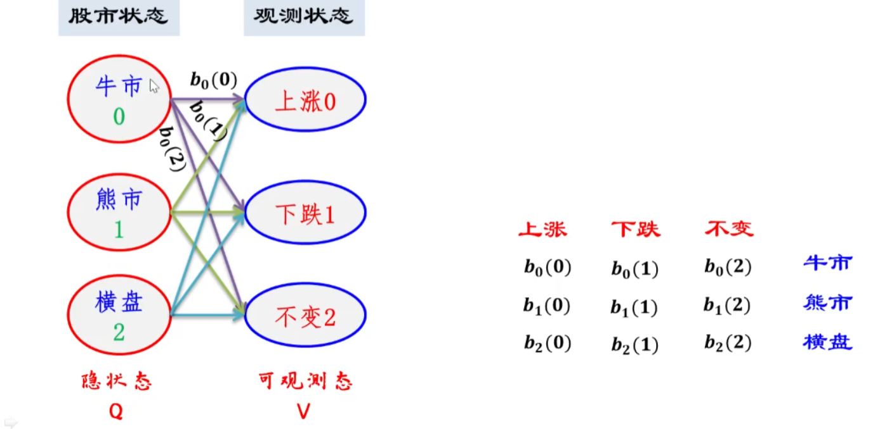

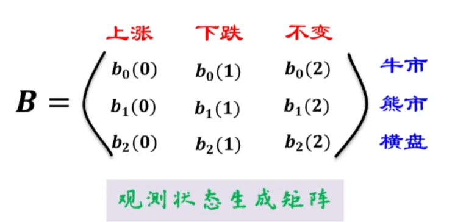

也就是说个我们隐状态到可观测态的概率，B也就是右边为观测状态生成矩阵

结合之前的P矩阵就可以达成一下功能：根据当前的状态预测下一状态并预测涨跌，这时候就需要初始状态

## 隐马尔科夫模型

定义：

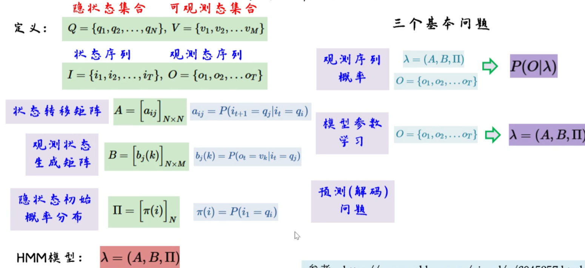

### 那么如何得到I

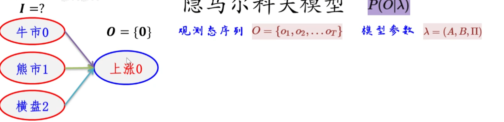

比如，我们知道当前I通过观测状态生产矩阵就可以得到当前的涨跌，但是当前时间如何知道我们是处于那种状态？

 如果不考虑当前状态I，那么上涨的概率可以通过穷举相加得到

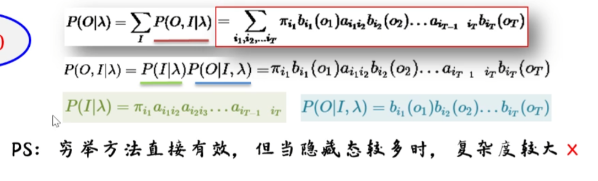

注：$a_{i_1i_2}$为和时间相关的概率，$b_{i_1}$为观测状态转移矩阵

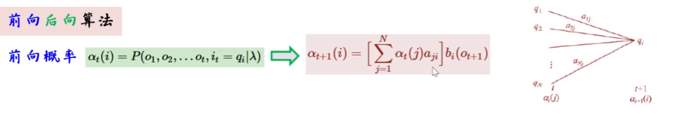

注：$a_ij$为状态转移矩阵，简单来说就是只要知道当前状态就可以知道下一状态，那么我们主要总第一个状态不懂进行预测就可以得到实时的预测

那么我们只需要知道开始状态就可以迭代的预测

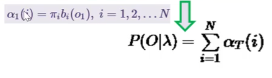

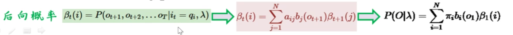

向后概率就是得到了当前状态预测之后的状态

## 例子

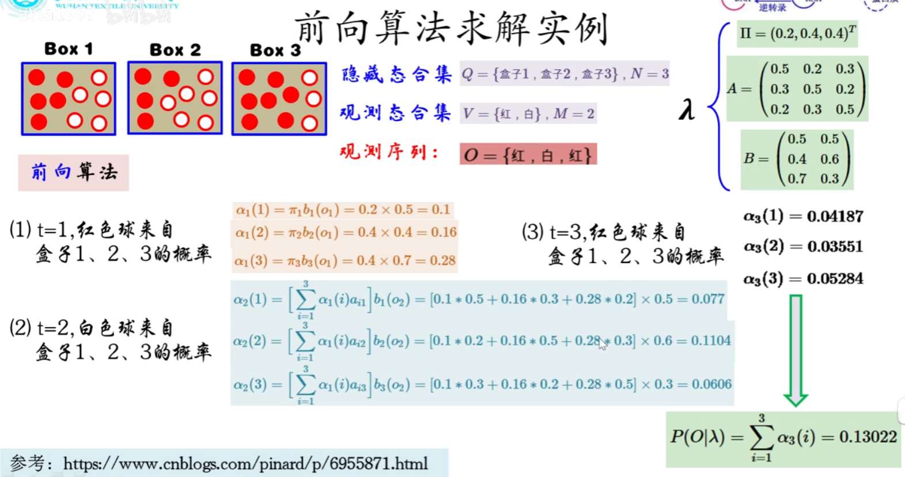

## 学习问题

之前的前提为知道模型$\gamma$ ,用到算法鲍姆-韦尔奇算法<=期望最大值算法(em算法)

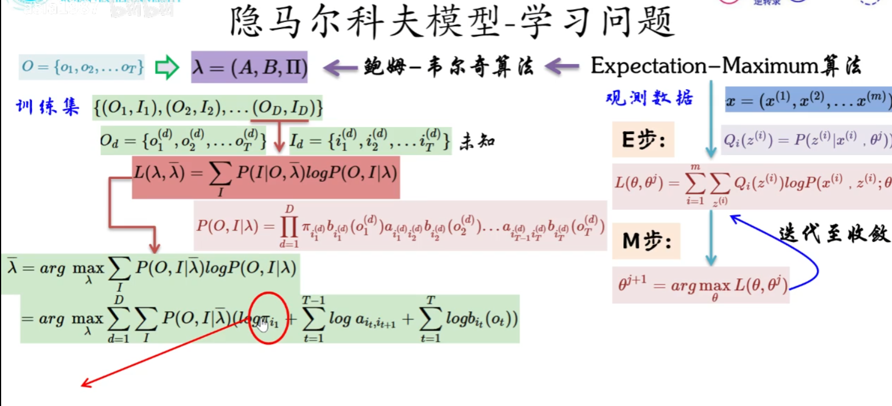

这时候求偏导每一项都是独立的

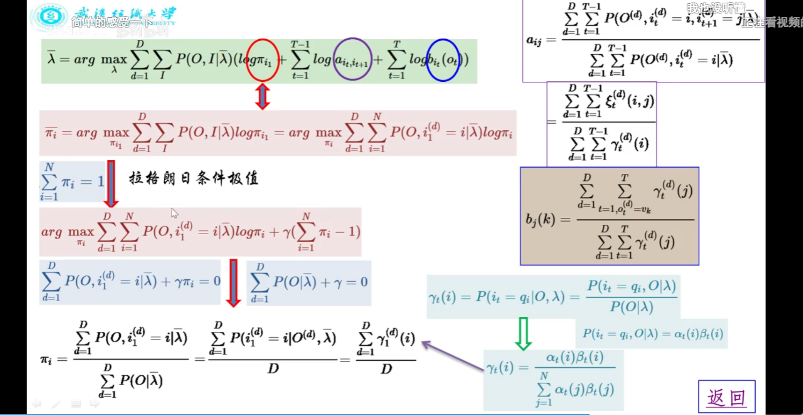

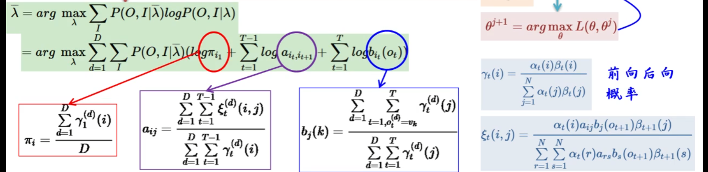

## 解码问题

 viterbi算法

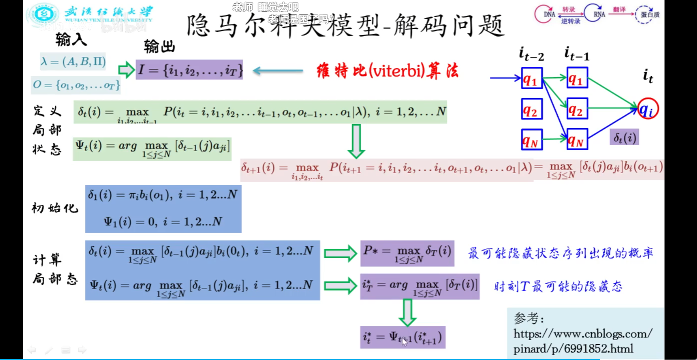

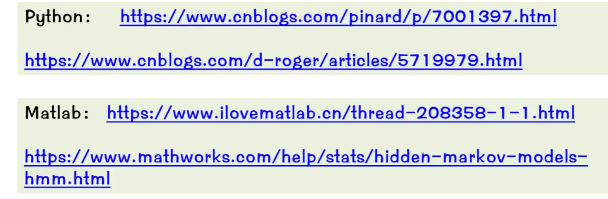
