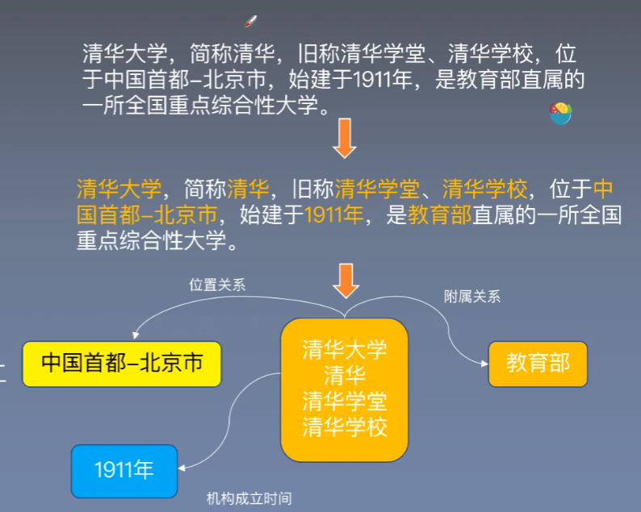
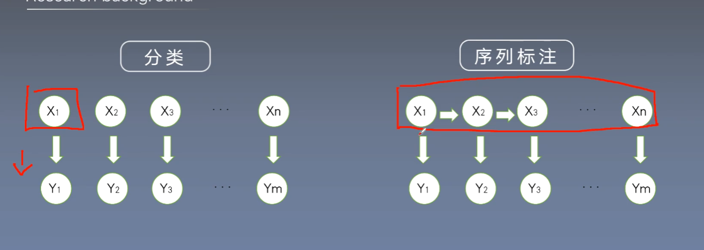
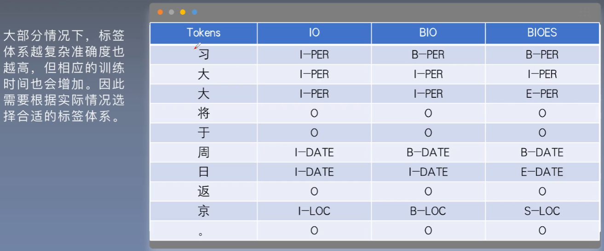
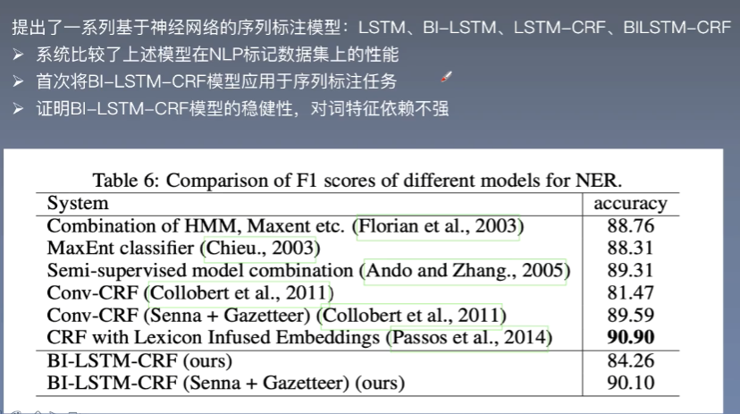

# 命名体识别

## 定义

识别出文本中具有**特定意义**的**实体字符串边界**，并归类到**预定义类别**，传统识别任务识 别时间、机构名、地点等，但随着应用逐渐发展为识别**特殊预定义类别**。

例子

序列标注和分类的区别：不仅仅有自身的类别，还要根据上下文得出标签体系

IO的问题是不能区分连续的名词，BIO模式添加了开始字，用来区分连续的词，

BIOES还添加了end字

## 研究背景

序列识别：词性标记，分块和命名体识别

## 论文泛读

核心摘要

- 双向LSTM可以综合利用过去和未来的特征
- CRF可以利用句子的特性
- BILSTM-CRF模型效果好，鲁棒性强，对词向量的依赖性不强

