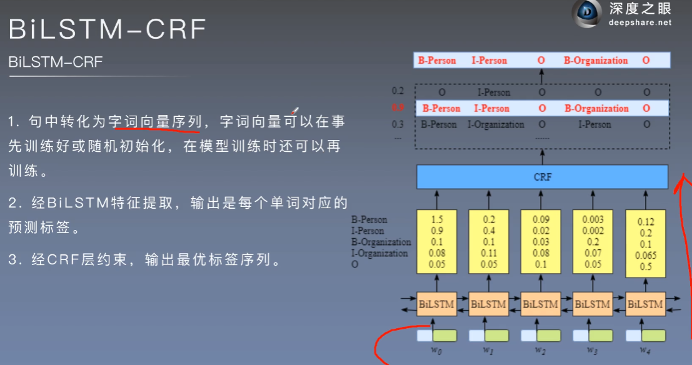

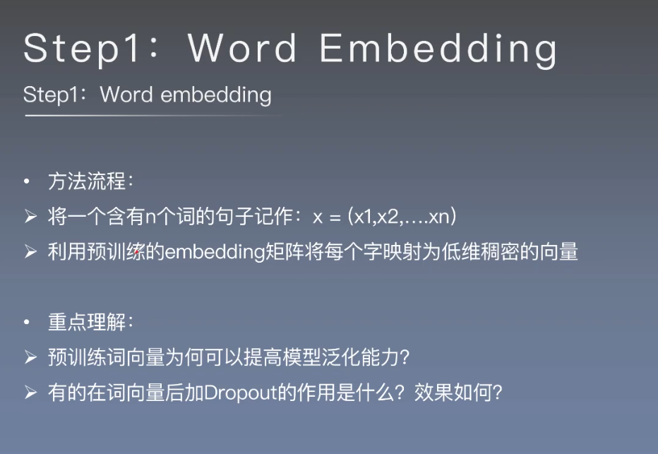

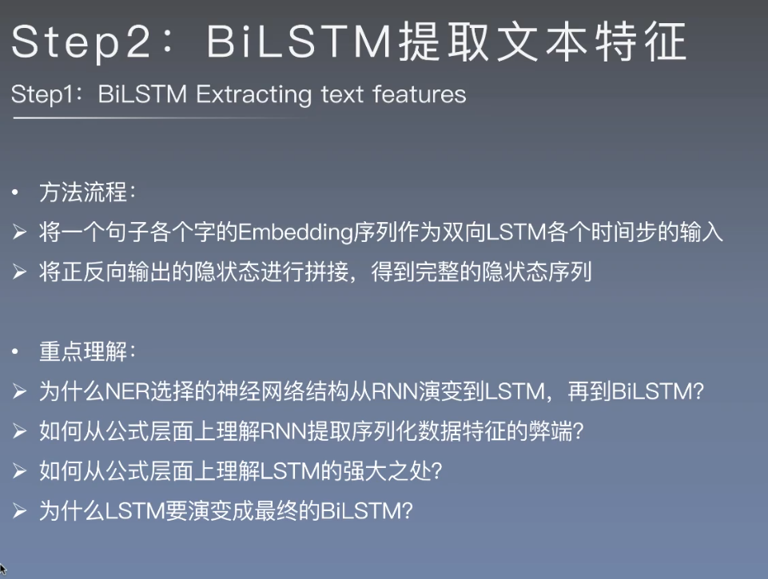

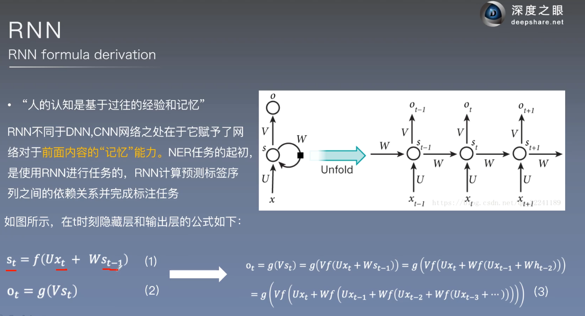

RNNt时刻的结构来自t时刻的输入和t-1时刻的结果

RNN的问题是网络越深很可能出现梯度爆炸，即某一个错误可能深度的影响全局

## LSTM

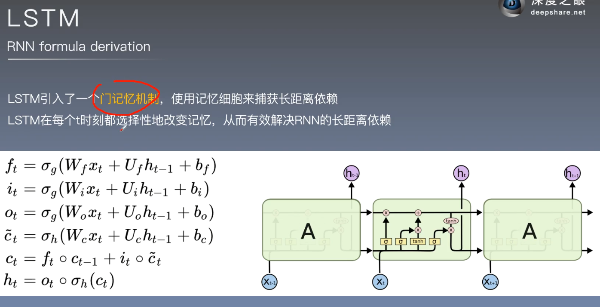

- $f_t$遗忘门,

- $i_t$输入门，

- $o_t$输出门,

- $\hat{c_t}$临时(ceil state)
- $c_t$ceil state

https://blog.csdn.net/qian99/article/details/88628383 LSTM详细解析

- $h_t$输出

## 双向LSTM

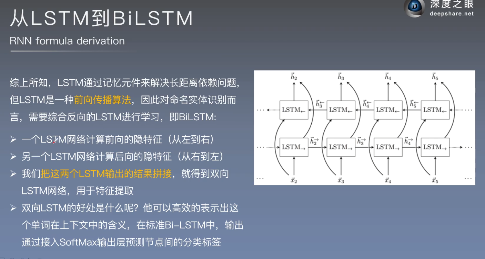

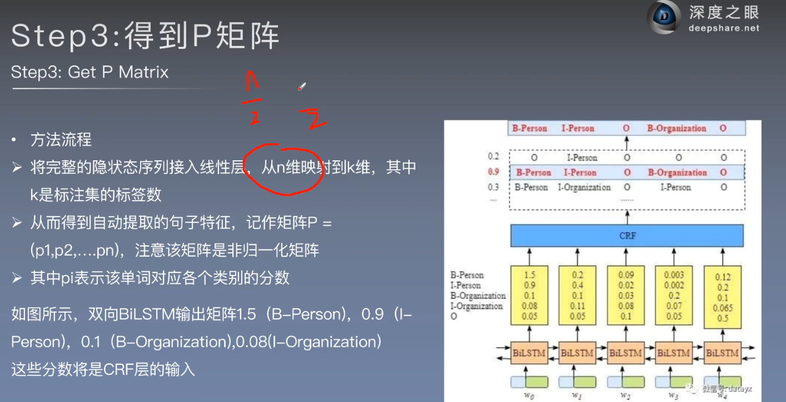

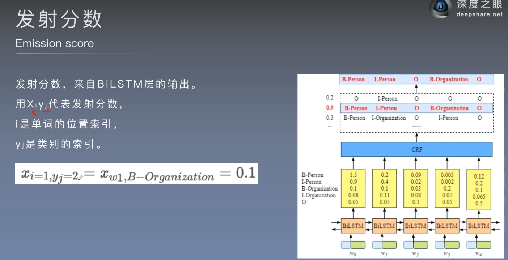

我们得到发射分数就可以得到每个单词对应标签的最大可能性 

但是为什么使用CRF呢？

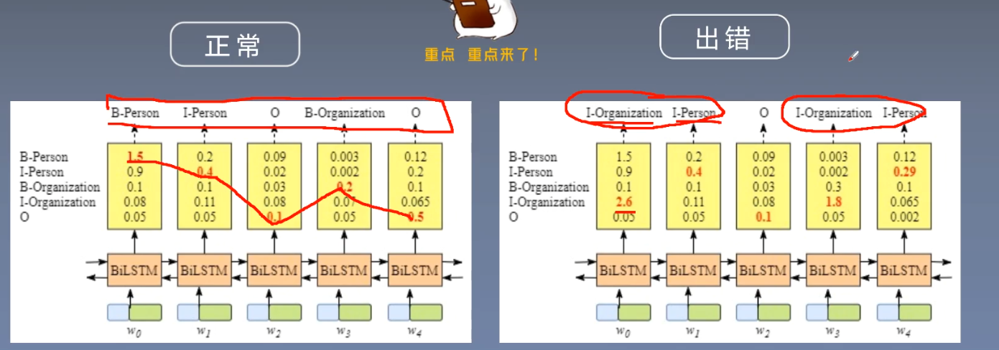

CRF可以对标签之间进行约束，以此来减少

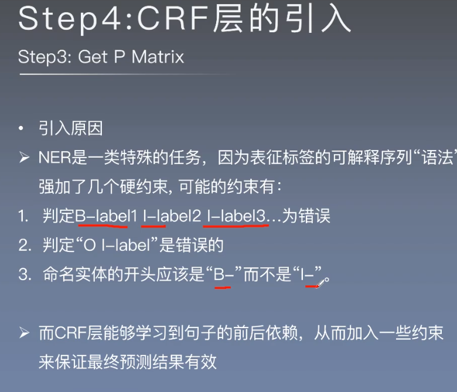

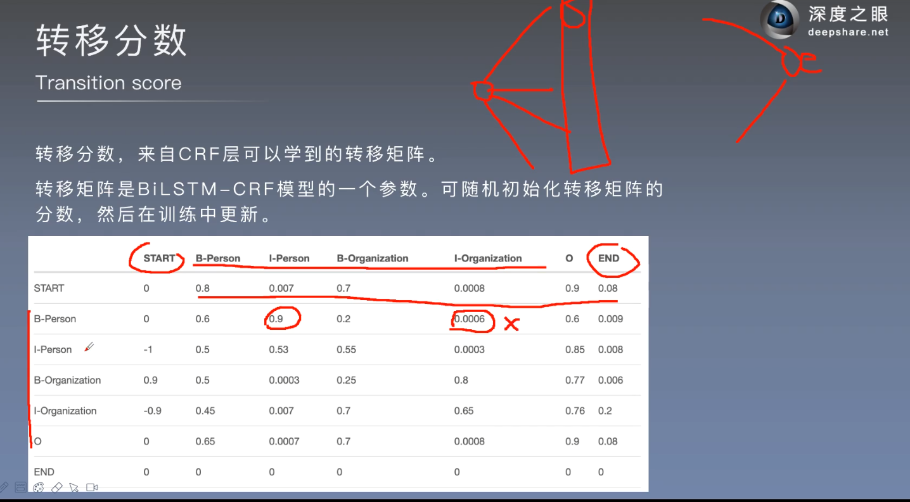

转移分数是不同标签之间转移的分数以此来减少错误

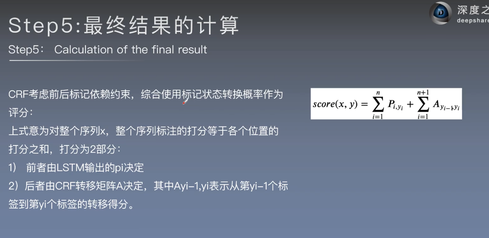

最终得分等于转移分数加上发射分数

总的路径分数计算

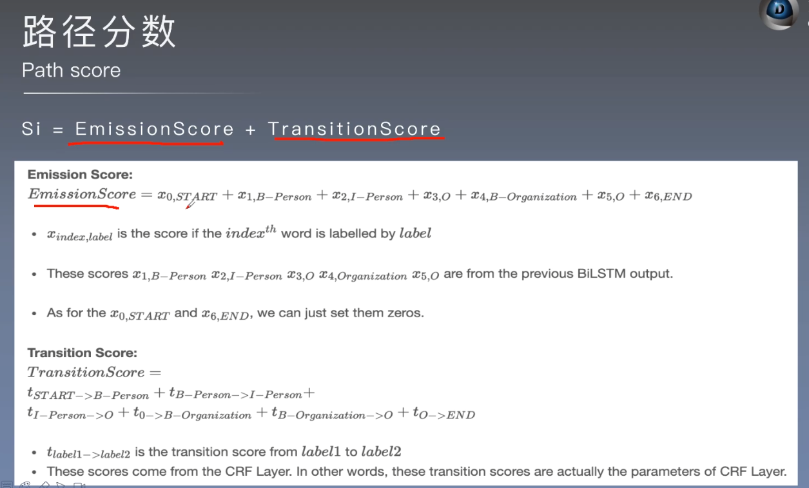