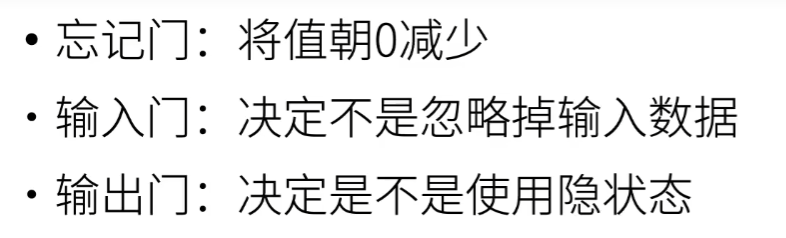
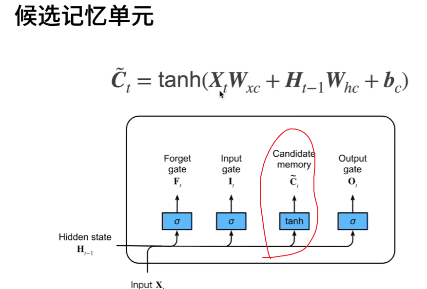
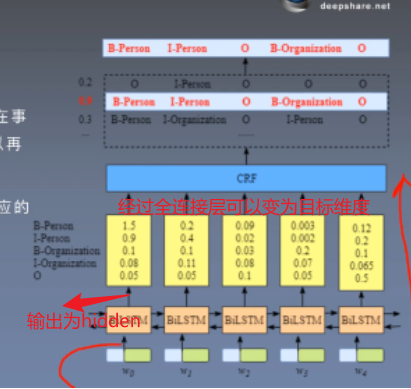

### nn.Embedding(句子用到单词的个数，标签个数)

用于将句子中每个单词转化为标签，也就是发射矩阵

官方案例

```
>>> # an Embedding module containing 10 tensors of size 3
>>> embedding = nn.Embedding(10, 3)
>>> # a batch of 2 samples of 4 indices each
>>> input = torch.LongTensor([[1,2,4,5],[4,3,2,9]])
>>> embedding(input)
tensor([[[-0.0251, -1.6902,  0.7172],
         [-0.6431,  0.0748,  0.6969],
         [ 1.4970,  1.3448, -0.9685],
         [-0.3677, -2.7265, -0.1685]],

        [[ 1.4970,  1.3448, -0.9685],
         [ 0.4362, -0.4004,  0.9400],
         [-0.6431,  0.0748,  0.6969],
         [ 0.9124, -2.3616,  1.1151]]])


>>> # example with padding_idx
>>> embedding = nn.Embedding(10, 3, padding_idx=0)
>>> input = torch.LongTensor([[0,2,0,5]])
>>> embedding(input)
tensor([[[ 0.0000,  0.0000,  0.0000],
         [ 0.1535, -2.0309,  0.9315],
         [ 0.0000,  0.0000,  0.0000],
         [-0.1655,  0.9897,  0.0635]]])
```

`input = torch.LongTensor([[1,2,4,5],[4,3,2,9]])`

`input.size=(2,4)`

意义为两个句子，每句话四个单词

本代码中使用如下

```python
embeds = self.word_embeds(sentence).view(len(sentence), 1, -1)
```

`sentence`为一行n列的单词索引列表,返回每个单词可能的标签值

```python
embed = nn.Embedding(10,3)
embed( torch.LongTensor([1,2,3,4,5]))
'''
tensor([[ 0.8020, -0.3090,  0.8384],
        [ 0.0195,  0.6898,  0.1703],
        [-0.4772,  0.9876,  0.1831],
        [-0.2254, -0.1457,  2.1110],
        [-0.8413,  0.3626,  1.5816]], grad_fn=<EmbeddingBackward0>)
'''
```

## hidden_dim的作用

LSTM中各种门的作用





hidden_size的作用：也就是输出的维度这里只需要四个输出维度

同时

