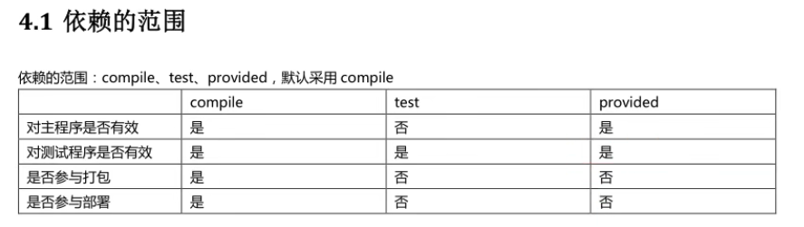

### 目录结构

```
Hello
|---src
|---|---main
|---|---|---java
|---|---|---resources（配置文件）
|---|---test
|---|---|---java
|---|---|---resources
|---pom.xml  maven的核心文件
```

### 手动编译

在当前目录文件下使用`mvn compile`，之后会下载插件，下载目录`User\<name>\.m2\repository`。编译完成的文件放在根目录下的target文件中，需要执行代码直接使用java运行class类就可以

### 修改本地目录位置

1. 备份conf/setting.xml文件
2. 修改setting文件中的`<localRepository>`项

```xml
  <!-- localRepository
   | The path to the local repository maven will use to store artifacts.
   |
   | Default: ${user.home}/.m2/repository
  <localRepository>/path/to/local/repo</localRepository>
  -->
```

> 注：不能使用中文目录

## Maven基础

maven的作用：

1. 管理依赖：jar管理，下载，版本
2. 构建项目：完成项目代码的编译，测试，打包，部署

maven的使用方式：

1. 命令行单独使用
2. 结合IDEA使用，简单快捷

## 仓库

仓库就是我们需要用到的jar包

### 仓库的分类

- 本地仓库，本地文件夹内的jar包
- 远程仓库
  - 中央仓库
  - 中央仓库的镜像
  - 私服

中央仓库地址https://mvnrepository.com/

## Pom文件

基本信息

| 基本信息     |                                     |
| ------------ | ----------------------------------- |
| modelVersion | maven的模型版本                     |
| groupId      | 组织Id                              |
| artifactId   | 项目/模块名称                       |
| version      | 版本号，自定义                      |
| packaging    | 项目的打包类型，jar/war/rar,默认jar |

 groupId，artifactId，version三者被称为坐标


| dependencies                                                 | 依赖 |
| ------------------------------------------------------------ | ---- |
|                                                              |      |
| 具体可以在中央仓库中进行复制粘贴，下载好之后直接进行import就好 |      |

- Properties   使用jdk等版本

- build ： maven在项目构建的时候的配置信息

## Maven常用命令

对应maven的声明周期:清理，编译，测试，报告，打包，安装，部署

通过junit可以进行单元测试

### 使用junit测试

1. 加入依赖

```xml
<!-- https://mvnrepository.com/artifact/junit/junit -->
<dependency>
    <groupId>junit</groupId>
    <artifactId>junit</artifactId>
    <version>4.13.1</version>
    <scope>test</scope>
</dependency>
```

- `mvn clean`清理target
- `mvn compile/test-compile`
- `mvn test`测试乘车一个目录surefire-reports,保存测试结果，测试会使用前面所有声明周期
- `mvn install` 安装主程序，会把本地工程打包到本地仓库中，这时候其他文件就可以使用jar包了
- `mvn deploy`部署主程序

```java
public class exxx {
    @Test
    public void testAdd(){
        HelloMaven hello = new HelloMaven();
        int res = hello.add(10, 20);
        Assert.assertEquals(30,res);
    }
}
```

`mvn compile`在编译过程中，java文件会拷贝到target/classes,resources目录的所有文件会拷贝到target/classes目录下，`mvn testcompile`同理，放到target/test-classes中

## Maven中IDEA设置

https://www.bilibili.com/video/BV1dp4y1Q7Hf?p=19&vd_source=8beb74be6b19124f110600d2ce0f3957

基础pom的设置

```xml
<?xml version="1.0" encoding="UTF-8"?>
<project xmlns="http://maven.apache.org/POM/4.0.0"
         xmlns:xsi="http://www.w3.org/2001/XMLSchema-instance"
         xsi:schemaLocation="http://maven.apache.org/POM/4.0.0 http://maven.apache.org/xsd/maven-4.0.0.xsd">
    <modelVersion>4.0.0</modelVersion>

    <groupId>org.example</groupId>
    <artifactId>ch01</artifactId>
    <version>1.0-SNAPSHOT</version>


    <properties>
        <project.build.sourceEncoding>UTF-8</project.build.sourceEncoding>
        <maven.compiler.source>11</maven.compiler.source>
        <maven.compiler.target>11</maven.compiler.target>
    </properties>


    <!-- https://mvnrepository.com/artifact/junit/junit -->
    <dependencies>
        <dependency>
            <groupId>junit</groupId>
            <artifactId>junit</artifactId>
            <version>4.13.1</version>
            <scope>test</scope>
        </dependency>
    </dependencies>
    <build>
        <plugins>
            <plugin>
                <groupId>org.apache.maven.plugins</groupId>
                <artifactId>maven-compiler-plugin</artifactId>
                <version>3.1</version>
                <configuration>
                    <source>11</source>
                    <target>11</target>
                </configuration>
            </plugin>
        </plugins>
    </build>

</project>
```

## 常用技巧

### 导入模块

导入模块的时候，需要手动刷新

### 依赖管理

#### 依赖范围

```xml
        <dependency>
            <groupId>junit</groupId>
            <artifactId>junit</artifactId>
            <version>4.13.1</version>
            <scope>test</scope>
        </dependency>
```

`<scope>test</scope>`这个就是依赖的范围，在不同的声明周期有效及其之后有效，取值范围：compile,test,provided,默认compile

junit的范围就是test，provided过程中在编译测试的时候有效，其他的如部署，安装的时候无用，由安装环境默认提供



#### version管理

通过`<version></version>`中管理通过jar包的版本

#### maven中常用设置

1. 属性设置properties

常用设置

```xml
    <properties>
        <project.build.sourceEncoding>UTF-8</project.build.sourceEncoding>
        <maven.compiler.source>11</maven.compiler.source>
        <maven.compiler.target>11</maven.compiler.target>
    </properties>
```

2. 全局变量

一般定义版本号，当项目中要使用多个相同的版本号，先使用全局变量，再使用${变量名}

再properties中设置全局变量

```xml
    <properties>
        <project.build.sourceEncoding>UTF-8</project.build.sourceEncoding>
        <maven.compiler.source>11</maven.compiler.source>
        <maven.compiler.target>11</maven.compiler.target>
        <spring.version>5.2.0</spring.version>
    </properties>

        <dependency>
            <groupId>springframework</groupId>
            <artifactId>springframework</artifactId>
            <version>${spring.version}</version>
        </dependency>
```

3. 资源插件

```xml
<build>
	<resources>
    	<resource>
        	<directory>xxx</directory> <!--所在目录-->	
        	<includes>
            	<!--包括目录下的.properties,.xml文件扫描到-->
                <include>**/*.properties</include>
                <include>**/*.xml</include>
            </includes>
            <!--filtering选项false不开启过滤器，-->
            <filtering>false</filtering>
        </resource>
    </resources>
</build>
```

在mybatis中会用到

1. 在没有resources的时候，maven编译的时候会把resource编译到target/classes中，对于src/main/java中非java文件不处理，不拷贝到classes中
2. 但是我们需要把一些文件放在main/java中，当我们执行java的时候需要用到这些文件，我们需要maven将这些文件一同拷贝到classes中，因此我们需要加上以上配置

