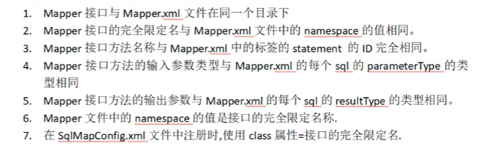
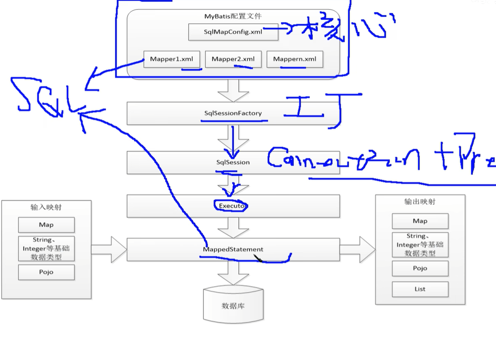
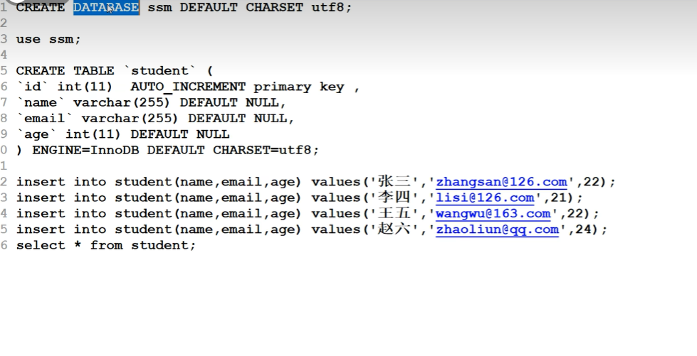

规范，和准备







添加依赖需要添加mysql的依赖

1. 修改pom

   ```xml
    <!-- https://mvnrepository.com/artifact/org.mybatis/mybatis -->
           <dependency>
               <groupId>org.mybatis</groupId>
               <artifactId>mybatis</artifactId>
               <version>3.5.10</version>
           </dependency>
           <!-- https://mvnrepository.com/artifact/mysql/mysql-connector-java -->
           <dependency>
               <groupId>mysql</groupId>
               <artifactId>mysql-connector-java</artifactId>
               <version>8.0.30</version>
           </dependency>
   
    <resources>
        <resource>
            <directory>src/main/java</directory>
            <includes>
                <include>**/*.xml</include>
                <include>**/*.properties</include>
            </includes>
        </resource>
        <resource>
            <directory>src/main/resources</directory>
            <includes>
                <include>**/*.xml</include>
                <include>**/*.properties</include>
            </includes>
        </resource>
   </resources>
   ```

2. 配置mybatis配置文件

   ```properties
   #jdbc.properties
   jdbc.driverClassName=com.mysql.cj.jdbc.Driver
   jdbc.url=jdbc:mysql://120.48.155.196:3306/ssm?useUnicode=true&characterEncoding=utf8
   jdbc.username=root
   jdbc.password=zh123456
   ```

   配置xml文件时需要注意先后顺序

   ```xml
   <?xml version="1.0" encoding="UTF-8" ?>
   <!DOCTYPE configuration
           PUBLIC "-//mybatis.org//DTD Config 3.0//EN"
           "http://mybatis.org/dtd/mybatis-3-config.dtd">
   <configuration>
   <!--    读取属性文件 jdbc.properties
           属性：
               resources:从resources目录下找指定名称的文件
               url：使用绝对路径加载属性文件
   -->
       <properties resource="jdbc.properties"/>
   <!--    配置数据库环境变量-->
       <environments default="development">
           <environment id="development">
   <!--            配置事务控制交给
                   type:JDBC事务的控制交给传许愿 ，MANAGED：由容器(Spring)来管理事务-->
               <transactionManager type="JDBC"></transactionManager>
   <!--            配置数据源  type：指定不同的配置方式
                   JNDI：java命名目录接口
                   POOLED：使用数据库连接处
                   UNPOOLLED：不适用数据库连接池-->
               <dataSource type="POOLED">
   <!--            配置基本参数，driver,url,username,password-->
                   <property name="driver" value="${jdbc.driverClassName}"/>
                   <property name="url" value="${jdbc.url}"/>
                   <property name="username" value="${jdbc.username}"/>
                   <property name="password" value="${jdbc.password}"/>
               </dataSource>
           </environment>
   <!--        可以指定不同化境，通过default来指定-->
   <!--        <environment id="development">-->
   <!--            <transactionManager type=""></transactionManager>-->
   <!--            <dataSource type=""></dataSource>-->
   <!--        </environment>-->
       </environments>
   <!--    注册mapper.xml文件  resource：从resource目录下找指定名称的文件加载 url同上
           class：动态代理方式下的注册-->
       <mappers>
           <mapper resource="StudentMapper.xml"/>
       </mappers>
   </configuration>
   ```

3. 实体类的创建

   注：需要添加无参构造方法，在数据库操作的时候进行初始化

   ```java
   package org.example.pojo;
   
   public class Student {
       private Integer id;
       private String name;
       private String email;
       private Integer age;
   
       public Student() {
       }
   
       public Student(String name, String email, Integer age) {
           this.name = name;
           this.email = email;
           this.age = age;
       }
   
       public Student(Integer id, String name, String email, Integer age) {
           this.id = id;
           this.name = name;
           this.email = email;
           this.age = age;
       }
   
       public Integer getId() {
           return id;
       }
   
       public void setId(Integer id) {
           this.id = id;
       }
   
       public String getName() {
           return name;
       }
   
       public void setName(String name) {
           this.name = name;
       }
   
       public String getEmail() {
           return email;
       }
   
       public void setEmail(String email) {
           this.email = email;
       }
   
       public Integer getAge() {
           return age;
       }
   
       public void setAge(Integer age) {
           this.age = age;
       }
   
       @Override
       public String toString() {
           return "Student{" +
                   "id=" + id +
                   ", name='" + name + '\'' +
                   ", email='" + email + '\'' +
                   ", age=" + age +
                   '}';
       }
   }
   
   ```

4. StudentMapper.xml的配置

   ```xml
   <?xml version="1.0" encoding="UTF-8" ?>
   <!DOCTYPE mapper
           PUBLIC "-//mybatis.org//DTD Mapper 3.0//EN"
           "http://mybatis.org/dtd/mybatis-3-mapper.dtd">
   <!--属性 namespace:指定命名空间，用来区分不同mapper.xml文件中相同的id属性-->
   <mapper namespace="zh">
   <!--    完成查询所有学生的功能
           List<Student> getAll();
           resultType:指定查询返回的结果集的类型，如果是集合，则必须是泛型的类型
           parameterType:如果有参数，则通过这个知道你参数的类型
   -->
       <select id="getAll" resultType="org.example.pojo.Student">
           select * from student;
       </select>
   <!--    注需要在配置文件中进行注册-->
   </mapper>
   ```

5. 测试

   ```java
   public class MyTest {
       @Test
       public void testA() throws IOException {
   //        用文件流读取核心配置文件
           InputStream in = Resources.getResourceAsStream("SqlMapConfig.xml");
   //        创建SqlSessionFactory工厂
           SqlSessionFactory factory = new SqlSessionFactoryBuilder().build(in);
   //        去除SqlSession对象
           SqlSession sqlSession = factory.openSession();
   //        查询
           List<Student> list = sqlSession.selectList("zh.getAll");
           list.forEach(student -> System.out.println(student));
   //        关闭
           sqlSession.close();
       }
   }
   
   ```

   
