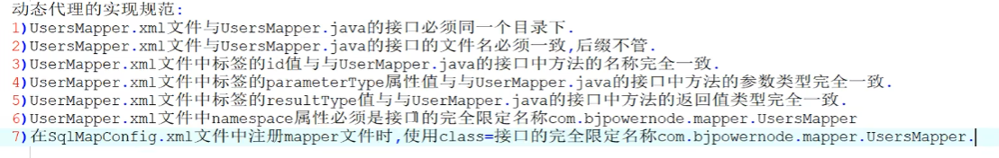

# 动态代理

使用动态代理的原因：dao层无法直接使用xml文件定义的东西，使用sqlsession又很麻烦

在业务逻辑层依然使用接口调用xml文件中的功能，这个功能由动态代理对象代理出来

**规范如下**



## 具体步骤

1. 建表，建立maven工程，修改pom

2. 配置sqlmapconfig

   ```xml
   <?xml version="1.0" encoding="UTF-8" ?>
   <!DOCTYPE configuration
           PUBLIC "-//mybatis.org//DTD Config 3.0//EN"
           "http://mybatis.org/dtd/mybatis-3-config.dtd">
   <configuration>
       <properties resource="JDBC.properties"/>
   
       <typeAliases>
           <typeAlias type="org.example.pojo.Users" alias="users"/>
       </typeAliases>
   <!--    配置数据库环境变量-->
       <environments default="development">
           <environment id="development">
               <transactionManager type="JDBC"/>
               <dataSource type="POOLED">
   <!--            配置基本参数，driver,url,username,password-->
                   <property name="driver" value="${jdbc.driverClassName}"/>
                   <property name="url" value="${jdbc.url}"/>
                   <property name="username" value="${jdbc.username}"/>
                   <property name="password" value="${jdbc.password}"/>
               </dataSource>
           </environment>
       </environments>
   </configuration>
   ```

3. 创建接口以及对应的mapper.xml文件

   ```java
   public interface UsersMapper {
       List<Users> getAll();
   }
   
   ```

   ```xml
   <?xml version="1.0" encoding="UTF-8" ?>
   <!DOCTYPE mapper
           PUBLIC "-//mybatis.org//DTD Mapper 3.0//EN"
           "http://mybatis.org/dtd/mybatis-3-mapper.dtd">
   <mapper namespace="org.example.mapper.UsersMapper">
       <select id="getAll" resultType="users" >
           select * from users;
       </select>
   </mapper>
   ```

4. 对于mapper进行注册，使用class属性

   ```xml
   <mappers>
       <mapper class="org.example.mapper.UsersMapper"/>
   </mappers>
   ```

5. 进行测试

   ```java
   public class MyTest {
   
       SqlSession sqlSession;
   
       @Before
       public void openSession() throws IOException {
           InputStream in = Resources.getResourceAsStream("SqlMapConfig.xml");
           SqlSessionFactory factory = new SqlSessionFactoryBuilder().build(in);
           sqlSession = factory.openSession();
       }
   
       @After
       public void clossSession() {
           sqlSession.close();
       }
   
   
       @Test
       public void testAll() {
   //        取出动态代理东西，来调用之前配置的sql语句
           UsersMapper usersMapper = sqlSession.getMapper(UsersMapper.class);
           List<Users> list = usersMapper.getAll();
           System.out.println(list);
       }
   }
   ```

**update测试**

```xml
 <update id="update" parameterType="users">
        update users set username = #{userName},birthday = #{birthday},
        sex = #{sex} , address=#{address} where id = #{id};

    </update>
```

```java
    @Test
    public void testUpdata(){
        UsersMapper usersMapper = sqlSession.getMapper(UsersMapper.class);
        int num = usersMapper.update(new Users(2, "张三", new Date(), "1", "江苏"));
        sqlSession.commit();
        System.out.println(num);
    }
```

> 日期格式化
>
> ```java
> SimpleDateFormat sf = new SimpleDateFormat("yyyy-MM-dd");
> sf.parse("2000-01-01")
> ```

> 注意点：
>
> - xml和接口要在同一个目录下，且文件名相同
> - namespace必须是接口的引用
> - 需要注册（使用class）

## 优化

mapper.xml的批量注册,直接指向mapper文件夹 

```xml
<mappers>
    <!--        <mapper class="org.example.mapper.UsersMapper"/>-->
    <package name="org.example.mapper"/>
</mappers>
```


