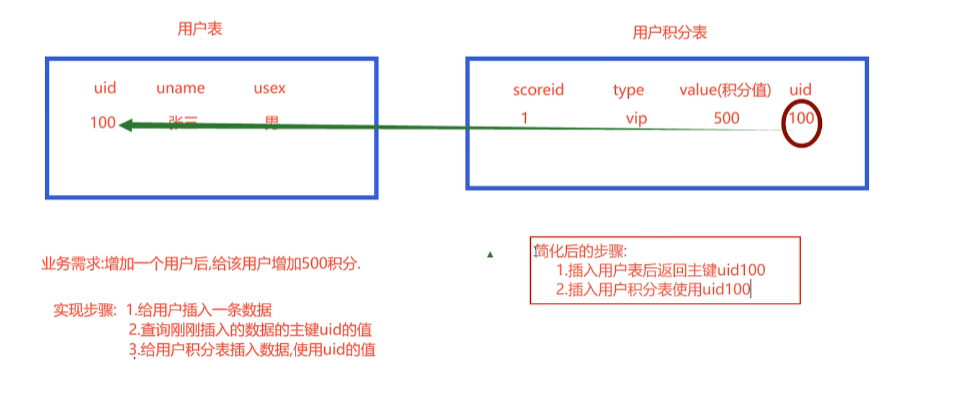
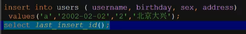

## #{}和${}的区别

- `#{}`是对非字符串**拼接**的占位符，如果参数为简单参数，内部任意，如果参数是对象的话，`#{}`必须是成员变量的名称，这样可以有效防止sql注入

  > - 普通类型只是占位ie

- `${}`针对字符串拼接替换

  - 一般用在模糊查询里

  分为两种情况

  - 如果入参为简单类型：${}里随便
  - 如果是实体类，${}里面只能是成员变量名称

### 优化的模糊查询

```java
List<Users> getByName(String name);
```

```xml
<select id="xxx" parameterType="string" resultType="users">
select * from users where username like concat('%',#{name},'%');
</select>
```

可以防止sql注入

### 字符串替换

如果我们需要对不同字段实现模糊查询

```sql
selsct * from users where username like '%x%'
selsct * from users where address like '%y%'
```

这里只有username和address不一样

```java
List<Users> getByNameOrAddress(
    @Param("columnName")
    String columnName,
    @Param("columnValue")
    String columnValue
);
```

```xml
<!--    如果有多个的输入则不使用 parameterType-->
<select id="getByNameOrAddress" resultType="users">
    select * from users where ${columnName} like concat('%',#{columnValue},'%')
</select>
```

注意这里替换字符串使用的是${}

## 返回主键标签

插入的时候我们可能需要同时插入多张表





```xml
<insert id="insert" parameterType="users">
    <selectKey keyProperty="id" resultType="int" order="AFTER">
        select last_insert_id()
    </selectKey>
    insert into users (username,birthday,sex,address) values (
    #{userName},#{birthday},#{sex},#{address}
    )
</insert>
```

- `keyProperty`使用对象的哪个属性来接收返回的值
- `resultType`返回的类型
- `order`在插入语句前还是执行后

```java
@Test
public void testInsert() throws ParseException {
    Users users = new Users("xx", sf.parse("2022-01-10"), "1", "浙江");
    UsersMapper usersMapper = sqlSession.getMapper(UsersMapper.class);
    int num = usersMapper.insert(users);
    sqlSession.commit();
    System.out.println(users);
    //        Users{id=29, userName='xx', birthday=Mon Jan 10 00:00:00 CST 2022, sex='1', address='浙江'}
}
```

## 使用UUID全球唯一字符串

```java
UUID uuid = UUID.randomUUID();
System.out.println(uuid.toString.replace("-","").subString(20));
```

