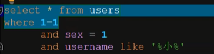
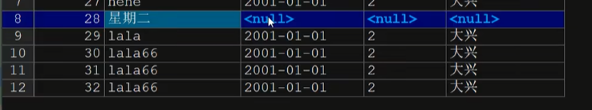
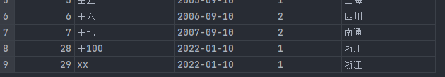
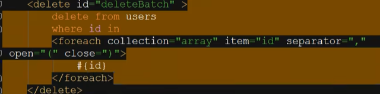
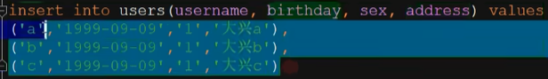
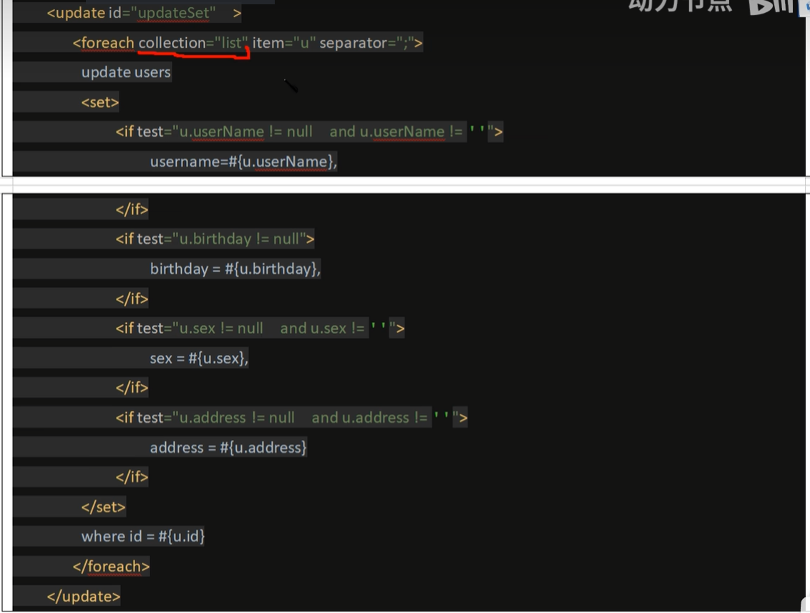
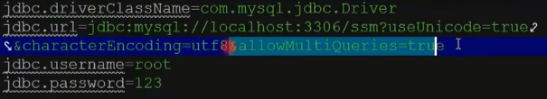

# 动态sql

可以定义代码片段，可以进行逻辑判断，可以进行循环处理，使条件判断更加简单（可以通过一条xml来指定不同数量的条件）



如上不断加入and/or语句

## 使用

- `<sql>`定义代码片段，可以讲所有的列名，或复杂的条件定义为代码片段
- `<include>`用来引用`<sql>`定义的代码片段，两者配合使用

```xml
<!--  定义代码片段-->
<sql id="allColumns">
    id,username,birthday,sex,address
</sql>

<select id="getAll" resultType="users" >
    select <include refid="allColumns"/> from users;
</select>
```

## 条件判断

- `<if>`进行条件判断
- `<where>`进行多条件拼接，在查询，删除，更新中使用

定义接口,直接通过对象就可以进行多种条件查询

```java
List<Users> getByCondition(Users users);
```

```xml
<!--    根据实体类的成员变量进行条件判断-->
<select id="getByCondition" parameterType="users" resultType="users">
    select <include refid="allColumns"/> from users
    <where>
        <if test="userName != null and userName != ''">
            and username like concat('%',#{userName},'%')
        </if>
        <if test="birthday != null">
            and birthday = #{birthday}
        </if>
        <if test="sex != null and userName != ''">
            and sex = #{sex}
        </if>
        <if test="address != null and address != ''">
            and address like concat('%',#{address},'%')
        </if>
    </where>
</select>
```

```java
@Test
public void testCondition() {
    UsersMapper usersMapper = sqlSession.getMapper(UsersMapper.class);
    Users u = new Users();
    u.setUserName("王");
    List<Users> list = usersMapper.getByCondition(u);
    list.forEach(users -> System.out.println(users));

}
```

拼接的sql语句

```sql
select id,username,birthday,sex,address from users WHERE username like concat('%',?,'%')
```

可以看到第一个会自动取出and  ， 会自动加上where

## 有选择的更新

`<set>`有选择的更新，至少更新一列

原本update的时候需要指定所有的成员变量！！！不然会赋值null！！！



```java
int UpdateBySet(Users users);
```

```xml
<update id="UpdateBySet" parameterType="users">
    update users
    <set>
        <if test="userName != null and userName != ''">
            username = #{userName},
        </if>
        <if test="birthday != null">
            birthday = #{birthday},
        </if>
        <if test="sex != null and userName != ''">
            sex = #{sex},
        </if>
        <if test="address != null and address != ''">
            address = #{address},
        </if>
    </set>
    where id = #{id}
</update>
```

```java
@Test
public void testSet() {
    UsersMapper usersMapper = sqlSession.getMapper(UsersMapper.class);
    Users u = new Users();
    u.setId(28);
    u.setUserName("王100");
    int num = usersMapper.UpdateBySet(u);
    sqlSession.commit();
}
```



### 一点问题

如果只给了id没有给其他的属性赋值，那么就有可能报错，所以我们在业务层就需要进行判断

## foreach标签

用来完成批量查询，删除，增加，更新

如

```sql
select * from users where id=1 or id = 2 or id=3;
select * from users where id in (2,3,5)
```

使用

```java
List<Users> getByIds(Integer []arr);
```

```xml
<!--    item随便写   separator:分隔符-->
<select id="getByIds" resultType="users">
    select * from users
    where id in
    <foreach collection="array" item="id" separator="," open="(" close=")">
        #{id}
    </foreach>
</select>
```

```java
@Test
public void testByIds(){
    UsersMapper usersMapper = sqlSession.getMapper(UsersMapper.class);
    Integer[] arr = {2,4,6};
    List<Users> list = usersMapper.getByIds(arr);
    list.forEach(users -> System.out.println(users));
}
```

**参数**

- `collection`: List集合：list，Map集合：map，数组：arr
- item：每次循环出来的值或者对象
- separator：分隔符
- open,close:前后括号

删除同理



批量增加



```xml
<insert id="insertBatch" >
    insert into users (username,birthday,sex,address) values
    <foreach collection="list" item="u"  separator=",">
        (#{u.userName},#{u.birthday},#{u.sex},#{u.address})
    </foreach>
</insert>
```

```java
@Test
public void testInsertBatch() throws ParseException {
    UsersMapper usersMapper = sqlSession.getMapper(UsersMapper.class);
    Users s1 = new Users("aa", sf.parse("2022-01-10"), "1", "浙江");
    Users s2 = new Users("bb", sf.parse("2022-01-10"), "1", "浙江");
    Users s3 = new Users("cc", sf.parse("2022-01-10"), "1", "浙江");
    Users s4 = new Users("dd", sf.parse("2022-01-10"), "1", "浙江");
    List<Users> list = new ArrayList<>();
    list.add(s1);
    list.add(s2);
    list.add(s3);
    list.add(s4);

    int num = usersMapper.insertBatch(list);
    sqlSession.commit();


}
```

因为我们的item使对象，所以我们通过item.xxx来写入对象的属性

### 批量更新

多条update语句



> 如果需要批量更新我们需要在properties中的url中启动多条操作
>
> ```
> &allowMultiQueries=true
> ```
>
> 