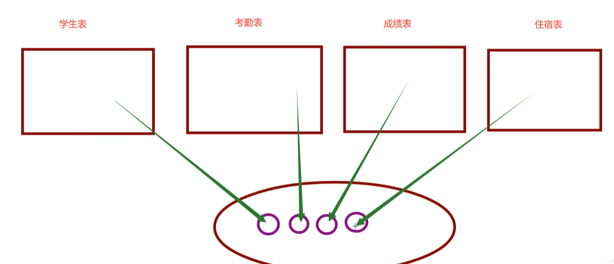
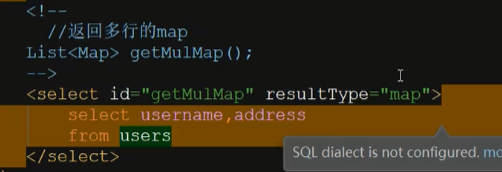
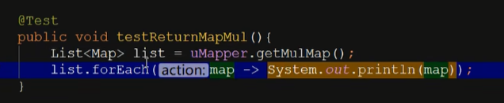
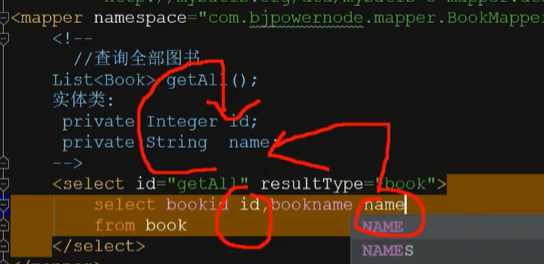

# 参数

## 指定参数位置

如果入参使多个，可以通过指定参数位置进行传参，是实体类包含不住的条件（如日期有区间范围的判断，或者两个值进行处理，则实体类包不住）

```java
List<Users> getByBirthday(Date begin,Date end);
```

```xml
<select id="getByBirthday" resultType="users">
    select * from users
    where birthday between #{arg0} and #{arg1}
</select>
```

```java
@Test
public void selectByDate() throws ParseException {
    UsersMapper usersMapper = sqlSession.getMapper(UsersMapper.class);
    List<Users> list = usersMapper.getByBirthday(sf.parse("1999-12-10"), sf.parse("2000-2-1"));
    list.forEach(users -> System.out.println(users));
}
```

## 指定参数名称

```java
List<Users> getByBirthday(
    @Param('xxx')
    Date begin,
    @Param('xxx')
    Date end);
```

## 入参为map

直接通过键值对来指定参数

```java
List<Users> getByMap(Map map);
```

```xm
<select id="getByMap" resultType="users">
select * from users
where birthday between #{begin} and #{end}
</select>
```

```java
@Test
public void selectByMap() throws ParseException {
    UsersMapper usersMapper = sqlSession.getMapper(UsersMapper.class);
    Date begin = sf.parse("1999-12-10");
    Date end = sf.parse("2000-2-1");
    Map map = new HashMap<>();
    map.put("begin",begin);
    map.put("end",end);
    List<Users> list = usersMapper.getByMap(map);
    list.forEach(users -> System.out.println(users));
}
```

## 返回值为map

### 返回单个map



```java
Map getReturnMap(Integer id);
```

```xml
<select id="getReturnMap" parameterType="int" resultType="map">
    select birthday,address from users where id =#{id};
</select>
```

```java
@Test
public  void testReturnMap() {
    UsersMapper usersMapper = sqlSession.getMapper(UsersMapper.class);
    Map returnMap = usersMapper.getReturnMap(29);
    System.out.println(returnMap.get("birthday"));
    System.out.println(returnMap.get("address"));
}
```

### 返回多个map





## 列名和类中成员变量不一致

**方法一**

使用别名，让表中和成员变量一直



**方法二**

使用resultMap手动定义

```xml
    <resultMap id="bookMap" type="book">
<!--    主键绑定   前者为类中属性，后者为column-->
        <id property="id" column="bookid"/>
<!--    非主键绑定-->
        <result property="name" column="bookname"/>
    </resultMap>
    <select id="getAll2" resultMap="bookMap">
        select bookid,bookname from book;
    </select>
```

