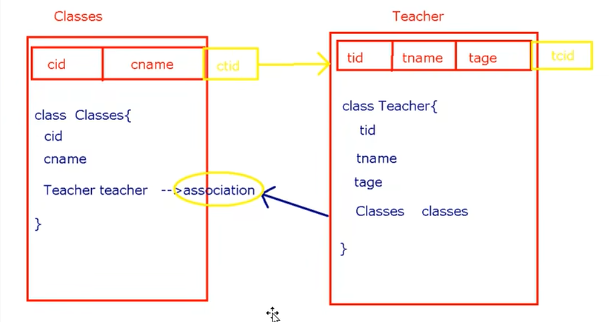
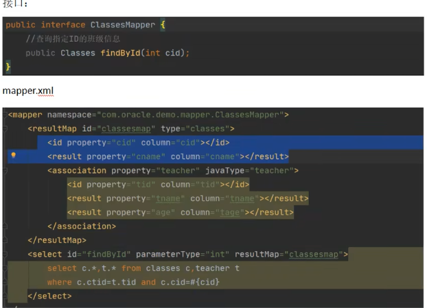
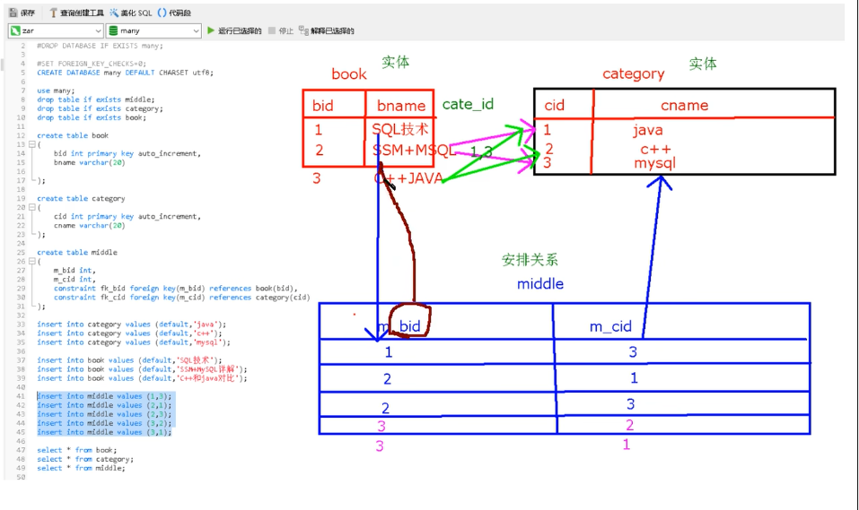
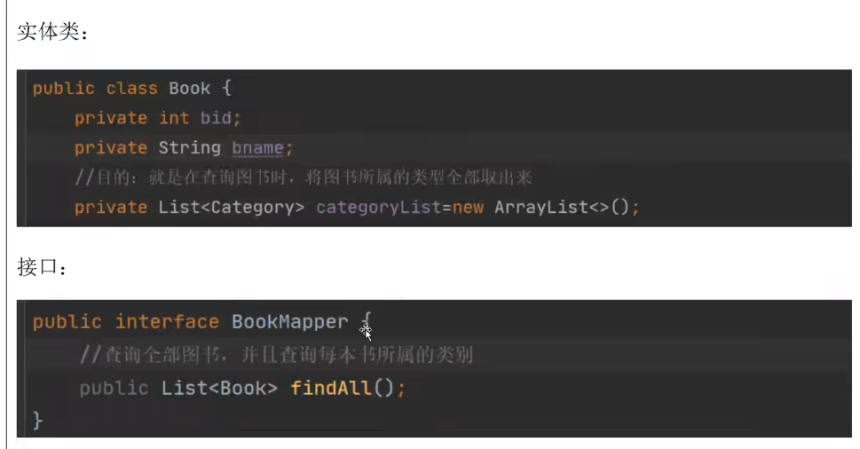
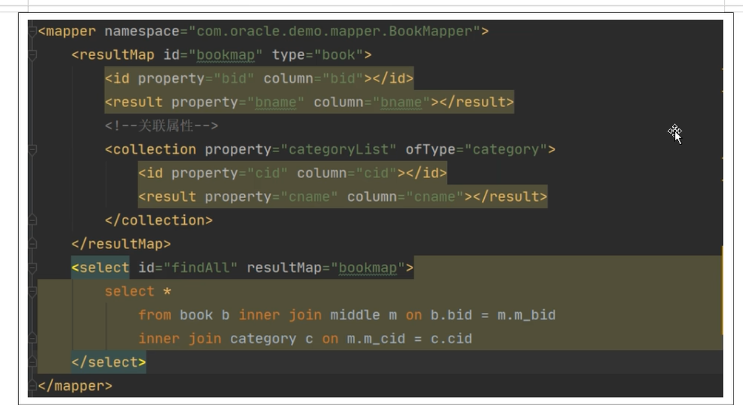
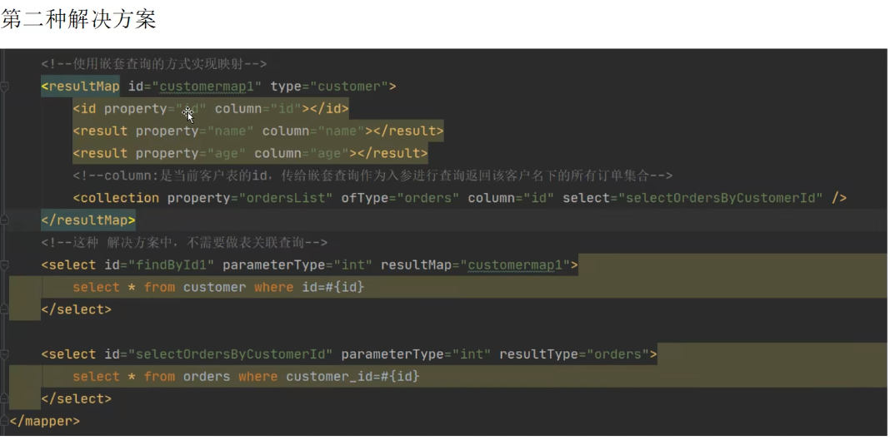
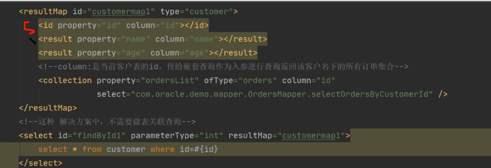

# 关联关系

关联关系是有方向的

- 一对多关联：老师-学生
- 多对一
- 一对一：单独辅导
- 多对多：车位和汽车

## 一对多

客户和订单---一个客户可以有多个订单，

```sql
create table customer(
    id int primary key auto_increment,
    name varchar(32),
    age int
);

insert into customer values (1,'张三',22);
insert into customer values (2,'李四',23);
insert into customer values (3,'王五',24);

create table orders(
    id int primary key auto_increment,
    orderNumber varchar(16),orderPrice double,
    customer_id int,
    foreign key (customer_id) references customer(id)
);
insert into orders values (11,20,22.22,1);
insert into orders values (12,60,16.66,1);
insert into orders values (13,90,19.99,2);


select * from orders;
```

使用一对多的关联关系，可以满足查询客户的同时查询该客户名下的所有订单

```sql
select c.id cid,name,age,o.id oid ,orderNumber,orderPrice,customer_id 
from customer c 
inner join orders o on c.id = o.customer_id;
```

> join的用法https://www.runoob.com/w3cnote/sql-join-image-explain.html

此时我们就可以在用户类中添加订单的集合

**创建实体类**

```java
public class Customer {
    private Integer id;
    private String name;
    private Integer age;
    //    该用户名下所有顶顶那的集合
    private List<Orders> ordersList;
```

```java
public class Orders {
    private Integer id;
    private String orderNumber;
    private double orderPrice;
```

**Mapper**

```java
public interface CustomerMapper {
    Customer getById(Integer id);
}

```

```xml
<?xml version="1.0" encoding="UTF-8" ?>
<!DOCTYPE mapper
        PUBLIC "-//mybatis.org//DTD Mapper 3.0//EN"
        "http://mybatis.org/dtd/mybatis-3-mapper.dtd">

<mapper namespace="org.example.Mapper.CustomerMapper">
    <resultMap id="customerMap" type="customer">
        <id property="id" column="cid"/>
        <result property="name" column="name"/>
        <result property="age" column="age"/>
<!--        List那部分的绑定  ofType泛型的类型
            同时需要绑定泛型中的属性
-->
        <collection property="ordersList" ofType="orders">
            <id property="id" column="oid"/>
            <result property="orderNumber" column="orderNumber"/>
            <result property="orderPrice" column="orderPrice"/>
        </collection>
    </resultMap>
<!--    此时resultType就不好用了-->
    <select id="getById" parameterType="int" resultMap="customerMap">
        select c.id cid,name,age,o.id oid,orderNumber,orderPrice,customer_id from customer c inner join orders o on c.id=o.customer_id
        where c.id=#{id}
    </select>
</mapper>
```

```java
@Test
public void testByid() {
    Customer byId = customerMapper.getById(1);
    System.out.println(byId);

}
```

如果多出来的是一个集合那么使用collection，泛型对应ofType，如果多出来的是一个类那么使用association，类型对应javaType

### 问题

如果没有订单的话 ，用户存在，返回结果为0

这时使用left join

```sql
select c.id cid,name,age,o.id oid ,orderNumber,orderPrice,customer_id 
from customer c 
left join orders o on c.id = o.customer_id;
```

## 多对一

通过订单查询用户

```sql
select o.id oid,orderNumber,orderPrice,customer_id,c.id cid,name,age from orders o inner join customer c on o.customer_id = c.id where o.id=11;
```

设计orders类

```java
public class Orders {
    private Integer id;
    private String orderNumber;
    private double orderPrice;
//    外键不同添加
    private Customer customer;
```

```xml
<?xml version="1.0" encoding="UTF-8" ?>
<!DOCTYPE mapper
        PUBLIC "-//mybatis.org//DTD Mapper 3.0//EN"
        "http://mybatis.org/dtd/mybatis-3-mapper.dtd">
<mapper namespace="org.example.Mapper.OrdersMapper">
    <resultMap id="ordersMap" type="orders">
        <id property="id" column="oid"/>
        <result property="orderNumber" column="orderNumber"/>
        <result property="orderPrice" column="orderPrice"/>
        <association property="customer" javaType="customer">
            <id property="id" column="cid"/>
            <result property="name" column="name"/>
            <result property="age" column="age"/>
        </association>
    </resultMap>

    <select id="selectById" parameterType="int" resultMap="ordersMap">
        select o.id oid,orderNumber,orderPrice,customer_id,c.id cid,name,age from orders o inner join customer c on o.customer_id = c.id where o.id=#{id};
    </select>
</mapper>
```

```java
@Test
public void testByOId() {
    Orders orders = ordersMapper.selectById(11);
    System.out.println(orders);
}
```

如果里面还有关联对象可以继续嵌套

## 一对一关联





## 多对多关联

 需要添加中间表进行化简，有两张表的外键







## 优化

同时使用两条查询语句进行查询



> sql子查询：https://blog.csdn.net/jhin_lx/article/details/120725467

**继续优化**



使用其他文件的sql语句！！！！

