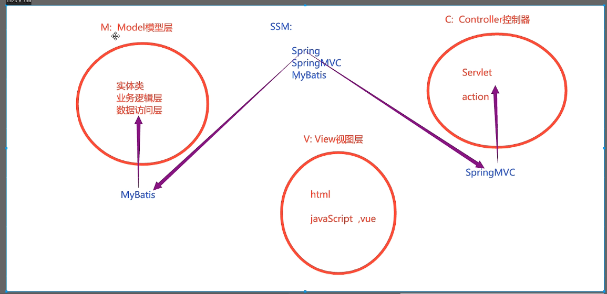
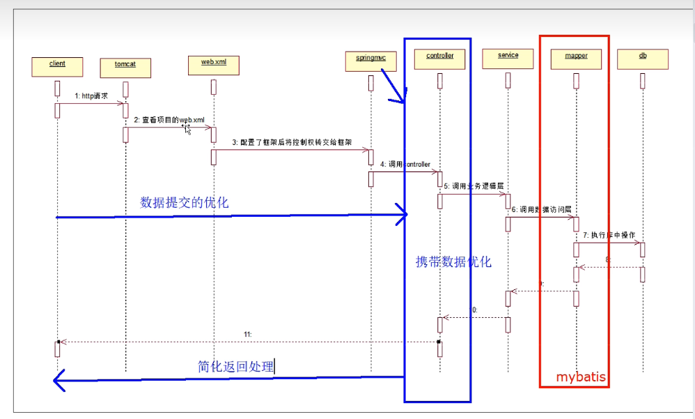
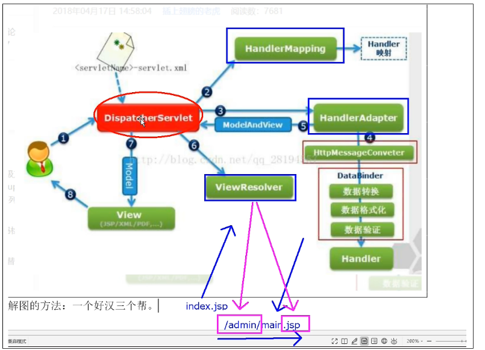
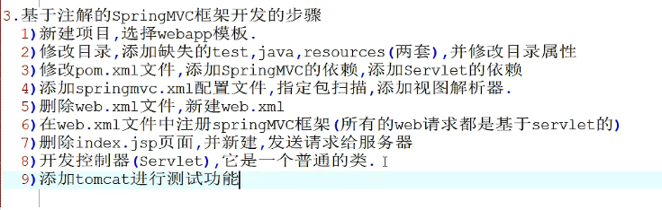
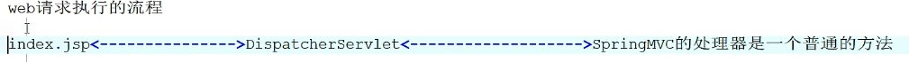
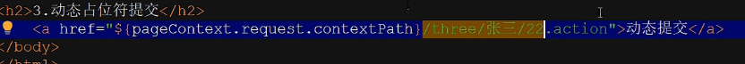
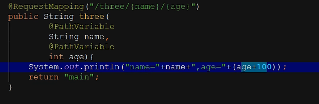
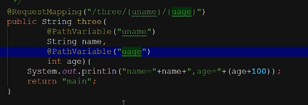
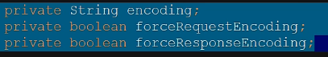
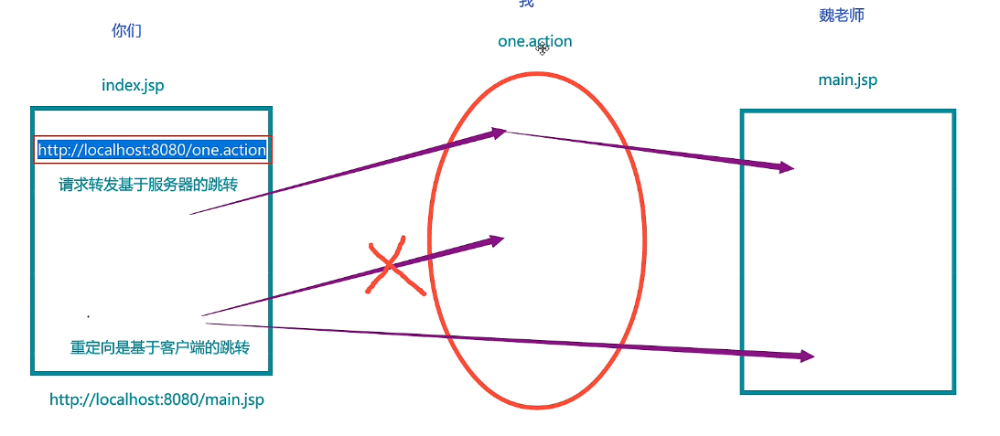

# SpringMVC

M：模型层，三层架构

V：视图层

C：控制器，用来接收客户端的请求并返回相应到客户的组件



SpringMVC时序图



**执行流程**



## 开发步骤



https://blog.csdn.net/m0_54849806/article/details/126097437

**配置springmvc.xml**

```xml
<?xml version="1.0" encoding="UTF-8"?>
<beans xmlns="http://www.springframework.org/schema/beans"
       xmlns:xsi="http://www.w3.org/2001/XMLSchema-instance"
       xmlns:context="http://www.springframework.org/schema/context"
       xsi:schemaLocation="http://www.springframework.org/schema/beans http://www.springframework.org/schema/beans/spring-beans.xsd http://www.springframework.org/schema/context https://www.springframework.org/schema/context/spring-context.xsd">
<!--添加包扫描-->
    <context:component-scan base-package="org.example.controller"/>
<!--    添加事务解析器-->
    <bean class="org.springframework.web.servlet.view.InternalResourceViewResolver">
<!--        配置前缀-->
        <property name="prefix" value="/admin/"/>
<!--        配置后缀-->
        <property name="suffix" value=".jsp"/>
    </bean>
</beans>
```

**servlet注册**



所有请求都是通过核心处理器进行转发，因此我们需要将DIspatchServlet进行注册

```xml
<?xml version="1.0" encoding="UTF-8"?>
<web-app xmlns="http://xmlns.jcp.org/xml/ns/javaee"
         xmlns:xsi="http://www.w3.org/2001/XMLSchema-instance"
         xsi:schemaLocation="http://xmlns.jcp.org/xml/ns/javaee http://xmlns.jcp.org/xml/ns/javaee/web-app_4_0.xsd"
         version="4.0">
<!--    注册springmvc框架-->
    <servlet>
        <servlet-name>springmvc</servlet-name>
        <servlet-class>org.springframework.web.servlet.DispatcherServlet</servlet-class>
<!--        进行初始化操作-->
        <init-param>
            <param-name>contextConfigLocation</param-name>
            <param-value>classpath:springmvc.xml</param-value>
        </init-param>
    </servlet>
    
    <servlet-mapping>
        <servlet-name>springmvc</servlet-name>
<!--        拦截什么样的请求都带着.action-->
        <url-pattern>*.action</url-pattern>
    </servlet-mapping>
</web-app>
```

**配置controller方法**

配置一条连接

```jsp
<a href="${pageContext.request.contextPath}/demo.action"></a>
```

配置controller

```java
@Controller
public class DemoAction {
    @RequestMapping("/demo.action")
    public String demo(){
        System.out.println("ok====================================");
        return "main";
    }
}
```

收到请求就会指向main.jsp

## @RequestMapping

- 此注解可以加载方法上，为此方法注册一个可以访问的名称
- 可以加载类上，相当于包名相当于加上一个前缀（虚拟路径），去等不同类中相同action

**参数**

- value：需要连接的名称
- method: 处理的http方式,`method = RequestMethod.GET`

## 五种数据提交方式

- 单个数据提交：参数对应需要的值

```java
    /*
    * 姓名:<input name="myname"> <br>
    * 年龄:<input name="age">
    * */
    @RequestMapping("/one.action")
    public String one(String myname,String age){
        System.out.println(myname+" : "+age);
        System.out.println("张三");
        return "main";
    }
```

- 对象封装的提交

在提交请求中，保证参数名称和实体类中成员变量的名称一致，则可以自动类型转换，自动装载到类中

```java
    /*
     * 姓名:<input name="name"> <br>
     * 年龄:<input name="age">
     * */
    @RequestMapping("/two.action")
    public String two(Users users){
        System.out.println(users);
        return "main";
    }
```

- 动态占位符提交

仅限于超链接/地址栏提交，一杠一值，使用注解来解析





可以修改名称



使用的较少

- 映射名称不一致，提交请求参数与action方法的形参的名称不一致，使用注解来解析

`@RequestParam`

```java
    @RequestMapping("/four.action")
    public String four(@RequestParam("name") String uname,
            @RequestParam("age") int uage
    ){
        System.out.println(uname+" : "+uage);
        return "main";
    }
```

- 手工提取数据

```java
    @RequestMapping("/five.action")
    public String five(HttpServletRequest request){
        String name = request.getParameter("name");
        int age = Integer.parseInt(request.getParameter("age"));
        System.out.println(name+" : "+age);
        return "main";
    }
```

## 中文编码问题！！！

配置过滤器



划入到web.xml最上方

```xml
<!--    中文编码过滤器-->
    <filter>
        <filter-name>encode</filter-name>
        <filter-class>org.springframework.web.filter.CharacterEncodingFilter</filter-class>
<!--        private String encoding;
    private boolean forceRequestEncoding;
    private boolean forceResponseEncoding;-->
        <init-param>
            <param-name>encoding</param-name>
            <param-value>UTF-8</param-value>
        </init-param>
        <init-param>
            <param-name>forceRequestEncoding</param-name>
            <param-value>true</param-value>
        </init-param>
        <init-param>
            <param-name>forceResponseEncoding</param-name>
            <param-value>true</param-value>
        </init-param>
    </filter>
    <filter-mapping>
        <filter-name>encode</filter-name>
        <url-pattern>/*</url-pattern>
    </filter-mapping>
```

## 返回值问题

- String：客户端资源的地址，自动拼接前缀和后缀，还可以屏蔽自动拼接字符串，指定返回路径
- Object：返回json格式的对象，自动将对象或集合转为json，使用jackson工具进行转换，一般用于ajax请求
- void：无返回值i，一般用于ajax
- 基本数据类型：用于ajax
- ModelAndView：返回数据和视图，现在用的很少了

### ajax相关的操作

返回学生的集合

- 添加jackson依赖
- 添加jquery
- 添加`@ResponseBody`，用来处理ajax请求
- 在springmvc.xml添加注解驱动，`<mvc:annotationdriven>`来解析@ResponseBody

POM

```xml
<!-- https://mvnrepository.com/artifact/com.fasterxml.jackson.core/jackson-databind -->
<dependency>
    <groupId>com.fasterxml.jackson.core</groupId>
    <artifactId>jackson-databind</artifactId>
    <version>2.13.3</version>
</dependency>
```

springmvc.xml中不需要视图解析器

```xml
<?xml version="1.0" encoding="UTF-8"?>
<beans xmlns="http://www.springframework.org/schema/beans"
       xmlns:xsi="http://www.w3.org/2001/XMLSchema-instance"
       xmlns:context="http://www.springframework.org/schema/context"
       xmlns:mvc="http://www.springframework.org/schema/cache"
       xsi:schemaLocation="http://www.springframework.org/schema/beans http://www.springframework.org/schema/beans/spring-beans.xsd http://www.springframework.org/schema/context https://www.springframework.org/schema/context/spring-context.xsd http://www.springframework.org/schema/cache http://www.springframework.org/schema/cache/spring-cache.xsd">
    <!--添加包扫描-->
    <context:component-scan base-package="org.example.controller"/>
<!--    &lt;!&ndash;    添加视图解析器&ndash;&gt;-->
<!--    <bean class="org.springframework.web.servlet.view.InternalResourceViewResolver">-->
<!--        &lt;!&ndash;        配置前缀&ndash;&gt;-->
<!--        <property name="prefix" value="/admin/"/>-->
<!--        &lt;!&ndash;        配置后缀&ndash;&gt;-->
<!--        <property name="suffix" value=".jsp"/>-->
<!--    </bean>-->
    
<!--    添加注解驱动 注意最后是mvc的那个-->
    <mvc:annotation-driven/>

</beans>
```

**开发实体类和controller**

```java
@Controller
public class StudentListAction {
//    使用RestController注解类就饿可以不用ResponseBody
    @RequestMapping("/list.action")
    @ResponseBody //必须在springmvc.xml中添加注解驱动
    public List<Student> list(){
        List<Student> list = new ArrayList<>();
        Student stu1 = new Student("张三",1);
        Student stu2 = new Student("李四",2);
        Student stu3 = new Student("王五",3);
        list.add(stu1);
        list.add(stu2);
        list.add(stu3);
        return list;//SpringMVC负责将集合转化为json数组
    }
}

```

使用ajax

```jsp
<%--
  Created by IntelliJ IDEA.
  User: 14143
  Date: 2022/8/7
  Time: 20:51
  To change this template use File | Settings | File Templates.
--%>
<%@ page contentType="text/html;charset=UTF-8" language="java" %>
<html>
<head>
    <title>Title</title>
    <script src="js/jquery.js"></script>
</head>
<body>
<h1>index</h1>
<a>返回学生集合</a>
<a href="javascript:showStu()">返回数据</a>
<div id="mydiv">等待服务器返回数据</div>
<script type="text/javascript">
    function showStu(){
    //    使用jquery封装的ajax方法发送请求
        $.ajax({
            url:"${pageContext.request.contextPath}/list.action",
            type:"get",
            dataType:"json",
            success:function (stuList){
                var s = "";
                $.each(stuList,function (i,stu){
                    s+=stu.name + "----"+stu.age+"<br>";
                });
                console.log(s);
                $("#mydiv").html(s);
            }
        })
    }
</script>
</body>
</html>
```

## 四种跳转方式

- 请求转发
- 重定向



此为sringmvc中视图解析器的实现的bean类

```java
public class UrlBasedViewResolver extends AbstractCachingViewResolver implements Ordered {
    public static final String REDIRECT_URL_PREFIX = "redirect:";
    public static final String FORWARD_URL_PREFIX = "forward:";
    @Nullable
    private Class<?> viewClass;
    private String prefix = "";
    private String suffix = "";
    @Nullable
    private String contentType;
    private boolean redirectContextRelative = true;
    private boolean redirectHttp10Compatible = true;
```

可以看到REDIRECT_URL_PREFIX，FORWARD_URL_PREFIX关键字只要返回的字符串包含两者的内容，那么就不进行拼接操作

```java
@RequestMapping("/one.action")
public String one(){
    System.out.println("请求转发页面");
    return "main";//使用视图解析器进行页面跳转
}
@RequestMapping("/two.action")
public String two(){
    System.out.println("请求转发action");
    //        因为有视图解析器所以直接return "/other.action"会失败
    return "forward:/other.action";//forward:可以屏蔽拼接
}


@Controller
public class OtherAction {
    @RequestMapping("/other.action")
    public String other() {
        return "main";
    }
}

```

**重定向同理**

```java
    @RequestMapping("/three.action")
    public String three(){
        System.out.println("重定向页面");
        return "redirect:/admin/main.jsp";
    }

    @RequestMapping("/four.action")
    public String four(){
        System.out.println("重定向action");
        return "redirect:/other.action";
    }
```

