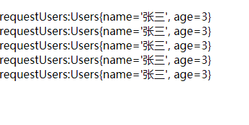
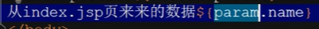
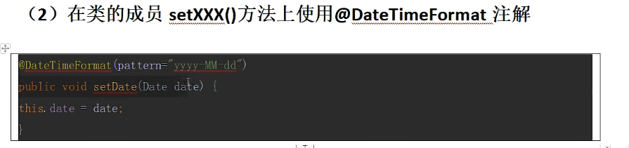
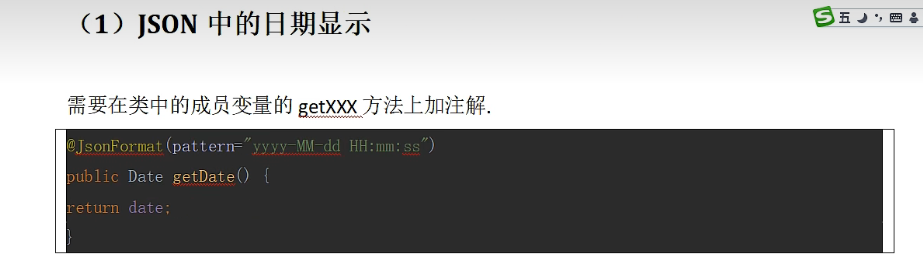
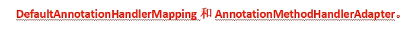
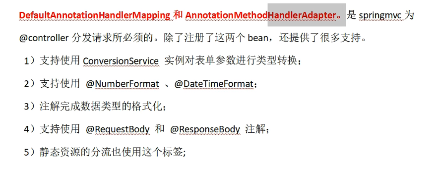

## 默认参数

```java
@RequestMapping("/four.action")
public String four(){
System.out.println("重定向action");
return "redirect:/other.action";
}
```

在这种controller中除了可以自动接收数据，还有一些默认可以使用参数

- `HttpServletRequest`
- `HttpServletResponse`
- `HttpServletSession`
- `Model`
- `Map`
- `ModelMap`

这些对象可以携带数据：model,map,modelmap,session.request

model,map,modelmap和request使用方法一样

因此服务器端的跳转必须是请求转发

```java
//<a href="${pageContext.request.contextPath}/data.action">访问服务器，并携带数据跳转</a>
@Controller
public class DataAction {
    @RequestMapping("/data.action")
    public String data(HttpServletRequest request, HttpServletResponse response,
                       HttpSession session, Model model, Map map, ModelMap modelMap) {
        Users users = new Users("张三",3);
//        传递数据
        request.setAttribute("requestUsers",users);
        session.setAttribute("sessionUsers",users);
        model.addAttribute("modelUsers", users);
        map.put("mapUsers", users);
        modelMap.addAttribute("modelMapUsers",users);
        return "main";
    }
}
/*
requestUsers:${requestUsers}<br>
requestUsers:${sessionUsers}<br>
requestUsers:${modelUsers}<br>
requestUsers:${mapUsers}<br>
requestUsers:${modelMapUsers}<br>
*/
```





可以获得请求中的参数

如果使用重定向，那么只有session中可以携带数据

## 注入日期

当前前端传入一个时间的时候是不能自动注入到action中，同时显示日期也很麻烦
### 日期的提交
#### 单个日处理
使用`@DateTimeFormat`,注：必须搭配springmvc.xml中`<mvc:annotation-driven/>`标签使用
```Java
@Controller  
public class MyDateAction {  
  
    SimpleDateFormat sf = new SimpleDateFormat("yyyy-MM-dd");  
  
    @RequestMapping("/myDate.action")  
    public String myDate(@DateTimeFormat(pattern = "yyyy-MM-dd") Date myDate){  
        System.out.println(myDate);  
        return "main";  
    }  
}
```
#### 类中全局日期处理
注册一个注解，用来解析本类中所有的日期类型，自动转换
```Java
@InitBinder  
@Controller  
public class MyDateAction {  
  
    SimpleDateFormat sf = new SimpleDateFormat("yyyy-MM-dd");  
  
  
    @InitBinder  
    public void InitBinder(WebDataBinder dataBinder) {  
        dataBinder.registerCustomEditor(Date.class,new CustomDateEditor(sf,true));  
    }  
  
    @RequestMapping("/myDate.action")  
    public String myDate(Date myDate){  
        System.out.println(myDate);  
        return "main";  
    }  
}
```


可以在set上设置也可以在成员变量定义中设置



## `mvc:annotation-driven`标签的使用

`<mvc:annotation-driven/>`会自动注册两个bean







