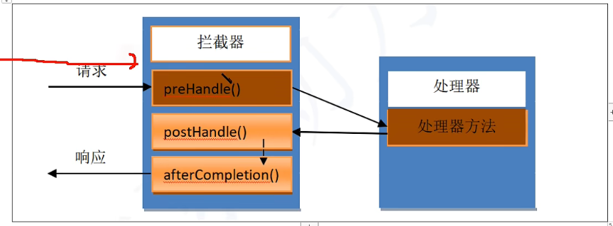

## 拦截器

针对请求和响应进行的二外的处理，在请求和响应过程中添加**预处理，后处理和最终处理**



### 拦截时机

- `preHandle()`在请求处理之前进行的处理
- `postHandle()`在结果没有渲染之前进行的处理，可以改变响应结果
- `afterCompletion()`所有请求响应接触执行后善后工作，清理对象，关闭资源

### 实现两种方式

- 实现接口`HandlerInterceptor`
- 基础父类`HandlerInterceptorAdapter`

一般都是通过接口实现

### 实现步骤

1. 在session中存储用户信息

   ```java
       @RequestMapping("/login")
       public void login(String name , String passwd, HttpServletRequest request){
           System.out.println(name+" : "+passwd);
           request.getSession().setAttribute("Users",name);
       }
   ```

   

2. 开发拦截器的功能，实现接口

   ```java
   public class LoginInterceptor implements HandlerInterceptor {
       @Override
       public boolean preHandle(HttpServletRequest request,
                                HttpServletResponse response,
                                Object handler) throws Exception {
   //        是否登录
           if (request.getSession().getAttribute("Users") == null) {
               System.out.println("没有登录");
               request.getSession().setAttribute("msg","没有登录");
               request.getRequestDispatcher("/admin/login.jsp").forward(request,response);
               return false;
           }else {
               return true;//放行请求
           }
       }
   }
   ```

   

3. 在springmvc.xml中注册拦截器

   在拦截器可以配置拦截器链，来使用多个拦截器

   ```xml
   <!--    进行拦截器的注册-->
       <mvc:interceptors>
           <mvc:interceptor>
   <!--            映射拦截的请求-->
               <mvc:mapping path="/**"/>
   <!--            配置放行的请求-->
               <mvc:exclude-mapping path="/login"/>
               <mvc:exclude-mapping path="/showLogin"/>
   <!--            配置具体的实现类-->
               <bean class="org.example.interceptor.LoginInterceptor"/>
           </mvc:interceptor>
       </mvc:interceptors>
   ```

接口原始方法

```java
    @Override
    public boolean preHandle(HttpServletRequest request,
                             HttpServletResponse response,
                             Object handler) throws Exception {
        
        return HandlerInterceptor.super.preHandle(request, response, handler);
    }
```

返回值为boolean，只有为true的时候才可以进行之后的处理，否则直接结束

