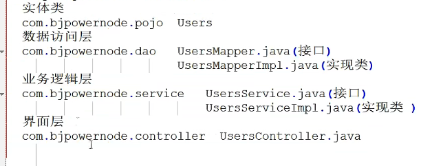

## AOP面向切面编程

将公共的，通用的，重复的代码单独开发，再需要的时候反织回去，原理：动态代理

## 创建对象

```xml
<bean id="stu" class="org.example.pojo.Student"></bean>
```

- id：创建对象的名称
- class：反射的目录

**在代码中使用对象**

```java
//        创建spring容器，并启动才可以创建对象
        ApplicationContext ac = new ClassPathXmlApplicationContext("applicationContext.xml");
        Student stu = (Student) ac.getBean("stu");
        System.out.println(stu);
```

**给创建的对象赋值**

- 使用setter注入法

注：注入分为简单/引用类型注入

简单类型注入使用value属性，引用类型注入使用ref属性

注：使用setter注入必须提供无参的构造方法，必须提供`setXXX()`方法

```xml
    <bean id="stu" class="org.example.pojo.Student">
        <property name="name" value="张三"/>
        <property name="age" value="21"/>
    </bean>
```

**注入引用类型**

```xml
    <bean id="stu" class="org.example.pojo.Student">
        <property name="name" value="张三"/>
        <property name="age" value="21"/>
        <property name="school" ref="school"/>
    </bean>

    <bean id="school" class="org.example.pojo.School">
        <property name="address" value="清华"/>
        <property name="name" value="随便"/>
    </bean>
```

可以看见通过ref可以调用其他bean进行初始化

- 使用构造方法注入

三层结构

