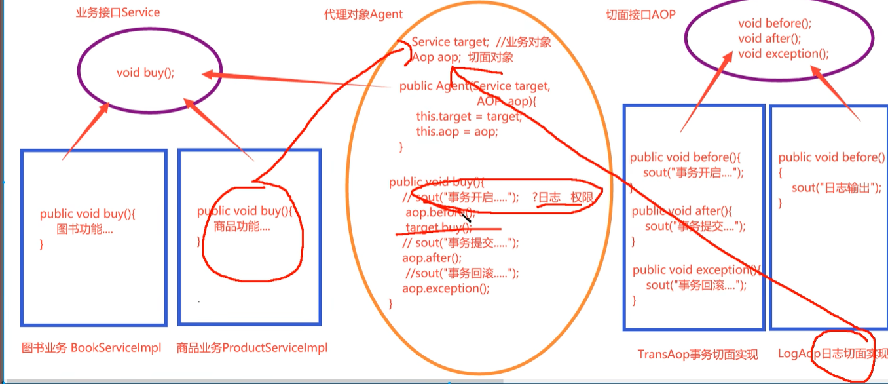
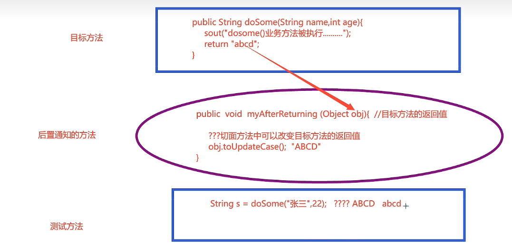
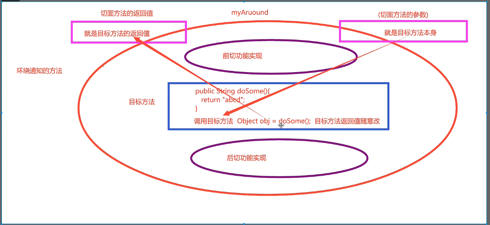
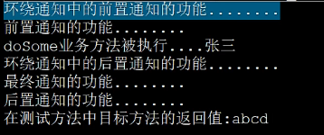

# AOP面向切面编程

切面：公共，通用，重复的功能就被成为切面

## 手写AOP

五个版本

- 业务和切面紧耦合
- 子类代理的方式拆分业务和切面
- 使用静态代理拆分业务和切面
- 使用静态代理拆分业务和业务接口
- 动态代理

版本一

```java
public class BookServiceImpl {
    public void buy(){
        try{
            System.out.println("事务开启");
            System.out.println("购买");
            System.out.println("事务提交");
        }catch (Exception e){
            System.out.println("事务错误");
        }
    }

}
```

版本二

```java
public class SubBookServiceImpl extends BookServiceImpl{
    @Override
    public void buy() {
        try{
            //    事务的切面
            System.out.println("事务开启");
            //    主业务实现
            super.buy();
            //    事务切面
            System.out.println("事务提交");
        }catch (Exception e) {
            System.out.println("事务错误");
        }
    }
}

@Test
public void TestProxy() {
    BookServiceImpl bookService = new SubBookServiceImpl();
    bookService.buy();
}
```

使用子类方法实现业务

版本三：静态代理实现

```java
//接口
public interface Service {
    void buy();
}
//实现类
public class BookServiceImpl implements Service{
    @Override
    public void buy() {
        System.out.println("购买");
    }
}
//代理类
public class Agent implements Service{

    public Service target;

    public Agent(Service target){
        this.target = target;
    }
    @Override
    public void buy() {
        try{
            //    事务的切面
            System.out.println("事务开启");
            //    主业务实现
            target.buy();
            //    事务切面
            System.out.println("事务提交");
        }catch (Exception e) {
            System.out.println("事务错误");
        }
    }
}

@Test
public void TestProxy() {
    Service service = new Agent(new BookServiceImpl());
    service.buy();
}
```

**版本四**:使用静态代理拆分业务和业务接口

在这个版本我们需要灵活的切换业务，如业务，日志，权限验证



```java
public interface AOP {

    default void before(){};
    default void after(){};
    default void except(){};
}

public class LogAOP implements AOP{
    @Override
    public void before() {
        System.out.println("日志输入");
    }

    @Override
    public void after() {
        System.out.println("日志提交");
    }

    @Override
    public void except() {
        System.out.println("日志失败");
    }
}


public class Agent implements Service {

    public Service target;
    public AOP aop;

    public Agent(Service target, AOP aop) {
        this.target = target;
        this.aop = aop;
    }

    @Override
    public void buy() {
        try{
            //    事务的切面
            aop.before();
            //    主业务实现
            target.buy();
            //    事务切面
            aop.after();
        }catch (Exception e) {
            aop.except();
        }
    }
}


```

第五个版本：动态代理

```java
public class ProxyFactory {
    public static Object getAgent(Service target,AOP aop){
        return Proxy.newProxyInstance(
                target.getClass().getClassLoader(),
                target.getClass().getInterfaces(),
                new InvocationHandler() {
                    @Override
                    public Object invoke(Object proxy, Method method, Object[] args) throws Throwable {
                        Object obj = null;
                        try {
                            aop.before();
                            obj = method.invoke(target,args);
                            aop.after();
                        } catch (Exception e) {
                           aop.except();
                        }

                        return obj;
                    }
                }
        );
    }
}


@Test
public void TestProxy() {
    Service agent = (Service) ProxyFactory.getAgent(new BookServiceImpl(), new LogAOP());
    agent.buy();

}
```

这里我们没有自己创建类，而是通过反射自动创建的，现在无论谁只要使用对应接口的方法，无论什么类，什么方法都可以通过代理实现

### Spring中的AOP

- before
- after
- throws
- around

常用术语

- 切面：xxx
- 连接点：就是目标方法，
- 切入点(Pointcut)：多个连接点构成切入点，切入点可以是一个或者多个方法
- 目标对象：操作对象
- 通知(Advice):指定切入的时机。是在目标方法执行前还是执行后切入

## AspectJ框架

四种类型

- before
- after
- around
- after
- 定义切入点`@Pointcut`

切入点表达式

规范

`execution(访问权限 方法返回值 方法声明(参数) 异常类型)`

简化

`execution(方法返回值 方法声明(参数))`

用到的符号：

- `*`通配符
- `..` 如果出现在方法的参数，表示任意参数；如果出现在路径中，代表本路径及其所有的子路径

### 案例

`execution(public * *(..))`任意路径，任意返回值，任意public方法

`execution(* set*(..))`任意以set开头的方法

`execution(* com.example.impl.*.*(..))` com.example.impl下任意类的任意方法的任意参数添加七日面

`execution(* *.service.*.*(..))` service前可以有一个包

`execution(* *..service.*.*(..))`  service之前可以有任意多个包

### 前置种植@before

实现的步骤

1. 创建业务接口

   ```java
   public interface SomeService {
       String doSome(String name , int age);
   }
   ```

2. 创建业务实现

   ```java
   public class SomeServiceImpl implements SomeService{
   
       @Override
       public String doSome(String name, int age) {
           System.out.println("do some service");
           return "abcd";
       }
   }
   ```

3. 创建切面类

   ```java
   @Aspect  //交给aspectj框架
   public class MyAspect {
       /**
        * 所有切面功能由切面方法实现
        * 可以将各种切面方法设置在此类中进行开发
        * <p>
        * 前置通知切面方法的规范
        * 1. 访问全西安public
        * 2， 返回void
        * 3. 方法名称自定义
        * 4. 方法没有参数，如果有也只能是JointPoint类型
        * 5. 必须用@before来声明切入时机和切入点
        */
   
       @Before(value = "execution(public String org.example.s01.SomeServiceImpl.doSome(String,int))")
       public void myBefore() {
           System.out.println("前置功能");
       }
   }
   
   ```

4. 在applicationContext.xml中进行注册

   ```xml
       <bean id="someService" class="org.example.s01.SomeServiceImpl"/>
       <bean id="aspect" class="org.example.s01.MyAspect"/>
   
   <!--    进行绑定-->
       <aop:aspectj-autoproxy/>
   ```

   

### 切换JDK动态代理和CGLib动态代理

```java
<aop:aspectj-autoproxy proxy-target-class="true"/>
```

```java
 @Test
    public void testAspect() {
        ApplicationContext ac =  new ClassPathXmlApplicationContext("applicationContext.xml");
        SomeServiceImpl someService = (SomeServiceImpl) ac.getBean("someService");
//        System.out.println(someService.getClass());//class com.sun.proxy.$Proxy10
        System.out.println(someService.getClass());//class org.example.s01.SomeServiceImpl$$EnhancerBySpringCGLIB$$f5d60a3b
    }
```

此时就不是JDK动态代理，此时子类也可以作为代理类（原本是接口指向实体类，现在是实体类指向实体类）（JDK动态代理只能通过接口实现，CGLib可以通过子类实现）

### 通过注解实现

1. 添加注解
2. 添加扫描

### 前置代理的方法参数JointPoint

```jade
@Before(value = "execution(public String org.example.s01.SomeServiceImpl.doSome(String,int))")
public void myBefore(JoinPoint jp) {

    System.out.println("前置功能");
    //        JoinPoint可以得到目标方法的签名和参数
    System.out.println("目标方法的签名"+jp.getSignature());
    System.out.println("目标方法的参数"+ Arrays.toString(jp.getArgs()));
}


/*
前置功能
目标方法的签名String org.example.s01.SomeServiceImpl.doSome(String,int)
目标方法的参数[123, 123]
do some service
abcd
*/
```

## 后置通知



如果目标方法是8中基本类型或string不可修改，如果是引用类型则可以修改

```java
    /**
     * 后置通知的规范
     * 1.访问权限是public
     * 2.没返回值
     * 3.方法有参数Object obj，如果没有返回值则可以是无参
     * 4.@AfterReturning注解
     * 参数：value
     * returning:指定目标方法的返回值名称，则名称必须与切面方法的参数名称一致
     */
    @AfterReturning(value = "execution(* org.example.s01.*.*(..))",returning = "obj")
    public void myAfter(Object obj) {
        System.out.println("后置通知");

    }

//切面中的返回值ABCD
//abcd
可以看到切面中的值改变了但是返回值没变
```

```java
@AfterReturning(value = "execution(* org.example.s01.*.*(..))",returning = "obj")
public void myAfter(Object obj) {
    System.out.println("后置通知");
    if (obj != null) {
        if (obj instanceof String) {
            obj = obj.toString().toUpperCase();
            System.out.println("切面中的返回值"+obj);
        }
        if (obj instanceof User) {
            User user = (User) obj;
            user.setName("change");
            System.out.println("切面中的返回值"+user);
        }
    }
}

@Override
public User change() {
    System.out.println("user change");

    return new User("123");
}

/*
user change
后置通知
切面中的返回值User{name='change'}
User{name='change'}*/
```

## Around通知

通过连接目标方法的方式，在目标方法前后增强功能的通知，是功能最强大的，同时可以任意改变返回值



```java
    /**
     * 1：public
     * 2：有返回值，返回目标方法的返回值
     * 3：有参数，参数就是目标方法
     * 4.回避异常
     * 5.@Around
     * value:xxxx
     */
    @Around(value = "execution(public String org.example.s01.SomeServiceImpl.doSome(String,int))")
    public Object muAround(ProceedingJoinPoint pjp) throws Throwable {
        System.out.println("前置功能");
        Object obj = pjp.proceed(pjp.getArgs());
        System.out.println("后置功能");
        return obj.toString().toUpperCase();
    }

/**
前置功能
do some service
后置功能
ABCD
*/
```

## 最终通知

```java
    /**
     * 1:public
     * 2:返回void
     * 3：方法参数有也是JoinPoint
     */
    @After(value = "execution(public String org.example.s01.SomeServiceImpl.doSome(String,int))")
    public void myafter() {
        System.out.println("最终");
    }
```

## 顺序



## 给切入点表达式起别名`@Pointcut`

```java
    @After(value = "mycut()")
    public void myafter() {
        System.out.println("最终");
    }

    @Pointcut(value = "execution(public String org.example.s01.SomeServiceImpl.doSome(String,int))")
    public void mycut() {}
```

