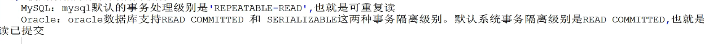
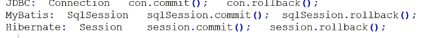
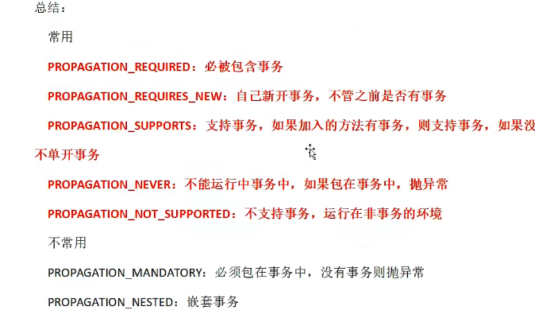
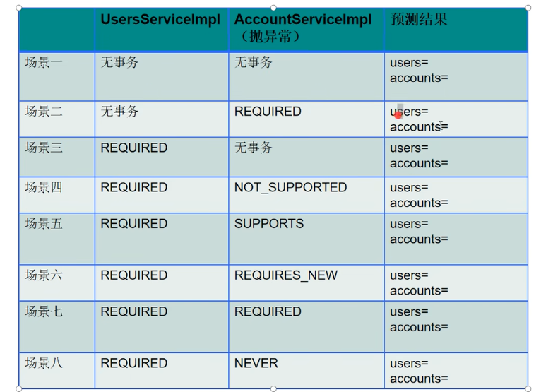
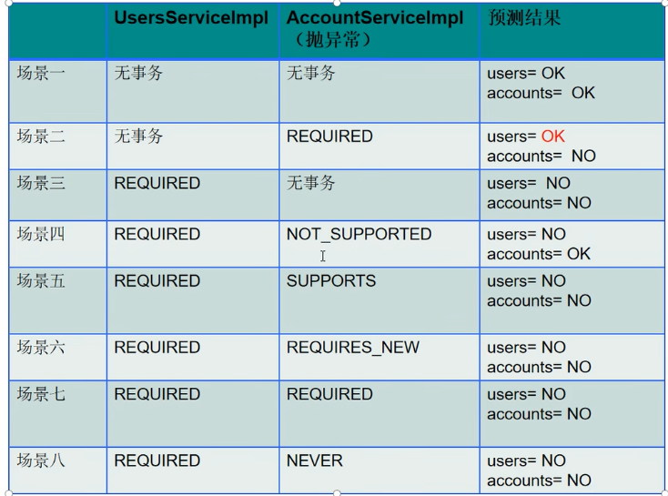
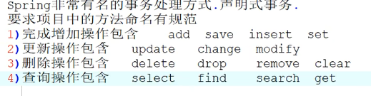

# 事务管理

## 事务的隔离级别

1. 未提交读:Read Uncommitted，允许脏读，可以读取到其他事务会话中未提交修改的数据
2. 提交都：Read Committed
3. 可重复读:Repeated Read。在同一个事务内的查询都是事务开始时刻一致的，InnoDB默认级别，取消了不可重复度，但是还存在幻象读，但是InnoDB解决了幻像
4. 串行度:Serializeable,完全串行化的读，每次读都需要获取表级共享锁，读写完全阻塞
5. 默认隔离级别: `isolation = Isolation.DEFAULT`



事务管理有两种方式

- 注解式

- 声明式(必须掌握)

注解式的弊端： 使用@Transactional可以添加到类或者方法上，进行事务的处理，但是此方法比较臃肿

## 使用事务管理器的原因



用来生产相应技术的连接+执行语句的对象

如果是Mybatis框架，必须使用DataSourceTransactionManager类来处理

只要加了事务管理器就可以生成SqlSession对象

## 事务的传播特性

| **传播行为**                  | **意义**                                                     |
| ----------------------------- | ------------------------------------------------------------ |
| **PROPERGATION_MANDATORY**    | **表示方法必须运行在一个事务中，如果当前事务不存在，就抛出异常** |
| **PROPAGATION_NESTED**        | **表示如果当前事务存在，则方法应该运行在一个嵌套事务中。否则，它看起来和 PROPAGATION_REQUIRED** **看起来没什么俩样** |
| **PROPAGATION_NEVER**         | **表示方法不能运行在一个事务中，否则抛出异常**               |
| **PROPAGATION_NOT_SUPPORTED** | **表示方法不能运行在一个事务中，如果当前存在一个事务，则该方法将被挂起** |
| **PROPAGATION_REQUIRED**      | **表示当前方法必须运行在一个事务中，如果当前存在一个事务，那么该方法运行在这个事务中，否则，将创建一个新的事务** |
| **PROPAGATION_REQUIRES_NEW**  | **表示当前方法必须运行在自己的事务中，如果当前存在一个事务，那么这个事务将在该方法运行期间被挂起** |
| **PROPAGATION_SUPPORTS**      | **表示当前方法不需要运行在一个是事务中，但如果有一个事务已经存在，该方法也可以运行在这个事务中** |


只需要在配置文件中进行配置，整个项目就遵循事务设定



多个事务之间的合并，互斥等都可以设置事务的传播特性来解决

https://www.bilibili.com/video/BV1q94y1o7ts?p=95&spm_id_from=pageDriver&vd_source=8beb74be6b19124f110600d2ce0f3957

 七个事务隔离级别：
    不要事务：
        never（上层调用方法中有事务就抛异常）、
        not_supported（上层调用方法中有事务就将该事务挂起继续运行）
    事务可有可无：
        supports（有就用，没有就不用）
    必须要有事务：
        requires_new（有没有都新建）、
        nested（没有就新建，有就在当前事务中嵌套子事务，子事务不影响父事务（父捕获子方法的异常时），父事务影响子事务）、
        required（没有就新建，有就加入当前事务）、
        mandatory（有就用，没有就抛异常）

## 实例

此时我们有两个事务，AccountService和UsersService

### 事务的嵌套

UserService实现UsersService的方法

```java
@Autowired
UsersMapper usersMapper;

@Autowired
AccountsService accountsService;


@Override
public int insert(Users users) {
    int num = 0 ;
    num = usersMapper.insert(users);
    num = accountsService.save(new Accounts(300, "张一", "ok"));

    return num ;
}
```

注：项目中所有的事务必须添加到业务逻辑层上，save中有一个异常



- 都没有事务，可以增加（会报错）
- 场景二：Users添加成功，Account添加失败
- 场景三：都失败，相当于两者共用一个事务
- 场景四：会挂起usersService，Users添加成功，Account添加失败
- 场景五：都失败
- 场景六：都失败，因为users包含account，account异常，全部回滚
- 场景七：都失败
- 场景八：都失败，但是用户sql通过，但是account事务直接失败



## 声明式事务



使用规范那么之后就可以使用通配符

- 取消之前的事务管理器，和注释

```xml
<!--    添加包扫描-->
    <context:component-scan base-package="org.example.service"/>
<!--    事务处理-->
<!--    1.添加事务管理器-->
<!--    <bean id="transactionManager" class="org.springframework.jdbc.datasource.DataSourceTransactionManager">-->
<!--&lt;!&ndash;        因为事务必须关联数据库处理，所以要配置数据源&ndash;&gt;-->
<!--        <property name="dataSource" ref="dataSource"/>&lt;!&ndash;就是之前那个数据源&ndash;&gt;-->
<!--    </bean>-->
<!--&lt;!&ndash;    2.添加注解驱动&ndash;&gt;-->
<!--&lt;!&ndash;    就是上一步中的事务管理器&ndash;&gt;-->
<!--    <tx:annotation-driven transaction-manager="transactionManager"/>-->
```

- 新建applicationContext_trans.xml

```xml
<?xml version="1.0" encoding="UTF-8"?>
<beans xmlns="http://www.springframework.org/schema/beans"
       xmlns:xsi="http://www.w3.org/2001/XMLSchema-instance"
       xmlns:context="http://www.springframework.org/schema/context"
       xmlns:tx="http://www.springframework.org/schema/tx" xmlns:aop="http://www.springframework.org/schema/aop"
       xsi:schemaLocation="http://www.springframework.org/schema/beans http://www.springframework.org/schema/beans/spring-beans.xsd http://www.springframework.org/schema/context https://www.springframework.org/schema/context/spring-context.xsd http://www.springframework.org/schema/tx http://www.springframework.org/schema/tx/spring-tx.xsd http://www.springframework.org/schema/aop https://www.springframework.org/schema/aop/spring-aop.xsd">
<!--    事务管理器配置文件-->
<!--    添加包扫描-->
    <context:component-scan base-package="org.example.service.impl"/>
<!--    添加事务管理器-->
    <bean id="transactionManager" class="org.springframework.jdbc.datasource.DataSourceTransactionManager">
        <property name="dataSource" ref="dataSource"/>
    </bean>
<!--    配置事务切面 并进行配置-->
    <tx:advice id="myAdvice" transaction-manager="transactionManager">
        <tx:attributes>
            <tx:method name="*select*" read-only="true"/>
            <tx:method name="*search*" read-only="true"/>
            <tx:method name="*find*" read-only="true"/>
            <tx:method name="*get*" read-only="true"/>
            <tx:method name="*insert*" propagation="REQUIRED" no-rollback-for="ArithmeticException"/>
            <tx:method name="*save*" propagation="REQUIRED" no-rollback-for="ArithmeticException"/>
            <tx:method name="*set*" propagation="REQUIRED"/>
            <tx:method name="*update*" propagation="REQUIRED"/>
            <tx:method name="*remove*" propagation="REQUIRED"/>
            <tx:method name="*delete*" propagation="REQUIRED"/>
            <tx:method name="*clear*" propagation="REQUIRED"/>
            <tx:method name="*" propagation="SUPPORTS"/>
        </tx:attributes>
    </tx:advice>
    <!--    绑定切面和切入点-->
    <aop:config>
        <aop:pointcut id="mycut" expression="execution(* org.example.service.impl.*.*(..))"/>
        <aop:advisor advice-ref="myAdvice" pointcut-ref="mycut"/>
    </aop:config>
</beans>
```

- 所有切面配置都可以在tx:method中进行配置如propagation和no-rollback-for，name指定需要绑定的方法的名称

- 之后需要绑定切面和切入点具体配置如下

## 事务的优先级

在宏观下有自己个性化的设置，可以通过注解来屏蔽全局的事务传播特性

可以设置优先级

```xml
<!--    事务处理-->
<!--    1.添加事务管理器-->
<bean id="transactionManager" class="org.springframework.jdbc.datasource.DataSourceTransactionManager">
    <!--        因为事务必须关联数据库处理，所以要配置数据源-->
    <property name="dataSource" ref="dataSource"/><!--就是之前那个数据源-->
</bean>
<!--    2.添加注解驱动-->
<!--    就是上一步中的事务管理器-->
<tx:annotation-driven transaction-manager="transactionManager" order="100"/>


<aop:config>
    <aop:pointcut id="mycut" expression="execution(* org.example.service.impl.*.*(..))"/>
    <aop:advisor advice-ref="myAdvice" order="1" pointcut-ref="mycut"/>
</aop:config>
```

通过指定不同的order可以完成优先级设置，order越大优先级越高
