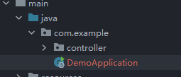

## 1.1 SpringBoot入门

### Features

- Create stand-alone Spring applications
- Embed Tomcat, Jetty or Undertow directly (no need to deploy WAR files)
- Provide opinionated 'starter' dependencies to simplify your build configuration
- Automatically configure Spring and 3rd party libraries whenever possible
- Provide production-ready features such as metrics, health checks, and externalized configuration
- Absolutely no code generation and no requirement for XML configuration

## 1.2创建springboot项目

- 使用spring.io
- springboot提供的初始化器，使用国内地址`https://start.springboot.io`
- maven创建`https://start.springboot.io`下载模板，直接使用

**一个简单的controller**

```java
@Controller
public class HelloSpring {
    @RequestMapping("/hello")
    @ResponseBody
    public String hello() {
        return "hello world!";
    }
}
```

## 1.3 重要的注解

主启动类中的注解

```java
@SpringBootApplication
```

是一个复合注解

```java
@SpringBootConfiguration
@EnableAutoConfiguration
@ComponentScan(
    excludeFilters = {@Filter(
    type = FilterType.CUSTOM,
    classes = {TypeExcludeFilter.class}
), @Filter(
    type = FilterType.CUSTOM,
    classes = {AutoConfigurationExcludeFilter.class}
)}
)
```

### @SpringBootConfiguration

```java
//@SpringBootConfiguration
@Target({ElementType.TYPE})
@Retention(RetentionPolicy.RUNTIME)
@Documented
@Configuration
@Indexed
//可以看见主要功能是定义一个javaconfig
//可以在配置文件中声明一个对象来注入！！！
```

### @EnableAutoConfiguration

启动自动配置，把java对象配置好，注入到springboot中，比如mybatis的对象处理好注入到容器中

```java
@Target({ElementType.TYPE})
@Retention(RetentionPolicy.RUNTIME)
@Documented
@Inherited
@AutoConfigurationPackage
@Import({AutoConfigurationImportSelector.class})
```

### @ComponentScan

扫描器，用来找到注解，根据注解功能创建对象，给属性赋值

默认扫描的包为`@ComponentScan`所在包和子包中的类



## 1.4 配置文件

在resources文件下的application文件后缀可以是properties,yml

**修改端口号**

```properties
server.port=9092
#设置上下文路径 contextpath /myboot/hello
server.servlet.context-path=/myboot
```

```yaml
server:
  port: 8082
  servlet:
    context-path: /myboot
```

两个都存在，默认使用properties的文件

## 1.5 多环节配置

项目的多个阶段：开发，测试，上线

创建多个配置文件application-xxx.yml

可以在主文件application.yml中进行选择

```yaml
#激活配置文件
spring:
  profiles:
    active: dev/test/online
```

