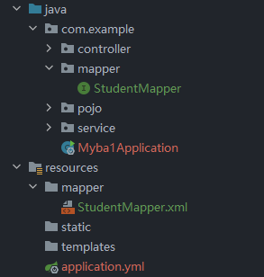

## 1. 准备

- 建表

## 2. ORM操作MySql

使用步骤：

1. 完成mybatis对象自动配置，对象放在容器中
2. pom.xml指定把java目录中的xml文件包含到classpath中
3. 创建实体类Student
4. 创建Dao接口StudentMapper,以及对应的Mapper.xml文件
5. 创建Service层对象，创建StudentService接口和他的实现类，取调用mapper层的方法
6. 创建controller对象，访问service层
7.  写application.yml文件，配置数据库连接信息

需要的配置项


**创建实体类以及mapper**

```java
@Mapper
public interface StudentMapper {
    Student selectById(@Param("stuId") Integer id);
}

```

```xml
<mapper namespace="com.example.mapper.StudentMapper">
    <select id="selectById" resultType="student">
        select id,name,age from student where id = #{stuId};
    </select>
</mapper>
```

**service**

```java
public interface StudentService {
    Student queryStudentById(Integer id);
}

@Service
public class StudentServiceImpl implements StudentService {

    @Resource
    private StudentMapper studentMapper;

    @Override
    public Student queryStudentById(Integer id) {
        return studentMapper.selectById(id);
    }
}

```

**controller**

```java

@Controller
public class StudentController {

    @Resource
    private StudentService studentService;

    @RequestMapping("/stu/query")
    @ResponseBody
    public String queryById(Integer id) {
        return studentService.queryStudentById(id).toString();
    }
}

```

**pom**

```xml
 <resources>
            <resource>
                <directory>src/main/java</directory>
                <includes>
                    <include>**/*.xml</include>
                    <include>**/*.properties</include>
                </includes>
            </resource>
        </resources>
```

**application**

```yaml
mybatis:
  type-aliases-package: com.example.pojo

spring:
  datasource:
    driver-class-name: com.mysql.cj.jdbc.Driver
    url: jdbc:mysql://120.48.155.196:3306/springdb?useUnicode=true&characterEncoding=utf8
    username: root
    password: zh123456
server:
  port: 9001
  servlet:
    context-path: /orm
```

https://www.bilibili.com/video/BV1XQ4y1m7ex?p=46&vd_source=8beb74be6b19124f110600d2ce0f3957

## 3. 注解的使用

### 第一种方式@mapper

@Mapper：放在dao接口上，每个接口上都要放

```java
@Mapper
public interface StudentMapper {
    Student selectById(@Param("stuId") Integer id);
}
```

### 第二种方式@MapperScan

如果mapper的接口比较多的时候，第一种方式就比较麻烦

这时候只需要在主类中使用`@MapperScan`加上包名

```java
@SpringBootApplication
@MapperScan(basePackages = "com.example.mapper")
public class Myba1Application {

    public static void main(String[] args) {
        SpringApplication.run(Myba1Application.class, args);
    }

}
```

`String[] basePackages() default {};`这是一个数组可以配置多个扫描地区使用`{"xx","xx"}`

## 4. 分开xml和mapper文件

在resource目录下创建mapper文件夹并把xml文件放在此文件夹



还需要进行配置

```yaml
mybatis:
  type-aliases-package: com.example.pojo
  mapper-locations: classpath:mapper/*.xml
```

pom也需要配置一下

```xml
<resource>
    <directory>src/main/resources</directory>
    <includes>
        <include>**/*.xml</include>
        <include>**/*.properties</include>
    </includes>
</resource>
```

**添加一下日志**

```yaml
mybatis:
  type-aliases-package: com.example.pojo
  mapper-locations: classpath:mapper/*.xml
  configuration:
    log-impl: org.apache.ibatis.logging.stdout.StdOutImpl
```

