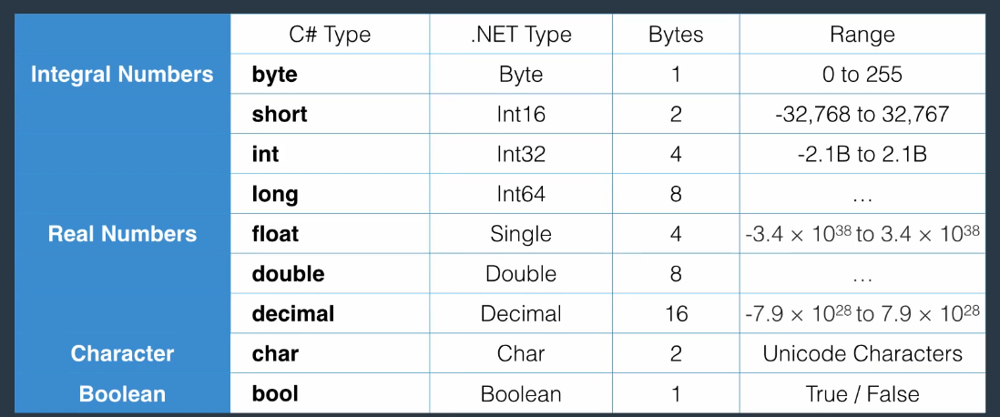
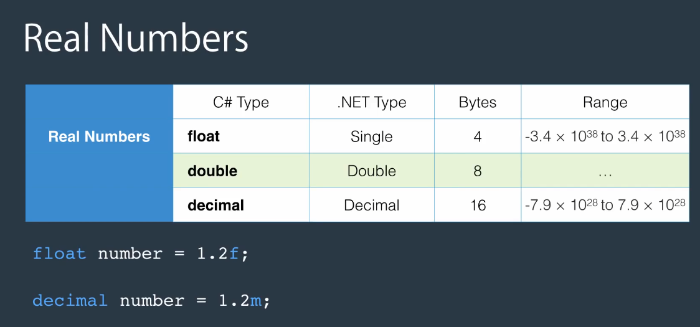
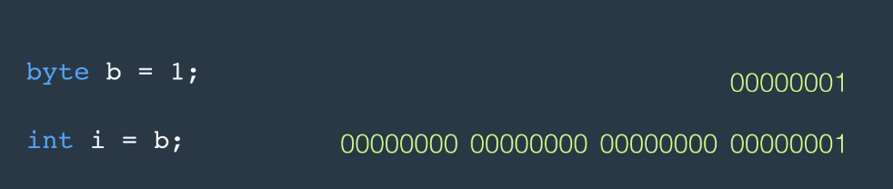
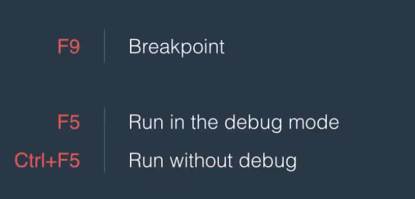
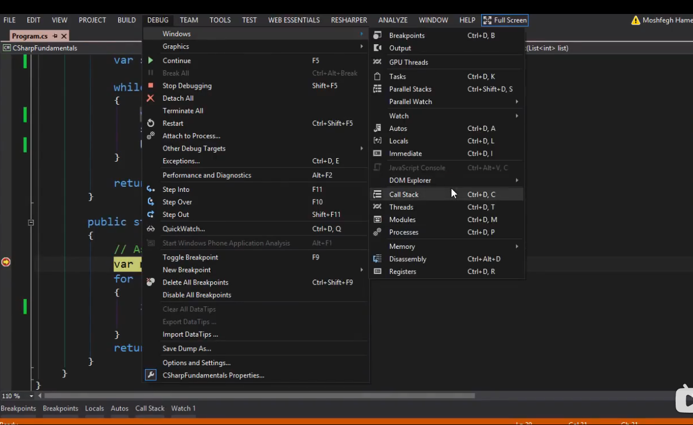

# C#

- namespace   我们可以通过using来使用namespace中所有的类

常见的namespace比如system涵盖了大部分常用的类

 命名规则：

局部变量----使用驼峰式

常量----使用全大写开头



C#在使用实数时默认使用double类型，因此在声明一个浮点数的时候我们需要明确的告诉编辑器其类型



**var**:可以简单的声明一个变量，编辑器会自动的根据初始化的值更新类型

**字符串初始化**

```c#
Console.WriteLine("{0},{1}",byte.MinValue,byte.MaxValue);
```

### 格式转换

隐式转换

```c#
byte b = 1;
int i = b ;
```



强制类型转换

```python
float f = 1.0f
int i = (int)f
```

字符和数字之间的转换

```c#
string s = "1";
int i = Convert.ToInt32(s);
int j = int.Parse(s);
Console.WriteLine(i);
```

同样 Convert有很多类如

- ToByte()
- ToInt16()----32,64

### 异常处理

```c#
var s = "1234";
try
{
    int i = Convert.ToByte(s);
    int j = int.Parse(s);
}
catch (Exception)
{

    Console.WriteLine("num cant be converted");
}
```

## 1. 列表和函数

```c#
using System;
using System.Collections.Generic;

namespace app1
{
    internal class Program
    {
        static void Main(string[] args)
        {
            var list_num = new List<int> { 1, 2, 3, 4, 5, 6, 7 };
            var smallests = GetSmallests(list_num, 3);
            foreach (var item in smallests)
            {
                Console.WriteLine(item);
            }
        }

        public static List<int> GetSmallests(List<int> list, int count)
        {
            var smallests = new List<int>();
            while (smallests.Count < count)//.Count 查看列表长度
            {
                var min = GetSmallest(list);
                smallests.Add(min);
                list.Remove(min);
            }
            return smallests;
        }

        public static int GetSmallest(List<int> list)
        {
            var min = list[0];
            for (int i = 0; i < list.Count; i++)
            {
                if (list[i] > min) min = list[i];
            }
            return min;
        }
    }
}

```



### 抛出异常

```c#
public static List<int> GetSmallests(List<int> list, int count)
{
    var smallests = new List<int>();
    if (count > list.Count) throw new ArgumentOutOfRangeException("count");
    while (smallests.Count < count)//.Count 查看列表长度
    {
        var min = GetSmallest(list);
        smallests.Add(min);
        list.Remove(min);
    }
    return smallests;
}
```

> 可以在debug过程中查看调用的栈,来精准定位代码位置
>
> 
