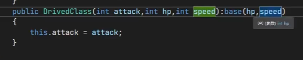

# 面向对象

****

## 1. 异常

```python
try
{
    int a = 100;
}
catch (IndexOutOfRangeException bug)
{
    Console.WriteLine(bug);
    throw;
}
catch(Exception e)
{
    Console.WriteLine(e);
    throw;
}
finally
{
    Console.WriteLine("无论是否出现异常都会执行");
}
```

注意下面catch的异常不能是上面的超类！！！

## 2. 类

**构造参数**

```c#
 internal class human
 {
     int id;
     string name;
     List<goal> goals;

     public human()
     {
         this.goals = new List<goal>;
     }
     public human(int id, string name):this()
     {
         this.id = id;
         this.name = name;

     }
 }
```

**get , set**

可以直接在属性类增加get，set

```c#
internal class Human
{
    private int _id;
    string name;
    List<goal> goals;

    public int Id
    {
        get
        {
            return _id;
        }
        set
        {
            this._id = value;
        }
    }

Human human = new human();
human.Id =32;
Console.WriteLine(human.Id)
```

有种情况直接创建getset，系统会自动创建属性

```c#
internal class Human
{
    string name;
    List<goal> goals;
    int id;
    public int age { get; set; }
}

Human human = new Human();
human.Age = 100;
Console.WriteLine(human.Age);
Console.WriteLine("10123123");
```

### 2.1 值类型和引用类型

- 整数，bool，struct，小数，enum为值类型
- string，数组，类，内置类为引用类型

### 2.2 继承

子类访问父类的参数

```python
base/this.id = id;
```

如果子类没有覆盖id，那么base.id === this.id\

覆盖了那么两者指向的就不同了


但是new可以显示的隐藏基类成员！！！！有没有都一样

```c#
public new int id;
```

#### Virtual

Virtual 和  override对应，

如果使用父类定义，子类声明，写了override就是直接重写

否则默认使用父类方法

如果使用子类定义，子类声明，那么默认使用子类

#### 隐藏方法

```c#
    public new void print_base()
    {
        Console.WriteLine(this.id);
        Console.WriteLine(base.id);
    }
```

主动隐藏父类方法

两者的区别

- 隐藏方法：如果是父类定义，子类声明，那么使用的方法就是父类的方法
- 如果是虚方法的话，前面这种情况显示子类方法！！

### 2.3 抽象类和密封类

```c#
abstract class xxx{
    public abstract xxx xxx();
}
```

只有函数定义，没有声明

> 1,抽象方法即是虚拟方法(隐含);
>
> 2,抽象方法只能在抽象类中声明;
>
> 3,因为抽象方法只是声明, 不提供实现, 所以方法只以分号结束,没有方法体,即没有花括号部分;如
>
> ```
> public abstract void MyMethod();
> ```
>
> 4,override修饰的覆盖方法提供实现,且只能作为非抽象类的成员;
>
> 5,在抽象方法的声明上不能使用virtual或者是static修饰.即不能是静态的,又因为abstract已经是虚拟的,无需再用virtual强调.
>  抽象属性尽管在行为上与抽象方法相似,但仍有有如下不同:
>
> 1,不能在静态属性上应用abstract修饰符;
>
> 2,抽象属性在非抽象的派生类中覆盖重写,使用override修饰符;

**密封**

```c#
sealed class xxxx{
    
}
```

sealed类防止被new覆盖,但是可以override，如果是`sealed override`就是不能再次被重写

sealed类不能被继承

### 2.4 子类构造函数

```c#
class xxx:base
{
    public xxx():base()
    {
        
    }
}
```

会先调用父类的构造函数，之后调用子类的构造函数

如果不写的话也会自动调用父类的构造函数，但是默认调用无参的



### 2.5 修饰符

- public 同一程序集(DLL,exe)任何其他代码或者其他引用该程序集的程序集都可以访问
- private: 同一类或者结构才可以访问
- protected: 同一类，结构，派生类，可以访问
- internal：同一程序集种任何代码都可以访问该类型或者成员，但其他程序集不行（其他引用也不行）
- protected internal: 在同一程序集：和internal一样，在其他程序集种：体现protected


public class 其他程序集可以使用,class其他程序集不可以使用

### 2.6 其他关键字

- readonly  声明只读字段 ，只可以在声明和构造函数种初始化

可以和static同时使用，只可以在声明和静态初始化函数种初始化

- static   静态函数只能使用静态数据

静态类只能包含静态成员

## 3. 接口

```c#
public interface Ixxx{
    void Fly();
}
public class A:Ixxx{
    
}
```

注：接口语法上和首相类相同，但不允许任何任何成员实现，接口不能构造有函数

接口只能包含属性，方法，索引器和事件的声明，且接口成员必须是公有的

- 接口可以彼此继承

```c#
public interface Ixxx{
    void Fly();
}
public interface Iff:Ixxx{
    void Fly();
}
```

继承了接口就必须实现其方法

类可以实现多个接口，但是只能继承一个类

## 4. 索引器

索引：

```c#
int[] array = {1,23,4};
int b = array[1]
```

索引器就是类中的索引

```c#
class Cm : en
{
    //public int a = 10;
    public override void pp()
    {
        Console.WriteLine(this.a);
    }

    public int this[int idex]
    {
        get
        {
            return 1000;
        }
        set
        {
            Console.WriteLine(value);
        }
    }
}

Cm cm = new Cm();
int a = cm[1];
Console.WriteLine(a);//1000
cm[1] = 100;//100
```

里面有两个值

- index  输入的索引
- value   set输入的值

可以在类里面设置数组，之后通过索引取出

## 5. 运算符重载

```c#
public static bool operator==(C c1,C c2){
    return c1.id == c2.id;
}
public static bool operator!=(C c1,C c2){
    return c1.id != c2.id;
}
```

注重写了==，就必须重写!=

## 6. 可变长度列表

```c#
List<int> list = new List<int>(){1,2,3,4};
list.Count//列表的长度
```

> 空列表添加元素之后，内容扩大为4，添加到第五个扩大为8，之后为16
>
> 如果`List<int> list = new List<int>(10)`创建了初始容量为10的列表，容量不够时，会按照之前的2倍进行叠加

### 常见操作

```c#
foreach(int temp in list){
    xxxxx
}
```

- `list.Capacity`显示列表的容量
- `Add,insert(index item)` 添加元素,add添加到末尾，insert添加到指定位置
- `list.Count`列表的长度
- `RemoveAt(index)`删除指定位置的元素，`Remove(item)`删除指定第一个匹配项，`ReomoveAll(item)`删除所有匹配项(使用lamda表达式)
- `IndexOf()`返回第一个匹配元素的索引，`LastIndexOf()`从后向前搜索
- `Sort()`从小到大排序

## 7. 泛型

两类：泛型类和泛型方法

### 泛型类

实现通过同种代码，操作多种类型

```c#
    internal class test<T>
    {
        private T a;
        private T b;
        public test(T a, T b)
        {
            this.a = a;
            this.b = b;
        }
        public T getSum()
        {//某些情况下不能这么写--return a+b;
            dynamic num1 = a;
            dynamic num2 = b;
            return (T)(num1 + num2);
        }
    }
```

> dynamic 其目的是在程序编译过程中忽略对类型的检查，等到运行时刻再明确定义的对象的类型。
>
>  
>
> var关键字和dynamic做比较。实际上，var和dynamic完全是两个概念，var实际上是[编译器](https://so.csdn.net/so/search?q=编译器&spm=1001.2101.3001.7020)抛给我们的“语法糖”，一旦被编译，编译器会自动匹配var 变量的实际类型，并用实际类型来替换该变量的声明，这看上去就好像我们在编码的时候是用实际类型进行声明的。而dynamic被编译后，实际是一个object类型，只不过编译器会对dynamic类型进行特殊处理，让它在编译期间不进行任何的类型检查，而是将类型检查放到了运行期。

**ToString**

```c#
public override string ToString()
{
    xxx;
    return xxx;
}
```

### 泛型方法

```c#
public static T GetSun<T>(T a,T b){
    dynamic num1 = a;
    dynamic num2 = b;
    return (T)(num1 + num2);
}
```

## 8.Equals

判断值是否相等

但是自定义类比较的是比较引用，如果想要比较数据可以重写

```c#
public override bool Equals(object obj){
    Student stu = (Student)obj;
    if(stu.id==this.id) return True;
    else return False;
}
```


