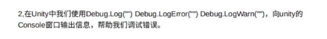
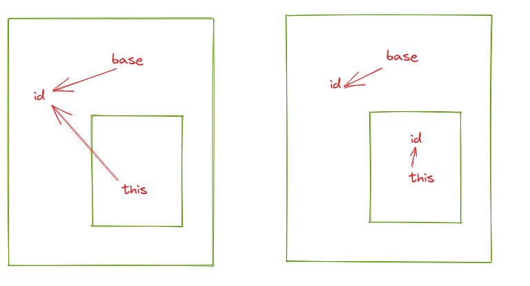

# 面向对象

****

## 1. 异常

```python
try
{
    int a = 100;
}
catch (IndexOutOfRangeException bug)
{
    Console.WriteLine(bug);
    throw;
}
catch(Exception e)
{
    Console.WriteLine(e);
    throw;
}
finally
{
    Console.WriteLine("无论是否出现异常都会执行");
}
```

注意下面catch的异常不能是上面的超类！！！

## 2. 类

**构造参数**

```c#
 internal class human
 {
     int id;
     string name;
     List<goal> goals;

     public human()
     {
         this.goals = new List<goal>;
     }
     public human(int id, string name):this()
     {
         this.id = id;
         this.name = name;

     }
 }
```

**get , set**

可以直接在属性类增加get，set

```c#
internal class Human
{
    private int _id;
    string name;
    List<goal> goals;

    public int Id
    {
        get
        {
            return _id;
        }
        set
        {
            this._id = value;
        }
    }

Human human = new human();
human.Id =32;
Console.WriteLine(human.Id)
```

有种情况直接创建getset，系统会自动创建属性

```c#
internal class Human
{
    string name;
    List<goal> goals;
    int id;
    public int age { get; set; }
}

Human human = new Human();
human.Age = 100;
Console.WriteLine(human.Age);
Console.WriteLine("10123123");
```

### 2.1 值类型和引用类型

- 整数，bool，struct，小数，enum为值类型
- string，数组，类，内置类为引用类型

### 2.2 继承

子类访问父类的参数

```python
base/this.id = id;
```

如果子类没有覆盖id，那么base.id === this.id\

覆盖了那么两者指向的就不同了



但是new可以显示的隐藏基类成员！！！！有没有都一样

```c#
public new int id;
```

#### Virtual

Virtual 和  override对应，

