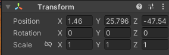

transform对象会的当前对应的物体的位置

具体对象如图



```c#
using UnityEngine;
using CreatorKitCode;

public class SpawnerSample : MonoBehaviour
{
    public GameObject ObjectToSpawn;
     //存放距离
    public int radius=15;
    void Start()
    {
        int angle = 15;

        //声明一个 3D Vector (矢量) 对象 spawnPosition 并赋值为当前游戏对象的位置
        Vector3 spawnPosition = transform.position;

        // 声明一个 3D Vector (矢量) 对象 direction，并使用 Quaternion（四元数）类的静态方法  Euler（欧拉）返回值 * Vector3(1,0,0)
        // 四元数 Quaternion 是 unity 3d 系统中，用来处理旋转的类
        // 说白了就是创建一个 方向对象，指定一个方向，旋转多少角度，然后生成一个向量坐标
        Vector3 direction = Quaternion.Euler(0, angle, 0) * Vector3.right;
        // 重新计算 spawnPosition 的值，原来的位置坐标 + 一个方向 * 距离
        spawnPosition = transform.position + direction * radius;
        // 用 Object 的 Instantiate（实例化） 静态方法实例化游戏对象
        Instantiate(ObjectToSpawn, spawnPosition, Quaternion.identity);

        angle = 55;
        direction = Quaternion.Euler(0, angle, 0) * Vector3.right;
        spawnPosition = transform.position + direction * radius;
        Instantiate(ObjectToSpawn, spawnPosition, Quaternion.identity);

        angle = 95;
        direction = Quaternion.Euler(0, angle, 0) * Vector3.right;
        spawnPosition = transform.position + direction * radius;
        Instantiate(ObjectToSpawn, spawnPosition, Quaternion.identity);
    }
}


```

`Quaternion.Euler`用来左旋转的，这里创建了一个方向https://docs.unity3d.com/2021.2/Documentation/Manual/class-Quaternion.html

```c#
// 重新计算 spawnPosition 的值，原来的位置坐标 + 一个方向 * 距离
spawnPosition = transform.position + direction * radius;
```

```c#
// 用 Object 的 Instantiate（实例化） 静态方法实例化游戏对象
Instantiate(ObjectToSpawn, spawnPosition, Quaternion.identity);
```

常用的数据类型


bool类型

var：系统会自动推断出所用的类型

类型? 表示类型可空

## 对象

对象不能像普通属性一样在component中直接复制，需要在类之前添加`[Serializable]`就可以在component中进行直接设置

**Unity中类运行的机制**

我们定义的任何继承自MonoBehaviour的组件类，都会自动被创建为实例后，才会被加载到游戏中，unity会自动生产我们定义的组件的空构造方法，用该方法创建对象，然后根据inspector中的组件配置，将组件对象加载到游戏对象中，执行相关组件操作

