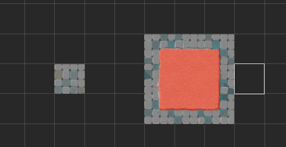
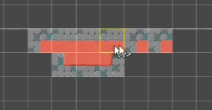
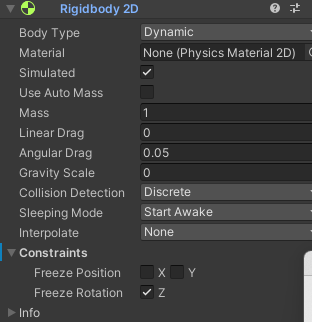

# 2D
项目地址https://learn.unity.com/project/ruby-s-adventure-2d-chu-xue-zhe
## 移动精灵
- 创建新的脚本RubyController
```C#
public class RubyController : MonoBehaviour
{
    // Start is called before the first frame update
    void Start()
    {
        
    }

    // Update is called once per frame
    void Update()
    {
        
    }
}
```

目标：让游戏对象每帧移动0.1
```C#
    void Update()
    {
        //Vector2对象用来存储当前的位置
        Vector2 position = transform.position;
        position.x = position.x + 0.1f;
        transform.position = position;
    }
```
### 使用键盘控制
在数学中，Vector 向量/矢量指的是带方向的线段

在 Unity 中，Transform 值使用 x 表示水平位置，使用 y 表示垂直位置，使用 z 表示深度。这 3 个数值组成一个坐标。由于此游戏是 2D 游戏，你无需存储 z 轴位置，因此你可以在此处使用 Vector2 来仅存储 x 和 y 位置。

Transform 中 position 的类型，也是 Vector2

C# 这种强类型语言，赋值时，左右必须是同一类型才能进行

**常见的控制方式**
-   鼠标键盘
-   手机触屏、重力
-   手柄
-   体感
-   可穿戴设备，比如 VR 、AR 眼镜 常用的瞳孔控制
-   声音控制
**使用最原始的键盘控制**
```C#
    void Update()
    {
        // 获取水平输入，按向左，会获得 -1.0 f ; 按向右，会获得 1.0 f
        float horizontal = Input.GetAxis("Horizontal");
        // 获取垂直输入，按向下，会获得 -1.0 f ; 按向上，会获得 1.0 f
        float vertical = Input.GetAxis("Vertical");

        // 获取对象当前位置
        Vector2 position = transform.position;
        // 更改位置
        position.x = position.x + 0.1f * horizontal;
        position.y = position.y + 0.1f * vertical;
        // 新位置给游戏对象
        transform.position = position;
    }
```
在 Unity 项目设置中，可以通过 Input Manager 进行默认的游戏输入控制设置
Edit > Project Settings > Input
键盘按键，以 2 个键来定义轴：
-   负值键 negative button，被按下时将轴设置为 -1
-   正值键 positive button ，被按下时将轴设置为 1
Axis 轴 Axes 是它的负数形式
-   Horizontal Axis： 水平轴 对应 X 轴
-   Vertical Axis：纵轴 对应 Y 轴
**input类**
[UnityEngine.Input 官方 API 文档](https://gitee.com/link?target=https%3A%2F%2Fdocs.unity3d.com%2Fcn%2Fcurrent%2FScriptReference%2FInput.html)
使用该类来读取传统游戏输入中设置的轴/鼠标/按键，以及访问移动设备上的多点触控/加速度计数据。

若要使用输入来进行任何类型的移动行为，请使用 Input.GetAxis。 它为您提供平滑且可配置的输入 - 可以映射到键盘、游戏杆或鼠标。 请将 Input.GetButton 仅用于事件等操作。****不要将它用于移动操作****。Input.GetAxis 将使脚本代码更简洁。

代码版本 3：
```C#
public class RubyController : MonoBehaviour
{
   // 每帧调用一次 Update
   // 可以这样做，但不建议
   void Update()
   {
       Vector2 position = transform.position;
       if(Input.GetKey("d")){
           position.x = position.x + 0.1f;
       }
       if(Input.GetKey("a")){
           position.x = position.x - 0.1f;
       }
       if(Input.GetKey("s")){
           position.y = position.y - 0.1f;
       }
       if(Input.GetKey("w")){
           position.y = position.y + 0.1f;
       }
       transform.position = position;
   }
}
```
### 时间和帧率
#帧率和速度的关系
遇到的问题：虽然只移动0.1但是移动速度还是还是很快
原因:帧率太高，update是在每一帧的时候执行，如果是60帧，移动就是`0.1*60`同理，帧率越低，速度越慢
解决：这只帧数
```C#
    void Start()
    {
        // 只有将垂直同步计数设置为0，才能锁帧，否则锁帧的代码无效
        // 垂直同步的作用就是显著减少游戏画面撕裂、跳帧，因为画面的渲染不是整个画面一同渲染的，而是逐行或逐列渲染的，能够让FPS保持与显示屏的刷新率相同。
        QualitySettings.vSyncCount = 0;
        //设定应用程序帧数为10
        Application.targetFrameRate = 10;

    }
```
但是锁帧不是一个好选项
这里我们需要通过时间来移动
引入Time.deltaTime 每帧的时间间隔，float 类型
为此，你需要通过将移动速度乘以 Unity 渲染一帧所需的时间来更改移动速度。如果游戏以每秒 10 帧的速度运行，则每帧耗时 0.1 秒。如果游戏以每秒 60 帧的速度运行，则每帧耗时 0.017 秒。如果将移动速度乘以该时间值，则移动速度将以秒表示。

## 使用TileMap制作地图
[Tilemap 官方手册](https://gitee.com/link?target=https%3A%2F%2Fdocs.unity3d.com%2Fcn%2F2021.2%2FManual%2Fclass-Tilemap.html)
Tilemap 是 2D 游戏中，用来构建世界的工具，这个工具使用技术的好坏，直接影响到你制作 2D 游戏时的工作量

The Tilemap component is a system which stores and handles Tile Assets for creating 2D levels.  
瓦片地图组件，是一个存储和操作 Tile 资源的系统，用来创建 2D 关卡。

It transfers the required information from the Tiles placed on it to other related components such as the Tilemap Renderer and the Tilemap Collider 2D.  
该系统还可以将所需信息通过所包含的 Tiles 传输到其他相关组件，例如 Tilemap Renderer 和 Tilemap Collider 2D。

**创建瓦片地图时，Grid 组件自动作为瓦片地图的父级，并在将瓦片布置到瓦片地图上时作为参照**

相关概念：

素材相关：

-   Sprite(精灵)：纹理的容器。大型纹理图集可以转换为精灵图集(Sprite Sheet)
-   Tile(瓦片)：包含一个精灵，以及二个属性，颜色和碰撞体类型。使用瓦片就像在画布上画画一样，画画时可以设置一些颜色和属性

工具相关：

-   Tile Palette(瓦片调色板)：当你在画布(Canvas)上画画时，会需要一个位置来保存绘画的结果。类似地，调色板(Palette)的功能就是保存瓦片，将它们绘制到网格上
-   Brush(笔刷)：用于将画好的东西绘制到画布上。使用 Tilemap 时，可以在多个笔刷中任意选择，绘制出线条、方块等各种形状

组件相关：
-   Tilemap（瓦片地图）：类似 Photoshop 中的图层，我们可以在 Tilemap 上画上 Tile
-   Grid(网格)：用于控制网格属性的组件。Tilemap 是 Grid 的子对象。Grid 类似于 UI Canvas(UI 画布)。
-   Tilemap Renderer(瓦片地图渲染器)：是 Tilemap 游戏对象的一部分,用于控制 Tile 在 Tilemap 上的渲染，控制诸如排序、材质和遮罩等。

### 分类
-   Rectangler 矩形瓦片地图
-   Hexagonal 六边形瓦片地图：除常规瓦片地图外，Unity 还提供 Hexagonal Point Top Tilemap 和 Hexagonal Flat Top Tilemap 瓦片地图。六角形瓦片通常用于战略类桌面游戏，因为它们的中心与边上的任何点之间具有一致的距离，并且相邻的瓦片总是共享边。因此，这些瓦片非常适合构建几乎任何类型的大型游戏区域，并让玩家做出关于移动和定位的战术决策。
      
    点朝顶部的六角形瓦片示例  
      
    平边朝顶部的六角形瓦片示例
-   Isometric 等距瓦片地图: 等距透视图显示所有三个 X、Y 和 Z 轴，因此可以将伪深度和高度添加到瓦片地图。  
    等距瓦片地图常用于策略类游戏，因为等距透视图允许模拟 3D 游戏元素，例如不同的海拔和视线。这样可使玩家在游戏过程中做出关于移动和定位的战术决策。

> 参考资料：
> -   [【Unity】使用 Tilemap 创建等距视角 (Isometric) 的 2D 环境](https://gitee.com/link?target=https%3A%2F%2Fzhuanlan.zhihu.com%2Fp%2F91186217)
### 瓦片
**瓦片**是排列在**瓦片地图**上的**资源**，用于构建 2D 环境。每个瓦片引用一个选定的**精灵**，然后在瓦片地图网格上的瓦片位置处渲染该精灵。

-   Tile ：新版本中已经看不到，但可以使用
-   Scriptable Tile：自编程瓦片
-   Rule Tile：规则瓦片
-   Animated Tile：动画瓦片

> 遇到的问题：
>
> 1. 瓦片不能完全填充整个项目
>
> 解决：因为精灵使64*64的因此，在精灵中设置Pixels per unit也是64即可
>
> 2. 任务在瓦片下面
>
> 解决：设置tilemap中 order in Layer值为负值

### 制作流程
0.  预处理 sprite 资源：将图片资源拖拽到 project 中，生成 sprite；然后一般需要进行切割 slice ，将其配置成需要的各个 tile;
1.  创建要在其上绘制瓦片的瓦片地图。此过程中还会自动创建 Grid 游戏对象作为瓦片地图的父级。
2.  直接创建瓦片资源，或者通过将用作瓦片素材的精灵带入 Tile Palette 窗口自动生成瓦片。
3.  创建一个包含**瓦片资源**的 Tile Palette，并使用各种笔刷来绘制到**瓦片地图**上。
4.  可以将 Tilemap Collider 2D 组件连接到瓦片地图以便使瓦片地图与 Physics2D 交互。

一般 Tilemap 创建三个，分别为:

-   background(地图背景)
-   bound(边界)
-   foreground(前景，主要是地形)

**一般的时候精灵可能不是一小块地图，可能使一个整体**

比如192*192，也就是9个`64*64`的格子，这里我们需要将Pixels per unit设置为一格的大小也就是64


同时，每个各自的作用也不一样，直接放入tilemap中的话，就如下所示



我们需要进行切分

步骤

- 修改精灵的sprite mode选项从single改为multiple
- 点击sprite editor
- 点击左上角的slice进行不同的分割
- 直接直接将分割好的图片放入tliemap中


## 瓦片地图的高级使用

使用普通的瓦片地图，构建整个世界，一个一个格子用笔刷来填充，非常费时，Unity 在不断地升级中，添加了很多种快速构建瓦片地图的方式，掌握了这些方法，能够极大减少绘制地图所用的时间。

### 4.1 编程瓦片 Scriptable Tile

Unity 支持用代码创建自己的 Tile 类，自己书写瓦片的绘制规则。

还可以为瓦片创建自定义编辑器。这与脚本化对象的自定义编辑器的工作方式相同。

创建一个继承自 TileBase（或 TileBase 的任何有用子类，如 Tile）的新类。重写新的 Tile 类所需的所有方法。

### 4.2 编程画笔 Scriptable Brush

Unity 也支持创建自己的 Brush 类，设计适合自己游戏的网格画笔。

创建一个继承自 GridBrushBase（或 GridBrushBase 的任何有用子类，如 GridBrush）的新类。重写新的 Brush 类所需的所有方法。

创建可编程画笔后，画笔将列在 Palette 窗口的 *Brushes 下拉选单 中。默认情况下，可编程画笔脚本的实例将经过实例化并存储在项目的 Library* 文件夹中。对画笔属性的任何修改都会存储在该实例中。如果希望该画笔有多个具备不同属性的副本，可在项目中将画笔实例化为资源。这些画笔资源将在 Brush 下拉选单中单独列出。

###  2D Tilemap Extras （2D 瓦片地图扩展）

> [2D 瓦片地图扩展--官方文档](https://gitee.com/link?target=https%3A%2F%2Fdocs.unity3d.com%2FPackages%2Fcom.unity.2d.tilemap.extras%402.2%2Fmanual%2Findex.html)

#### 4.3.1 Animated Tile 动画瓦片

动画瓦片在游戏运行时，按顺序显示 Sprite 列表以创建逐帧动画

#### 4.3.2 Rule Tile 规则瓦片

可以为每个瓦片创建规则，在绘制时，unity 会自动响应这些规则，绘制地图时更加智能

RuleTile 使用步骤：

- 准备 Tile 素材，配置素材属性，分割素材；
- 新建 RuleTile，为其添加规则，设置每个 Tile 的相邻规则；
- 将设置好的 RuleTile 拖拽到 Tile Palette 中，就可以使用了

#### 4.3.3 Rule Override Tile / Advanced Rule Override Tile 规则覆盖瓦片

可以用已经生成好的 Rule Tile，作为 Rule Override Tile 的规则来源，只替换对应的瓦片素材，而沿用原先的规则，可以快速的创建规则瓦片的方法

> 参考资料：
>
> - [2D TileMap Extras 官方文档](https://gitee.com/link?target=https%3A%2F%2Fdocs.unity3d.com%2FPackages%2Fcom.unity.2d.tilemap.extras%402.2%2Fmanual%2Findex.html)
> - [使用 Rule Tile 官方教程](https://gitee.com/link?target=https%3A%2F%2Flearn.unity.com%2Ftutorial%2Fusing-rule-tiles%235fe9914fedbc2a28d93ce460)

也就是通过可视化的工具创建有规则的瓦片



自动的检测并绘制按照规则的瓦片

步骤

- 创建ruletile
- 导入分割的精灵，设置规则
- 设置图片 

### 场景的排序

#### 伪透视图

透视图指的是有深度、距离感的图，一般要三维中的深度轴来表现场景的深度，而二维游戏中没有这个深度，只能通过前后来仿造深度效果，称为“伪透视图”

先前通过调整瓦片的 Order in Layer 属性来解决了瓦片地图的排序问题，但并非总是希望一个游戏对象在另一个游戏对象之上，比如，在同一个瓦片地图中，玩家角色在一个物体之前（比如一棵树）时，应该是玩家遮挡树，而玩家移动到树后时，应该是树遮挡玩家，这就需要“伪造”透视图。

在 2D 游戏中，场景里的 **“前后”** 是由 Y 轴决定的，需要让 Unity 根据游戏对象的 y 坐标来绘制游戏对象

Y 轴 y 坐标值越小，越靠前，应该遮挡 y 坐标值较大的游戏对象，也就是 y 坐标较小的游戏对象后绘制，就会位于上层

在游戏中，如果要设置 2D 伪透视试图，需要在项目设置中进行更改：

Edit > Project Settings > Graphics > Camera Settings > Transparency Sort Mode = Custom Axis > Transparency Sort Axis x = 0 / y = 1 / z = 0

此设置告诉 Unity 在 y 轴上基于精灵的位置来绘制精灵。


按 Play 以进入运行模式并测试你的更改。现在，你的角色比箱子高时，角色应该会绘制在箱子的后面；而角色比箱子低时，绘制在箱子的前面。

#### Sprite 轴心 pivot

每个 Sprite 都有一个轴心（中心点），Unity 根据 pivot 对 sprite 进行定位，这个 pivot 可以在 sprite editor 中调整，可以将其设置到 sprite 上任意位置

在 2D Rpg 游戏场景中的游戏对象，如果想要实现较为真实的 “伪透视” 效果，最好将游戏对象的 sprite 中 pivot 都设置到素材的最下方正中。

然后将游戏对象的 Sprite Sort Point 由 Center 改为 Pivot 即可

## 物理系统

### 1.2D刚体Rigidbody 2D

2D 刚体组件将对象置于物理引擎的控制之下，和 3D 标准刚体不同，刚体在 2D 中，对象只能在 XY 平面中移动，并且只能在垂直于该平面的轴上旋转。

#### 1.1 工作原理

发生碰撞时， 2D 刚体组件可以将碰撞将要导致的效果（如位移、旋转等），传达回 Transform 组件，Transform 组件就按照接收到的这些信息进行位移和旋转，表现出应用的碰撞效果

碰撞过程：

- collider 碰撞体 ---- 负责监测是否能够发生碰撞
- rigidbody 刚体 ---- 根据物理引擎设计的规则，产生碰撞后的效果数据
- Transform 变换 ---- 接收刚体传递过来的效果数据，将这些数据对应的效果表现出来，根据数据移动位置，发生旋转

> 注意:
> 连接到同一 2D 刚体的多个 2D 碰撞体不会相互碰撞。这意味着可以创建一组碰撞体来有效充当单一复合碰撞体，使所有碰撞体都与 2D 刚体同步移动和旋转。

#### 1.2 组件属性

### 组件属性


Simulated

使用 Simulated 属性可停止（取消选中）和启动（检查）2D 刚体以及任何附加的 2D 碰撞体和 2D 关节与 2D 物理模拟系统之间的交互。与启用或禁用单个 2D 碰撞体和 2D 关节组件相比，对此属性进行更改将在内存和处理器方面具有更高的效率。

Use Full Kinematic Contacts

如果希望 Kinematic 2D 刚体与所有 2D 刚体类型碰撞，请启用此设置（选中复选框）。这种情况下类似于 Dynamic 2D 刚体，不同之处在于 Kinematic 2D 刚体在接触另一 2D 刚体时不会被物理引擎移动，而会充当一个具有无限质量的不可移动对象。

### 1.3 Body Type 属性

Body Type 有三个选项；每个选项定义一种常见和固定的行为。附加到 2D 刚体的 2D 碰撞体将继承 2D 刚体的 Body Type。这三个选项是：

- Dynamic
- Kinematic
- Static

所选的选项将定义：

- 移动（位置和旋转）行为
- 碰撞体相互作用

Body Type 发生变化时，各种与质量相关的内部属性都将立即重新计算，并且在游戏对象的下一个 FixedUpdate 期间需要重新估算连接到 2D 刚体的 2D 碰撞体的所有现有触点。根据触点数量以及连接到刚体的 2D 碰撞体数量，更改 Body Type 可能会导致性能变化。

#### 1.3.1 Body Type：Dynamic 动态


Dynamic 类型的 2D 刚体设计为在模拟条件下移动。这种刚体类型具有可用的全套属性（例如有限质量和阻力），并受重力和作用力的影响。Dynamic 刚体类型将与每个其他刚体类型碰撞，是最具互动性的刚体类型。这是需要移动的对象的最常见刚体类型，因此是 2D 刚体的默认刚体类型。此外，由于具有动态性并与周围所有对象互动，因此也是性能成本最高的刚体类型。选择此刚体类型时，所有 2D 刚体属性均可用。

> 注意：
> 请勿使用变换组件来设置 Dynamic 类型的 2D 刚体的位置或旋转(不要直接通过编码来进行位置更改/移动)。模拟系统会根据 Dynamic 2D 刚体的速度对该刚体重新定位；可以通过脚本施加于刚体的力来直接更改此值，也可以通过碰撞和重力来间接更改此值。
> 说白了，就是控制 Dynamic 类型的 2D 刚体移动或旋转时，不要直接更改值（会跟物理系统相互影响，导致移动效果很诡异），而要通过力来间接更改，才能保证较为拟真的效果

#### 1.3.2 Body Type：Kinematic 力学、运动学


Kinematic 类型的 2D 刚体设计为在模拟条件下移动，但是仅在非常明确的用户控制下进行。虽然 Dynamic 2D 刚体受重力和作用力的影响，但 Kinematic 2D 刚体并不会受此影响。因此，Kinematic 2D 刚体的速度很快，与 Dynamic 2D 刚体相比，对系统资源的需求更低。Kinematic 2D 刚体按设计应通过 Rigidbody2D.MovePosition 或 Rigidbody2D.MoveRotation 进行显式重定位。应使用物理查询来检测碰撞，并通过脚本确定 2D 刚体应该移动的位置和方式。

Kinematic 2D 刚体仍然通过速度移动，但是此速度不受作用力和重力的影响。Kinematic 2D 刚体不会与其他 Kinematic 2D 刚体和 Static 2D 刚体碰撞，只会与 Dynamic 2D 刚体碰撞。与 Static 2D 刚体（见下文）相似，**Kinematic** 2D 刚体在碰撞期间的行为类似于不可移动的对象（就像具有无限质量）。选择此刚体类型时，与质量相关的属性将不可用。

#### 1.3.3 Body Type：Static 静态


Static 2D 刚体设计为在模拟条件下完全不动；如果任何对象与 Static 2D 刚体碰撞，此类型刚体的行为类似于不可移动的对象（就像具有无限质量）。此刚体类型也是使用资源最少的刚体类型。Static 刚体只能与 Dynamic 2D 刚体碰撞。不支持两个 Static 2D 刚体进行碰撞，因为这种刚体不是为了移动而设计的。

适合加到不会移动的固定物体上，比如 墙、树 等

可通过两种方法将 2D 刚体标记为 **Static**：

1.对于具有 2D 碰撞体组件的游戏对象，不附加任何 2D 刚体组件。所有此类 2D 碰撞体在内部均视为已附加到单个隐藏的 Static 2D 刚体组件。

2.对于需要附加 2D 刚体的游戏对象，将此 2D 刚体设置为 Static。

方法 1 是创建 Static 2D 碰撞体的快速方法。创建大量 Static 2D 碰撞体时，不为具有 2D 碰撞体的每个游戏对象添加 2D 刚体是比较容易实现的。

方法 2 用于提高性能。如果需要在运行时移动或重新配置 Static 2D 碰撞体，该碰撞体具有自己的 2D 刚体时完成这些操作会更快。如果需要在运行时移动或重新配置一组 2D 碰撞体，则将这些碰撞体全部设为一个标记为 Static 的父 2D 刚体的子代会比单独移动每个游戏对象更快。

注意：如上所述，**Static** 2D 刚体设计为不移动，因此不会考虑相交的两个 Static 2D 刚体对象之间的碰撞。然而，如果 Static 2D 刚体和 Kinematic 2D 刚体的其中一个 2D 碰撞体设置为触发器，两者就会交互作用。此外，还有一个功能可改变 Kinematic 刚体的交互对象（请参阅下文的 Use Full Kinematic Contacts）。

## 2. 2D 碰撞体

**2D 碰撞体**组件可定义用于物理碰撞的 2D 游戏对象的形状。碰撞体是不可见的，其形状不需要与游戏对象的网格完全相同；事实上，粗略近似方法通常更有效，在游戏运行过程中难以察觉。

可用于 2D 刚体的 2D 碰撞体类型为：

- 用于圆形碰撞区域的 2D 圆形碰撞体。
- 用于正方形和矩形碰撞区域的 2D 盒型碰撞体。
- 用于自由形状碰撞区域的 2D 多边形碰撞体。
- 用于自由形状碰撞区域和非全封闭区域（例如圆凸角）的 2D 边界碰撞体。
- 用于圆形或菱形碰撞区域的 2D 胶囊碰撞体。
- 用于合并 2D 盒型碰撞体与 2D 多边形碰撞体的 2D 复合碰撞体。

通用属性：


> 注意：
> 2D 游戏对象的所有碰撞体的名称都以“2D”结尾。名称中没有“2D”的碰撞体将用于 3D 游戏对象。请注意，不能混用 3D 游戏对象和 2D 碰撞体，也不能混用 2D 游戏对象和 3D 碰撞体。

##### 解决问题

1. 旋转问题

冻结刚体的z轴变换



2. 抖动问题

不适用transform的移动方式，使用刚体对象提供的移动方式

为了使物理计算保持稳定，需要定期进行更新，通过FixedUpdate函数进行设置

```c#
public class RubyController : MonoBehaviour
{

    public float speed = 0.1f;
    private Rigidbody2D _rigidbody2D;
    private float _horizontal;
    private float _vertical;
    

    // Start is called before the first frame update
    void Start()
    {
        _rigidbody2D = GetComponent<Rigidbody2D>();
        
    }

    // Update is called once per frame
    void Update()
    {
        // 获取水平输入，按向左，会获得 -1.0 f ; 按向右，会获得 1.0 f
        _horizontal = Input.GetAxis("Horizontal");
        // 获取垂直输入，按向下，会获得 -1.0 f ; 按向上，会获得 1.0 f
        _vertical = Input.GetAxis("Vertical");

    }

    private void FixedUpdate()
    {
        Vector2 position = transform.position;
        // 更改位置
        position.x = position.x + speed * _horizontal*Time.deltaTime;
        position.y = position.y + speed * _vertical* Time.deltaTime;
        _rigidbody2D.position = position;
    }
}
```

 可以不可以将getaxis放在fixedupdate中？

不可以，因为一般0.02秒刷新一次依旧是50次每秒，可以出现失帧

