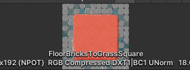
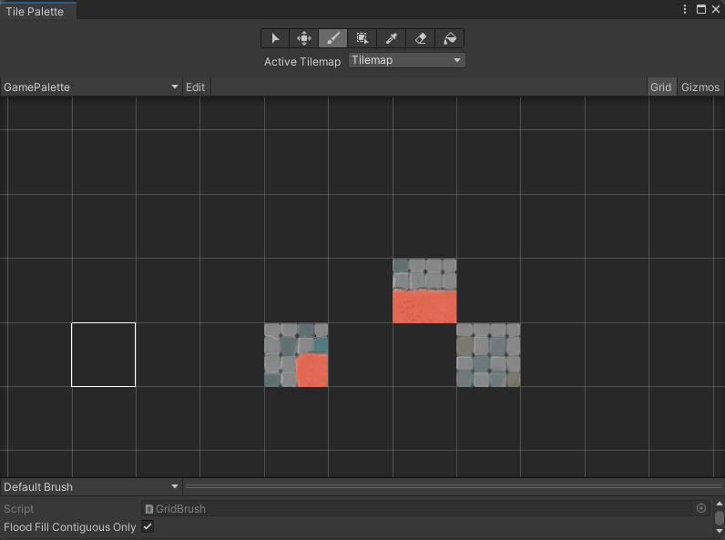

# 2D
项目地址https://learn.unity.com/project/ruby-s-adventure-2d-chu-xue-zhe
## 移动精灵
- 创建新的脚本RubyController
```C#
public class RubyController : MonoBehaviour
{
    // Start is called before the first frame update
    void Start()
    {
        
    }

    // Update is called once per frame
    void Update()
    {
        
    }
}
```

目标：让游戏对象每帧移动0.1
```C#
    void Update()
    {
        //Vector2对象用来存储当前的位置
        Vector2 position = transform.position;
        position.x = position.x + 0.1f;
        transform.position = position;
    }
```
### 使用键盘控制
在数学中，Vector 向量/矢量指的是带方向的线段

在 Unity 中，Transform 值使用 x 表示水平位置，使用 y 表示垂直位置，使用 z 表示深度。这 3 个数值组成一个坐标。由于此游戏是 2D 游戏，你无需存储 z 轴位置，因此你可以在此处使用 Vector2 来仅存储 x 和 y 位置。

Transform 中 position 的类型，也是 Vector2

C# 这种强类型语言，赋值时，左右必须是同一类型才能进行

**常见的控制方式**
-   鼠标键盘
-   手机触屏、重力
-   手柄
-   体感
-   可穿戴设备，比如 VR 、AR 眼镜 常用的瞳孔控制
-   声音控制
**使用最原始的键盘控制**
```C#
    void Update()
    {
        // 获取水平输入，按向左，会获得 -1.0 f ; 按向右，会获得 1.0 f
        float horizontal = Input.GetAxis("Horizontal");
        // 获取垂直输入，按向下，会获得 -1.0 f ; 按向上，会获得 1.0 f
        float vertical = Input.GetAxis("Vertical");

        // 获取对象当前位置
        Vector2 position = transform.position;
        // 更改位置
        position.x = position.x + 0.1f * horizontal;
        position.y = position.y + 0.1f * vertical;
        // 新位置给游戏对象
        transform.position = position;
    }
```
在 Unity 项目设置中，可以通过 Input Manager 进行默认的游戏输入控制设置
Edit > Project Settings > Input
键盘按键，以 2 个键来定义轴：
-   负值键 negative button，被按下时将轴设置为 -1
-   正值键 positive button ，被按下时将轴设置为 1
Axis 轴 Axes 是它的负数形式
-   Horizontal Axis： 水平轴 对应 X 轴
-   Vertical Axis：纵轴 对应 Y 轴
**input类**
[UnityEngine.Input 官方 API 文档](https://gitee.com/link?target=https%3A%2F%2Fdocs.unity3d.com%2Fcn%2Fcurrent%2FScriptReference%2FInput.html)
使用该类来读取传统游戏输入中设置的轴/鼠标/按键，以及访问移动设备上的多点触控/加速度计数据。

若要使用输入来进行任何类型的移动行为，请使用 Input.GetAxis。 它为您提供平滑且可配置的输入 - 可以映射到键盘、游戏杆或鼠标。 请将 Input.GetButton 仅用于事件等操作。****不要将它用于移动操作****。Input.GetAxis 将使脚本代码更简洁。

代码版本 3：
```C#
public class RubyController : MonoBehaviour
{
   // 每帧调用一次 Update
   // 可以这样做，但不建议
   void Update()
   {
       Vector2 position = transform.position;
       if(Input.GetKey("d")){
           position.x = position.x + 0.1f;
       }
       if(Input.GetKey("a")){
           position.x = position.x - 0.1f;
       }
       if(Input.GetKey("s")){
           position.y = position.y - 0.1f;
       }
       if(Input.GetKey("w")){
           position.y = position.y + 0.1f;
       }
       transform.position = position;
   }
}
```
### 时间和帧率
#帧率和速度的关系
遇到的问题：虽然只移动0.1但是移动速度还是还是很快
原因:帧率太高，update是在每一帧的时候执行，如果是60帧，移动就是`0.1*60`同理，帧率越低，速度越慢
解决：这只帧数
```C#
    void Start()
    {
        // 只有将垂直同步计数设置为0，才能锁帧，否则锁帧的代码无效
        // 垂直同步的作用就是显著减少游戏画面撕裂、跳帧，因为画面的渲染不是整个画面一同渲染的，而是逐行或逐列渲染的，能够让FPS保持与显示屏的刷新率相同。
        QualitySettings.vSyncCount = 0;
        //设定应用程序帧数为10
        Application.targetFrameRate = 10;

    }
```
但是锁帧不是一个好选项
这里我们需要通过时间来移动
引入Time.deltaTime 每帧的时间间隔，float 类型
为此，你需要通过将移动速度乘以 Unity 渲染一帧所需的时间来更改移动速度。如果游戏以每秒 10 帧的速度运行，则每帧耗时 0.1 秒。如果游戏以每秒 60 帧的速度运行，则每帧耗时 0.017 秒。如果将移动速度乘以该时间值，则移动速度将以秒表示。

## 使用TileMap制作地图
[Tilemap 官方手册](https://gitee.com/link?target=https%3A%2F%2Fdocs.unity3d.com%2Fcn%2F2021.2%2FManual%2Fclass-Tilemap.html)
Tilemap 是 2D 游戏中，用来构建世界的工具，这个工具使用技术的好坏，直接影响到你制作 2D 游戏时的工作量

The Tilemap component is a system which stores and handles Tile Assets for creating 2D levels.  
瓦片地图组件，是一个存储和操作 Tile 资源的系统，用来创建 2D 关卡。

It transfers the required information from the Tiles placed on it to other related components such as the Tilemap Renderer and the Tilemap Collider 2D.  
该系统还可以将所需信息通过所包含的 Tiles 传输到其他相关组件，例如 Tilemap Renderer 和 Tilemap Collider 2D。

**创建瓦片地图时，Grid 组件自动作为瓦片地图的父级，并在将瓦片布置到瓦片地图上时作为参照**

相关概念：

素材相关：

-   Sprite(精灵)：纹理的容器。大型纹理图集可以转换为精灵图集(Sprite Sheet)
-   Tile(瓦片)：包含一个精灵，以及二个属性，颜色和碰撞体类型。使用瓦片就像在画布上画画一样，画画时可以设置一些颜色和属性

工具相关：

-   Tile Palette(瓦片调色板)：当你在画布(Canvas)上画画时，会需要一个位置来保存绘画的结果。类似地，调色板(Palette)的功能就是保存瓦片，将它们绘制到网格上
-   Brush(笔刷)：用于将画好的东西绘制到画布上。使用 Tilemap 时，可以在多个笔刷中任意选择，绘制出线条、方块等各种形状

组件相关：
-   Tilemap（瓦片地图）：类似 Photoshop 中的图层，我们可以在 Tilemap 上画上 Tile
-   Grid(网格)：用于控制网格属性的组件。Tilemap 是 Grid 的子对象。Grid 类似于 UI Canvas(UI 画布)。
-   Tilemap Renderer(瓦片地图渲染器)：是 Tilemap 游戏对象的一部分,用于控制 Tile 在 Tilemap 上的渲染，控制诸如排序、材质和遮罩等。

### 分类
-   Rectangler 矩形瓦片地图
-   Hexagonal 六边形瓦片地图：除常规瓦片地图外，Unity 还提供 Hexagonal Point Top Tilemap 和 Hexagonal Flat Top Tilemap 瓦片地图。六角形瓦片通常用于战略类桌面游戏，因为它们的中心与边上的任何点之间具有一致的距离，并且相邻的瓦片总是共享边。因此，这些瓦片非常适合构建几乎任何类型的大型游戏区域，并让玩家做出关于移动和定位的战术决策。
      
    点朝顶部的六角形瓦片示例  
      
    平边朝顶部的六角形瓦片示例
-   Isometric 等距瓦片地图: 等距透视图显示所有三个 X、Y 和 Z 轴，因此可以将伪深度和高度添加到瓦片地图。  
    等距瓦片地图常用于策略类游戏，因为等距透视图允许模拟 3D 游戏元素，例如不同的海拔和视线。这样可使玩家在游戏过程中做出关于移动和定位的战术决策。

> 参考资料：
> -   [【Unity】使用 Tilemap 创建等距视角 (Isometric) 的 2D 环境](https://gitee.com/link?target=https%3A%2F%2Fzhuanlan.zhihu.com%2Fp%2F91186217)
### 瓦片
**瓦片**是排列在**瓦片地图**上的**资源**，用于构建 2D 环境。每个瓦片引用一个选定的**精灵**，然后在瓦片地图网格上的瓦片位置处渲染该精灵。

-   Tile ：新版本中已经看不到，但可以使用
-   Scriptable Tile：自编程瓦片
-   Rule Tile：规则瓦片
-   Animated Tile：动画瓦片

> 遇到的问题：
>
> 1. 瓦片不能完全填充整个项目
>
> 解决：因为精灵使64*64的因此，在精灵中设置Pixels per unit也是64即可
>
> 2. 任务在瓦片下面
>
> 解决：设置tilemap中 order in Layer值为负值

### 制作流程
0.  预处理 sprite 资源：将图片资源拖拽到 project 中，生成 sprite；然后一般需要进行切割 slice ，将其配置成需要的各个 tile;
1.  创建要在其上绘制瓦片的瓦片地图。此过程中还会自动创建 Grid 游戏对象作为瓦片地图的父级。
2.  直接创建瓦片资源，或者通过将用作瓦片素材的精灵带入 Tile Palette 窗口自动生成瓦片。
3.  创建一个包含**瓦片资源**的 Tile Palette，并使用各种笔刷来绘制到**瓦片地图**上。
4.  可以将 Tilemap Collider 2D 组件连接到瓦片地图以便使瓦片地图与 Physics2D 交互。

一般 Tilemap 创建三个，分别为:

-   background(地图背景)
-   bound(边界)
-   foreground(前景，主要是地形)

**一般的时候精灵可能不是一小块地图，可能使一个整体**

比如192*192，也就是9个`64*64`的格子，这里我们需要将Pixels per unit设置为一格的大小也就是64



同时，每个各自的作用也不一样，直接放入tilemap中的话，就如下所示


我们需要进行切分

步骤

- 修改精灵的sprite mode选项从single改为multiple
- 点击sprite editor
- 点击左上角的slice进行不同的分割
- 直接直接将分割好的图片放入tliemap中



## 瓦片地图的高级使用

使用普通的瓦片地图，构建整个世界，一个一个格子用笔刷来填充，非常费时，Unity 在不断地升级中，添加了很多种快速构建瓦片地图的方式，掌握了这些方法，能够极大减少绘制地图所用的时间。

### 4.1 编程瓦片 Scriptable Tile

Unity 支持用代码创建自己的 Tile 类，自己书写瓦片的绘制规则。

还可以为瓦片创建自定义编辑器。这与脚本化对象的自定义编辑器的工作方式相同。

创建一个继承自 TileBase（或 TileBase 的任何有用子类，如 Tile）的新类。重写新的 Tile 类所需的所有方法。

### 4.2 编程画笔 Scriptable Brush

Unity 也支持创建自己的 Brush 类，设计适合自己游戏的网格画笔。

创建一个继承自 GridBrushBase（或 GridBrushBase 的任何有用子类，如 GridBrush）的新类。重写新的 Brush 类所需的所有方法。

创建可编程画笔后，画笔将列在 Palette 窗口的 *Brushes 下拉选单 中。默认情况下，可编程画笔脚本的实例将经过实例化并存储在项目的 Library* 文件夹中。对画笔属性的任何修改都会存储在该实例中。如果希望该画笔有多个具备不同属性的副本，可在项目中将画笔实例化为资源。这些画笔资源将在 Brush 下拉选单中单独列出。

###  2D Tilemap Extras （2D 瓦片地图扩展）

> [2D 瓦片地图扩展--官方文档](https://gitee.com/link?target=https%3A%2F%2Fdocs.unity3d.com%2FPackages%2Fcom.unity.2d.tilemap.extras%402.2%2Fmanual%2Findex.html)

#### 4.3.1 Animated Tile 动画瓦片

动画瓦片在游戏运行时，按顺序显示 Sprite 列表以创建逐帧动画

#### 4.3.2 Rule Tile 规则瓦片

可以为每个瓦片创建规则，在绘制时，unity 会自动响应这些规则，绘制地图时更加智能

RuleTile 使用步骤：

- 准备 Tile 素材，配置素材属性，分割素材；
- 新建 RuleTile，为其添加规则，设置每个 Tile 的相邻规则；
- 将设置好的 RuleTile 拖拽到 Tile Palette 中，就可以使用了

#### 4.3.3 Rule Override Tile / Advanced Rule Override Tile 规则覆盖瓦片

可以用已经生成好的 Rule Tile，作为 Rule Override Tile 的规则来源，只替换对应的瓦片素材，而沿用原先的规则，可以快速的创建规则瓦片的方法

> 参考资料：
>
> - [2D TileMap Extras 官方文档](https://gitee.com/link?target=https%3A%2F%2Fdocs.unity3d.com%2FPackages%2Fcom.unity.2d.tilemap.extras%402.2%2Fmanual%2Findex.html)
> - [使用 Rule Tile 官方教程](https://gitee.com/link?target=https%3A%2F%2Flearn.unity.com%2Ftutorial%2Fusing-rule-tiles%235fe9914fedbc2a28d93ce460)

也就是通过可视化的工具创建有规则的瓦片


自动的检测并绘制按照规则的瓦片

步骤

- 创建ruletile
- 导入分割的精灵，设置规则
- 设置图片
