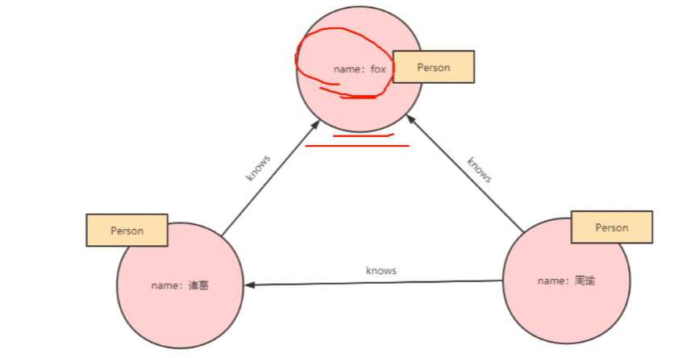

| 命令     | 用法                     |
| -------- | ------------------------ |
| CREATE   | 创建节点，关系和属性     |
| MATCH    | 检索节点，关系和属性数据 |
| RETURN   | 返回查询结果             |
| WHERE    | 提供条件过滤检索数据     |
| DELETE   | 删除节点和关系           |
| REMOVE   | 删除节点和关系的属性     |
| ORDER BY | 排序检索数据             |
| SET      | 添加或更新标签           |



使用cypher语言来描述

```cypher
(fox)<-[:knows]-(周瑜)-[:kones]->(诸葛亮)->[:konws]->(fox)
```

## Match

```CQL
MATCH (n:'西游')
return n
```

查询关系

```CQL
MATCH p=()-[r:'师兄']->() RETURN p LIMIT 25
```

## 常用命令

### load csv

```CQL
load csv
```

### create

#### 创建节点

```
create (n)
#创建多个
create (n),(m)
#创建带标签的节点
create (n:Persion)/create(ID:n,label:Person)
#创建带多个标签的节点
create (n:Person:Student)
#创建带标签和属性的节点并返回
create (n:person {name:'xxx'}) return n 
#创建关系
match (a:Person) (b:Person) whera a.name="xxx" and b.name="xxx"  create (a)-[r:RELTYPE {name:xxx}]->(b) return r
#创建完整关系
create p=(an {name:"an"})-[:WORKS_AT]->(neo)<-[:WORKS_AT]-(mach {name:"mach"}) return p;
```

### match

```
match (n1:<标签>) create (n1)xxx
```

### where 字句

```
match (n:person) where n.name="ccc" and/or n.sex='nan'
#判断是否为空值
match (n:student {xxx}) where n.sex is not null return n
#判断属性在一个范围内
match (n:student) where m.name in ["x1","x2","x3"] return n
```

### delete 删除

删除节点的前提是节点没有关系

```
#删除节点
match (n:person {name:"xxxx"}) delete n
#删除关系
Match (n:person {name:'x1'})<-[r]-(m) delete r return type(r)
```

### Remove 删除

```CQL
#删除属性
match (n:role {name:"fox"}) remove n.age return n
#删除标签
match (m:role:person {name:'xxx'}) remove m:person return m
```

### 索引

```cypher
create index on :star (name),
drop index on :star (name)
```

括号内为列名

此时使用`match (m:star) where m.name="xxx" return m`速度就会变快

### UNIQUE 约束

```shell
#创建/删除唯一约束
create/drop constraint on (n:xiyou) assert n.name is unique
```

## 函数

- string 字符串---(如：substring)
- aggregation 聚合
- relationship 关系

- count(n)查看数量 
- type(r) 显示关系  id(r)显示id
- starNode/endnode(r)用于知道开始和结束节点

## 数据的备份和回复

```shell
#先停止
neo4j stop
#备份
neo4j-admin dump --database=graph.db --to=/neo4j/backup/graph_backup.dump
#导入数据
neo4j-admin load --from=/neo4j/backup/graph_backup.dump --database=graph.db --force
neo4j start
```


