# 知识图谱

溯源：The Semantic Web，linked big data

典型知识图谱项目: Schema.org,DBPEDIA，YAGO（考虑时间和空间）,WordNet, ConceptNet,BabelNet(词典)，OpenKG.CN(中文开放知识图谱)，

### 知识图谱的价值

- 连接万物-进行搜索
- 智能问答
- 推荐系统--User和Item特征表示
- 大数据分析---PALANTIR
- 语言理解

### 应用

- 案例新零售知识图谱

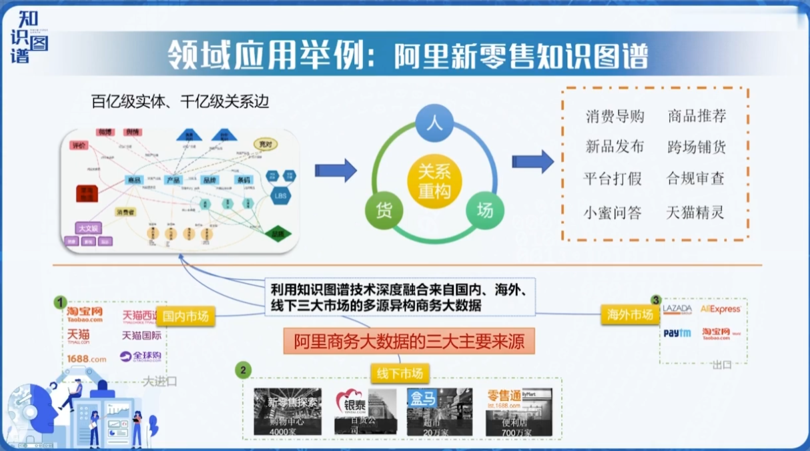

- 中医药语义网络

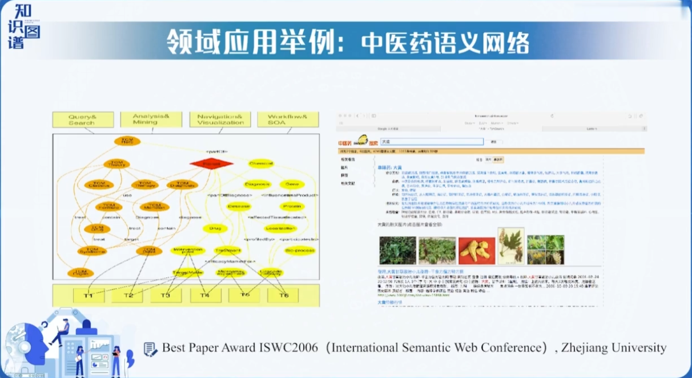

- 大规模故障误诊断知识图谱
- 金融知识知识图谱

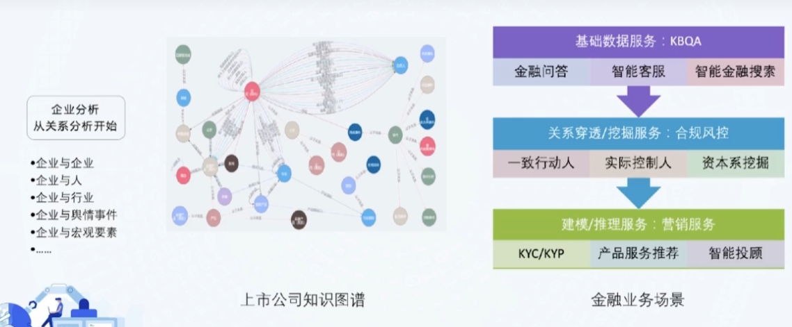

## 两个核心

知识+图谱

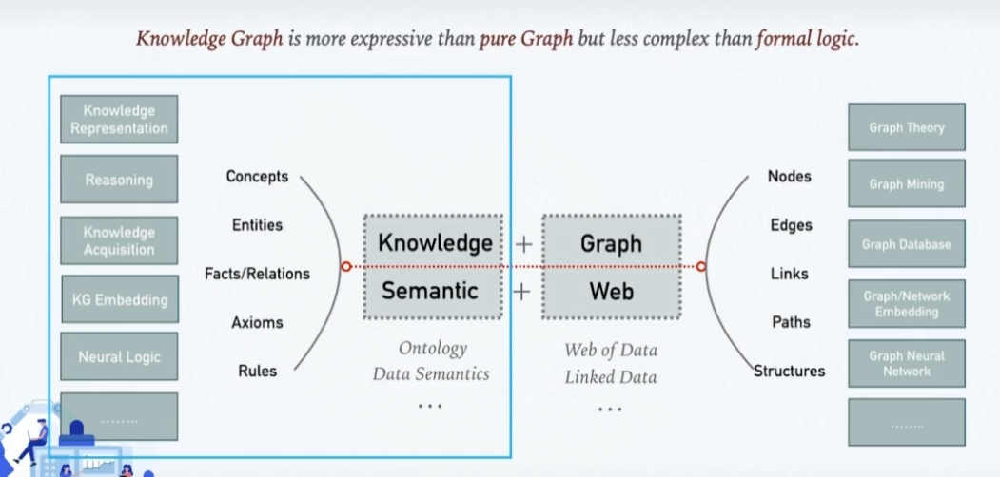

### 技术要素

- 表示
- 存储
- 抽取
- 融合
- 推理
- 问答
- 分析
- 其他

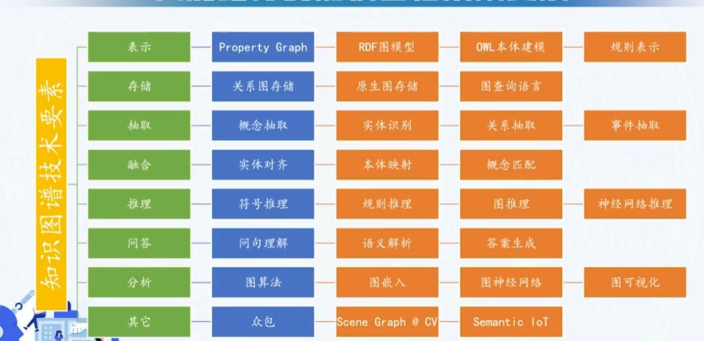

## 技术内涵

### 有向标记图

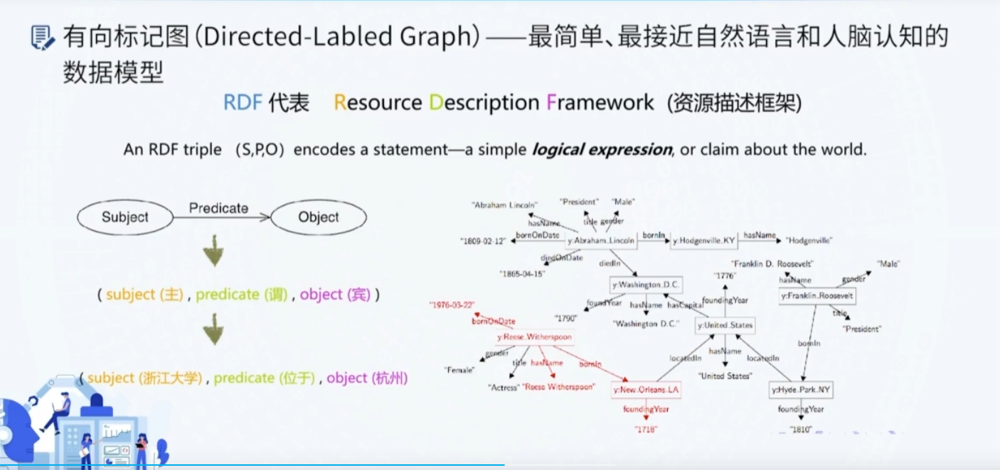

### 图数据存储和查询

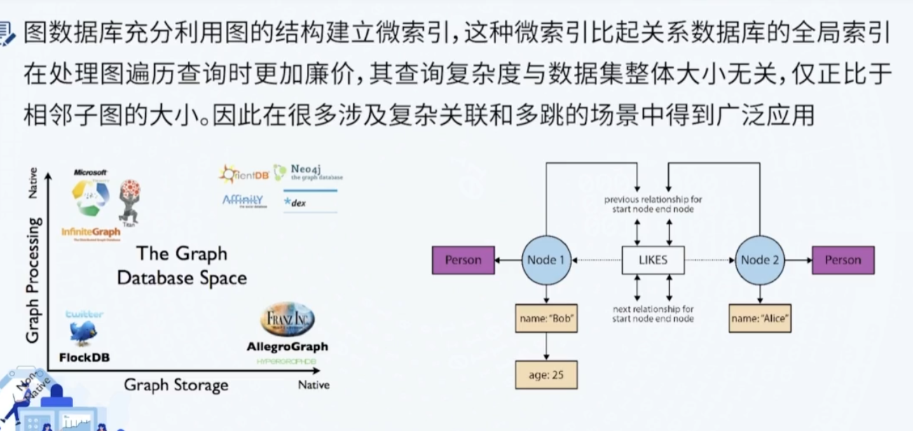

### Knowledge Base population

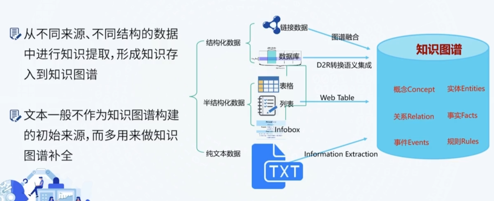

### 知识图谱的融合

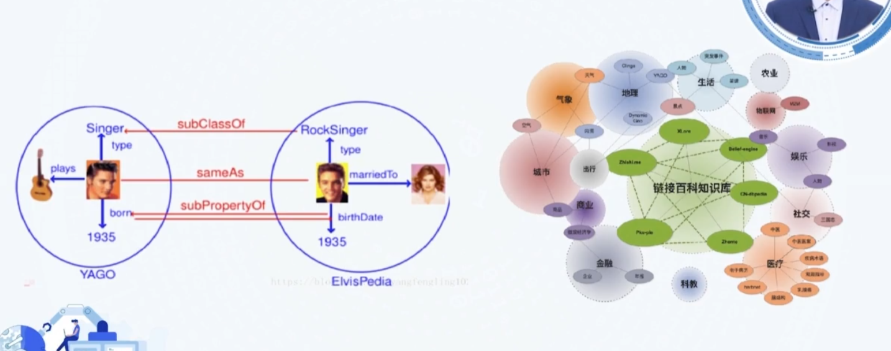

### 知识图谱推理

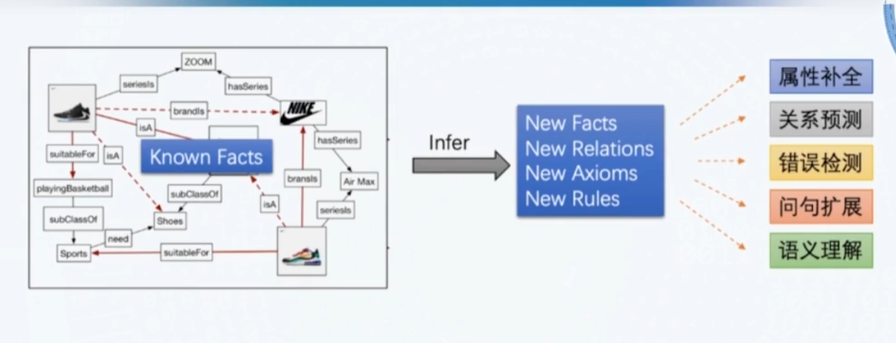

## 知识图谱问答

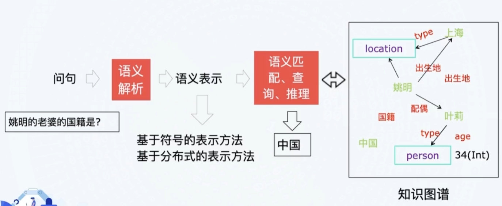

### 图算法和图神经网络

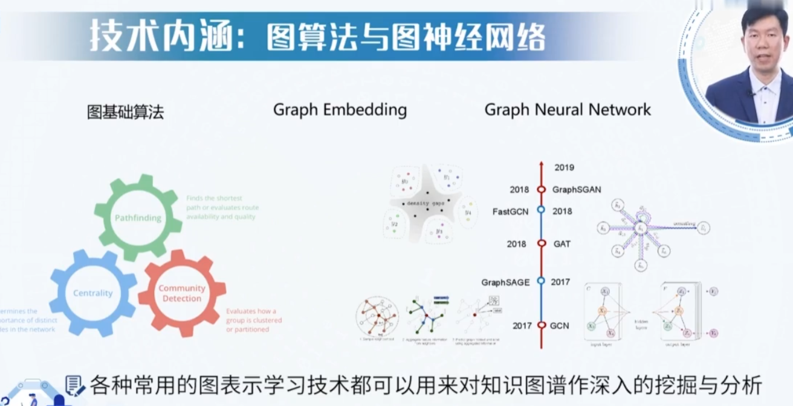