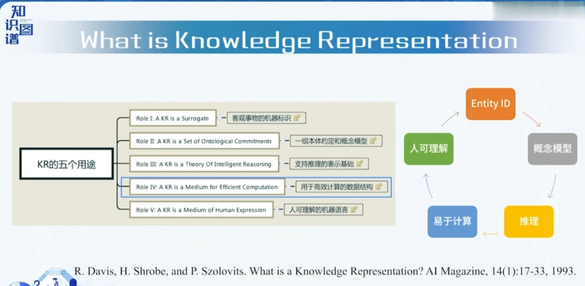
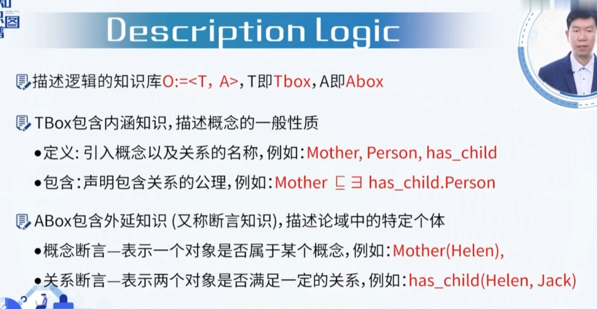
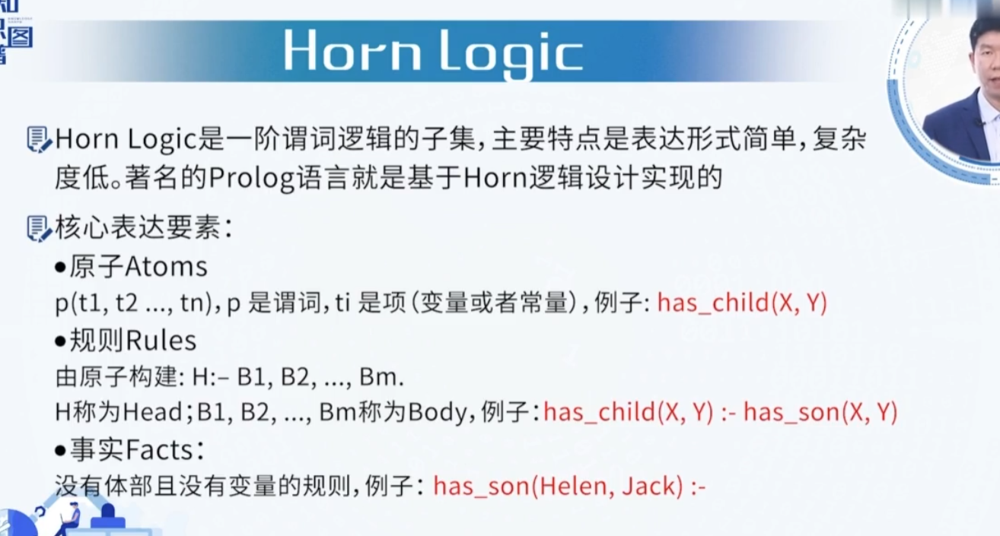
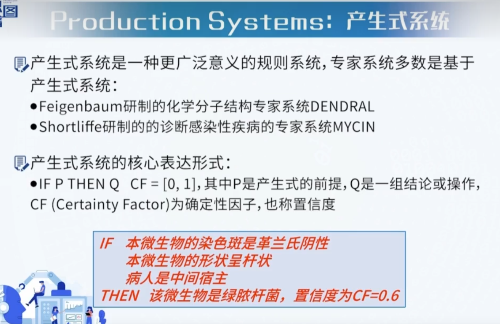
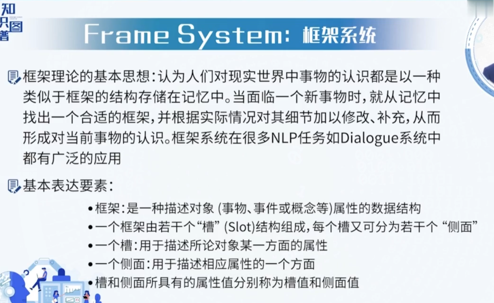
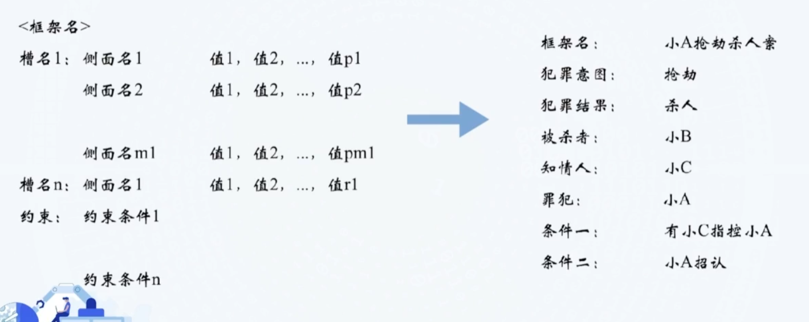
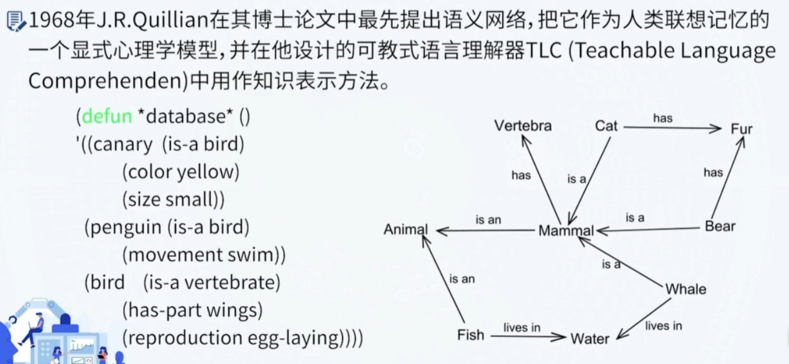
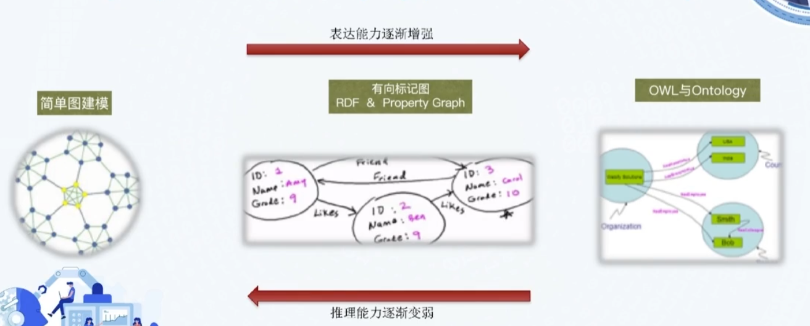
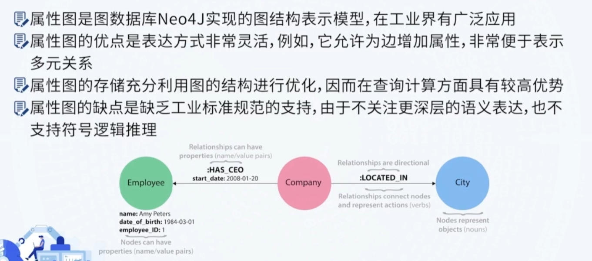
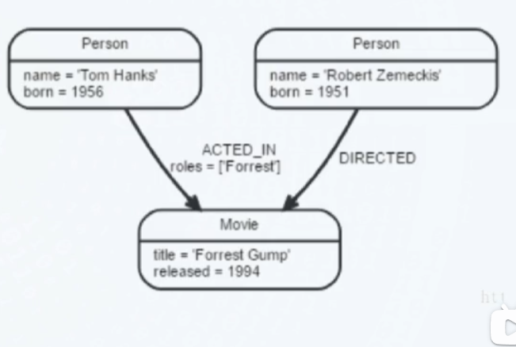

## 多种知识表示

向量表示的优势：

- 可以表示隐含知识的能力
- 具有推理过程

劣势：

- 丢失了符号的可解释性

### Description Logic

### Horn Logic

- 接近自然语言
- 有严格的形式

- 但是无法表示不确定性的知识

### Production Systems

### 框架系统 frame System

### Semantic Network

## 基于图的知识表示和建模

### 属性图

属性图的组成：顶点(Vertex),边(Edge),标签(Label),关系类型(Property)

- 顶点也称为节点(Node),边也成为关系(Relationship)

- 关系也就是边也可以有属性，即边属性，可以通过在关系上增加属性个图算法提供有关的元信息，比如时间权重等