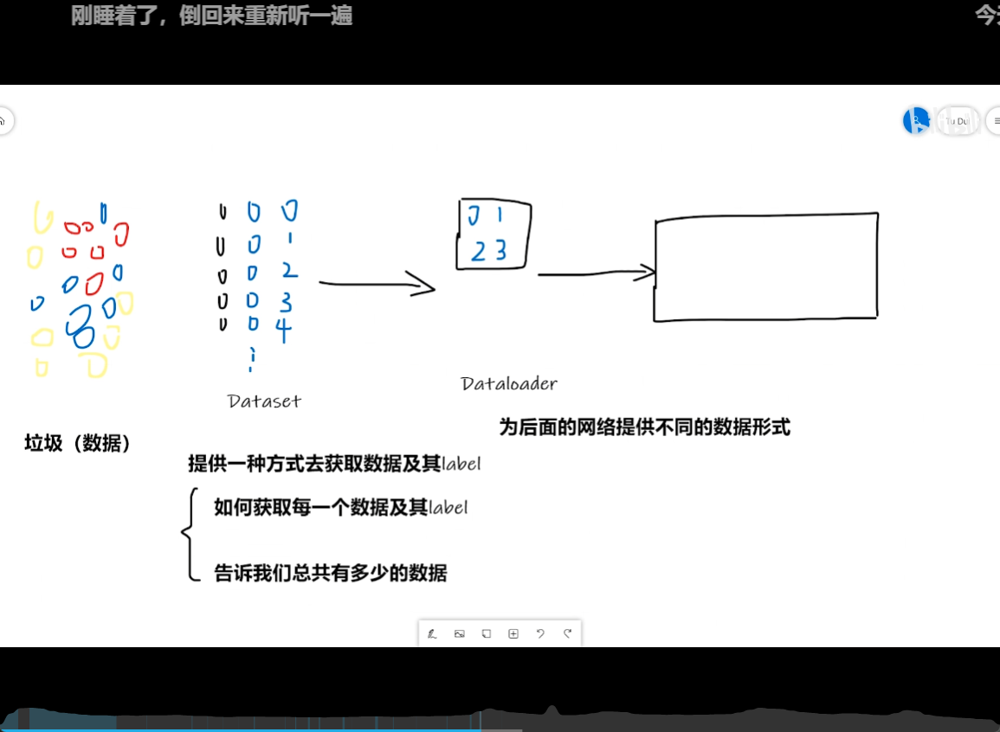
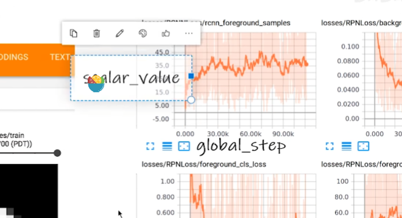
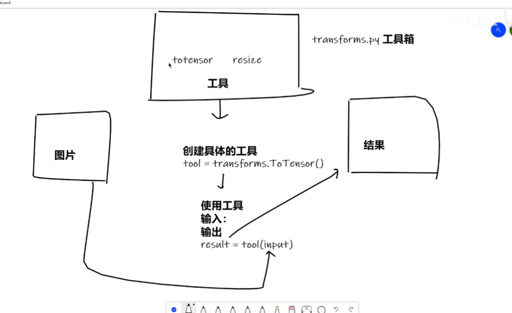
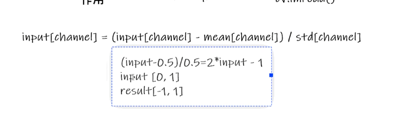

# 数据加载

## 1. Dataset和Dataloader



**如何使用**

```python
class MyData(Dataset):
    def __init__(self,root_dir,label_dir):
        self.root_dir = root_dir
        self.label_dir = label_dir
        self.path = '/'.join([self.root_dir,self.label_dir])
        # print(self.path)
        self.img_path = os.listdir(self.path)
        # print(self.img_path)
    
    def __getitem__(self,idx):
        img_name = self.img_path[idx]
        img_itrm_path = '/'.join([self.path,img_name])
        # print(img_itrm_path)
        img = Image.open(img_itrm_path)
        label = self.label_dir
        return img,label
    
    def __len__(self):
        return len(self.img_path)

ants_dataset = MyData('data/train','ants')
bees_dataset = MyData('data/train','bees')

train_datasets = ants_dataset+bees_dataset
```

## 1. Tensorboard的使用



> 启动tensorboard    `tensorboard --logdir=logs  --port=6666`

```python
from torch.utils.tensorboard import SummaryWriter
from rich import pretty,print
import time
pretty.install()

writer = SummaryWriter("logs")
# writer.add_image()
for i in range(20):
    time.sleep(1)
    writer.add_scalar("y=2x",3*i ,i)#添加标量
writer.close()
```

**添加图片**

```python
print(os.getcwd())
img_path = r'../data\train\ants\0013035.jpg'
img = np.array(Image.open(img_path))

with SummaryWriter("logs") as writer:
    writer.add_image('test',img,1,dataformats="HWC")
#不同的step可以在网页同改变，代表不同时间上的图片的变换
```

## 2. transforms

对图片进行变换



- 如何使用
- tensor类型

```python
from torchvision import transforms
from PIL import Image
from torch.utils.tensorboard import SummaryWriter
from rich import print
import os
import cv2
img_path = r'pytorch/data/train/ants/0013035.jpg'
img = Image.open(img_path)
# img.show()
cv_img = cv2.imread(img_path)
tensor_trans =  transforms.ToTensor()
# print(type(tensor_trans(cv_img)))
#torch.Size([3, 512, 768])
img = tensor_trans(cv_img)

with SummaryWriter("pytorch/transform/logs") as writer:
    writer.add_image('test',img)
```

### 常见的transforms

#### Compose

将多种transform类组合在一起进行顺序操作

#### Normalize归一化



#### Resize

改变图像大小

#### RandomCrop 随机裁剪

`trans_randomCrop = transforms.RandomCrop({num/[num,num]})`

```python
# %%
from PIL import Image
from torchvision import transforms
from torch.utils.tensorboard import SummaryWriter

# %%
img_path = r'../data/train/ants/0013035.jpg'
img = Image.open(img_path)
# img.show()
trans_totensor = transforms.ToTensor()
trans_norm = transforms.Normalize([1,3,5],[1,3,5])
trans_resize = transforms.Resize((512,512))
trans_compose = transforms.Compose([trans_resize,trans_totensor])
trans_randomCrop = transforms.RandomCrop(512)
trans_compose2 = transforms.Compose([trans_randomCrop,trans_totensor])

# %%
img_tensor = trans_totensor(img)
img_norm = trans_norm(img_tensor)


print(img.size)
img_resize = trans_resize(img)
print(img_resize.size)
'''
(768, 512)
(512, 512)
'''

img_compose = trans_compose(img)

for i in range(10): 
    img_compose_2 = trans_compose2(img)
    with SummaryWriter("logs") as writer:
        writer.add_image('randomCrop',img_compose_2,i)

# with SummaryWriter("logs") as writer:
#     writer.add_image('compose',img_compose)


# with SummaryWriter("logs") as writer:
#     writer.add_image('totensor',img_tensor , )
#     writer.add_image('trans_norm',img_norm , 1)

```

