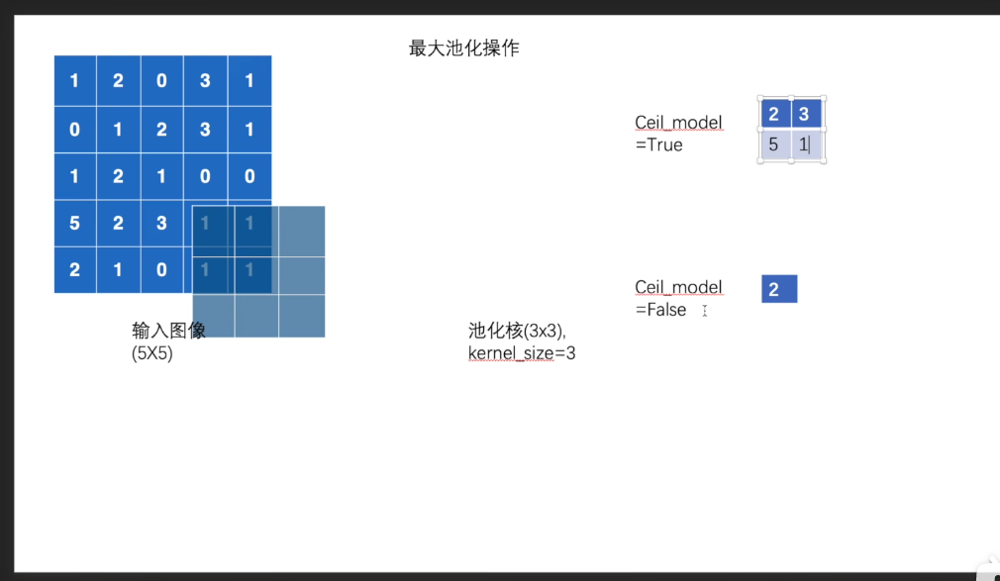
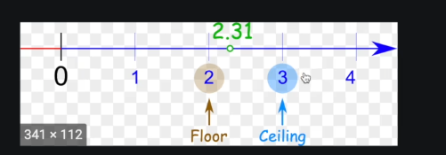

## 1. 池化层

torch.nn.MaxPool2d(*kernel_size*, *stride=None*, *padding=0*, *dilation=1*, *return_indices=False*, *ceil_mode=False*)

https://pytorch.org/docs/stable/generated/torch.nn.MaxPool2d.html#torch.nn.MaxPool2d

dilated convolution的作用----空洞卷积

https://github.com/vdumoulin/conv_arithmetic/blob/master/README.md





```python
from csv import writer
from torch import nn
from torch.utils.data import DataLoader
from torch.utils.tensorboard import SummaryWriter
import torch 
from rich import print
from torchvision import datasets,transforms
# input = torch.tensor([
#     [1,2,0,3,1],
#     [0,1,2,3,1],
#     [1,2,1,0,0],
#     [5,2,3,1,1],
#     [2,1,0,1,1]
# ],dtype=torch.float32)
# input = torch.reshape(input , (-1,1,5,5))
# print(input.shape)

datasets = datasets.CIFAR10("./pytorch/transform/dataset",train=True , transform=transforms.ToTensor())

dataloader = DataLoader(datasets , batch_size=64)

class poo(nn.Module):
    """Some Information about poo"""
    def __init__(self):
        super(poo, self).__init__()
        self.maxpool = nn.MaxPool2d(kernel_size=3,padding=1)

    def forward(self, input):
        output = self.maxpool(input)
        return output
    
writter = SummaryWriter('./pytorch/nn/Pool/logs')
model = poo()
step = 0 
for ss,data in enumerate(dataloader):
    imgs , targets = data
    output = model(imgs)
    if ss%10 == 0 :
        writter.add_images("input",imgs,step)
        writter.add_images("output",output,step)
        step += 1
writter.close()
```

## 2. 非线性激活

```python
torch.nn.Relu()
torch.nn.sigmod()
```

## 3. 正则化层

https://pytorch.org/docs/stable/generated/torch.nn.BatchNorm2d.html#torch.nn.BatchNorm2d

## 4. 线性层和dropout层

https://pytorch.org/docs/stable/generated/torch.nn.Linear.html#torch.nn.Linear

https://pytorch.org/docs/stable/generated/torch.nn.Dropout.html#torch.nn.Dropout

## 5. embedding

https://pytorch.org/docs/stable/generated/torch.nn.Embedding.html#torch.nn.Embedding

## 5. lossfunction

https://pytorch.org/docs/stable/nn.html#loss-functions

## 6.Sequential

https://pytorch.org/docs/stable/generated/torch.nn.Sequential.html?highlight=sequential#torch.nn.Sequential