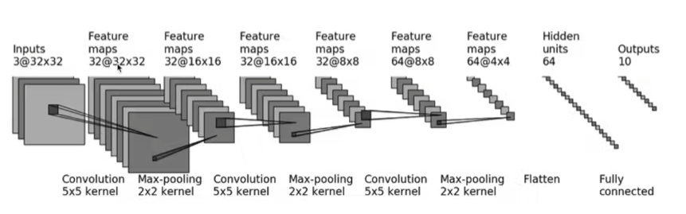

# 实战



```python
from statistics import mode
from black import out
import torch 
from torchvision import datasets,transforms
from rich import print
from torch  import conv3d, nn

class test(nn.Module):
    """Some Information about test"""
    def __init__(self):
        super(test, self).__init__()
        self.conv1 = nn.Conv2d(in_channels=3 ,out_channels=32,kernel_size=5, padding=2)
        self.pool1 = nn.MaxPool2d(2)
        self.conv2 = nn.Conv2d(32,32,5,padding=2)
        self.pool2 = nn.MaxPool2d(2)
        self.conv3 = nn.Conv2d(32,64,5,padding=2)
        self.pool3 = nn.MaxPool2d(2)
        self.flatten = nn.Flatten()
        
        self.liner1 = nn.Linear(1024,64)
        self.liner2 = nn.Linear(64,10)
        
        self.model1 = nn.Sequential(
            nn.Conv2d(in_channels=3 ,out_channels=32,kernel_size=5, padding=2),
            nn.MaxPool2d(2),
            nn.Conv2d(32,32,5,padding=2),
            nn.MaxPool2d(2),
            nn.Conv2d(32,64,5,padding=2),
            nn.MaxPool2d(2),
            nn.Flatten(),
            nn.Linear(1024,64),
            nn.Linear(64,10)
        )
        
    def forward(self, x):
        x = self.model1(x)  
        return x
    
model = test()
print(model)
input = torch.ones((64,3,32,32))
output = model(input)

print(output.shape)
```

