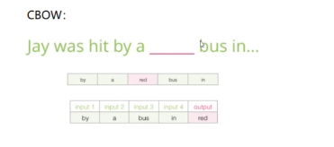
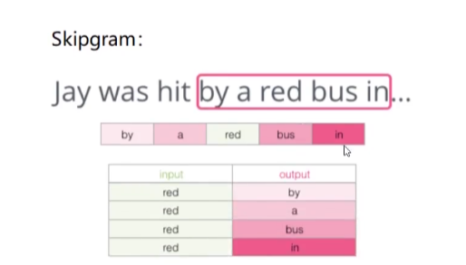
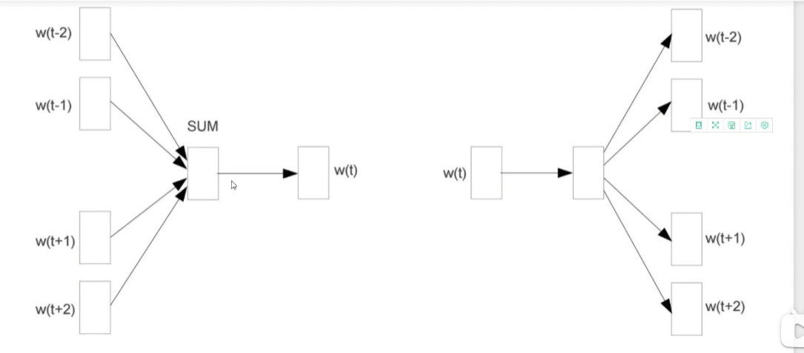
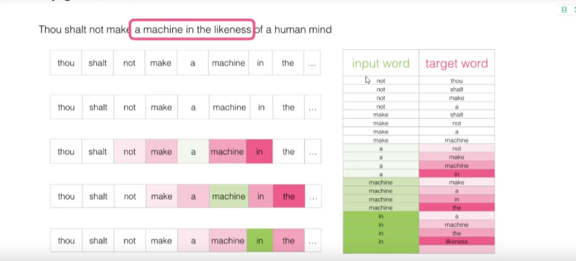
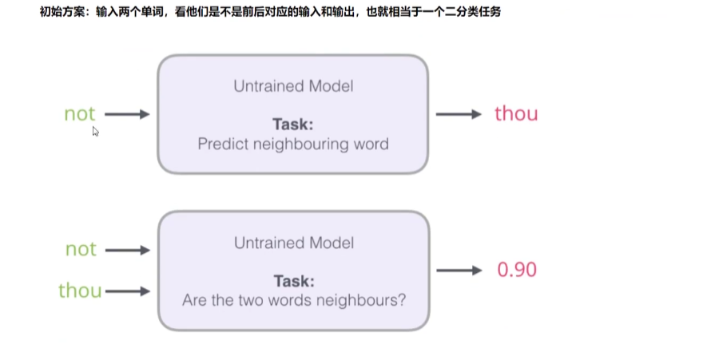

# 自然语言处理-词向量模型-Word2Vec

- 如何将文本向量化

相近的词在向量中是相似的

同通过神经网络预测之后的单词

- 通过单词找到对应的向量
- 输入向量到神经网络中
- 神经网络不仅仅更新权重，也更新词向量！
- 词向量库可以共用！

一段文字通过滑动窗口来构建训练数据

## CBOW和SKip-gram

CBOW：输入上下文，填出 中间空缺的词

SKipgram：输入空缺的词，预测上下文

https://www.bilibili.com/video/BV1AZ4y1y75H?p=189

通过滑动窗口可以快速的选择出大量的数据

训练过程：类似神经网络

### 语料库大如何解决

输入两个单词（一个为原本输出的单词），看他们是否有前后对应关系----相当于二分类问题

**************

但是训练时，因为target都为1，训练效果较差，所以要**负采样模型**

https://www.bilibili.com/video/BV1AZ4y1y75H?p=190
