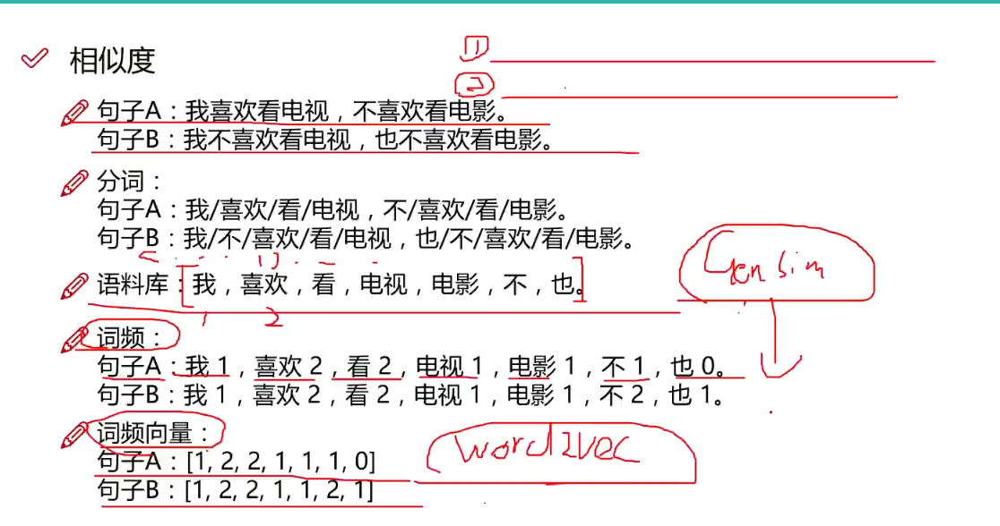
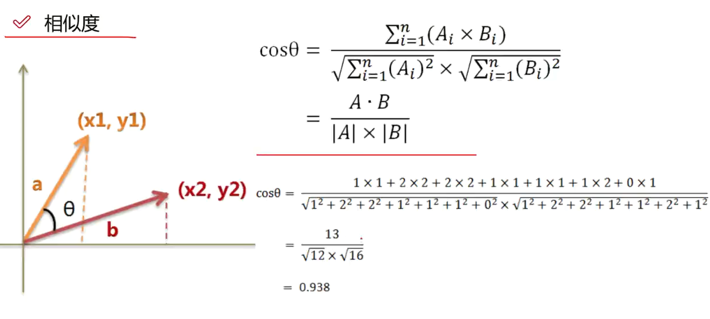

# 实验

## 1. 拼写检查器

$argmaxcP(c|w)->argmaxc {P(w|c)P(c)\over P(w)}$

- $P(c)$文章中出现一个正确拼写c的概率，也就是说文章中c出现的概率有多大
- $P(w|c)$用户想把w写错为c的概率
- argmaxc，用来枚举所有可能的c并且选取概率最大的

```python
# %% [markdown]
# # 贝叶斯

# %%
import re,collections

# %%
#把语料中所有单词提取出来并转化为小写
def words(text): return re.findall('[a-z]+',text.lower())

def train(features):
    model = collections.defaultdict(lambda:1)#遇到新的单词则初始化为1,0说明绝对不可能
    for f in features:
        model[f] +=1
    return model

# %%
NWORDS = train(words(open('big.txt').read()))
alphabet = 'abcdefghijklmnopqrstuvwxyz'

# %%
NWORDS

# %% [markdown]
# **编辑距离**
# 两个词之间的编辑距离定义为使用了几次插入（在词中插入一个单字母），删除（删除一个单字母），交换，替换的操作从一个词编导另一个词

# %%
def edits1(word):
    n = len(word)
    return set([word[0:i]+word[i+1:] for i in range(n)] +                     # deletion
               [word[0:i]+word[i+1]+word[i]+word[i+2:] for i in range(n-1)] + # transposition
               [word[0:i]+c+word[i+1:] for i in range(n) for c in alphabet] + # alteration
               [word[0:i]+c+word[i:] for i in range(n+1) for c in alphabet])  # insertion

# %%
def known_edits2(word):
    return set(e2 for e1 in edits1(word) for e2 in edits1(e1) if e2 in NWORDS)

# %%
def known(words): return set(w for w in words if w in NWORDS)

#如果known(set)非空, candidate 就会选取这个集合, 而不继续计算后面的
def correct(word):
    candidates = known([word]) or known(edits1(word)) or known_edits2(word) or [word]
    return max(candidates, key=lambda w: NWORDS[w])

# %%
correct('smaal')


```

## 2. 文本分析

**停用词**

1. 语料中大量出现
2. 没什么用

**关键词提取--TF-idf**

- 进行词频统计(Term Frequency  ----- TF)如：《中国的蜂蜜养殖》
- 出现次数最多的词是----的，是，在这类常用词（停用词）
- 中国，蜜蜂，养殖次数一样多，但是重要性不一样
- 中国很常见，但是蜜蜂和养殖不那么常见

**IDF：逆文档频率**

- 如果某个词比较少见，但是在本片文章中多次出现，那么特很可能反映了这篇文章的特性，就是我们需要的关键词

$TF(词频)={某个词在文章中出现的次数 \over 文中出现词语的次数}$

$IDF=log({语料库的文档总数 \over 包含盖茨的文档书+1})$

TF-IDF$=TF*IDF$

### 相似度

根据语料库找出词频，再构建出句子的词频向量



**相似度的计算**



### 实验:关键词提取

```python
# %%
import pandas as pd
import jieba
import numpy as np

# %%
df_news = pd.read_table('./val.txt',names = ['category','theme','URL','content'],encoding='utf-8')
df_news = df_news.dropna()
df_news.head()

# %%
content = df_news.content.values.tolist()#把每个数据的content项  转换为list格式
print(content[1000])

# %%
content_S = []
for line in content:
    current_segment =  jieba.lcut(line)#使用jieba分词
    if len(current_segment)> 1 and current_segment!='\r\n':
        content_S.append(current_segment)

# %%
content_S[1000]

# %%
df_content = pd.DataFrame({'content_S':content_S})
df_content.head()

# %%
stopwords = pd.read_csv('stopwords.txt',index_col=False,sep="\t",quoting=3,names=['stopword'],encoding='utf-8')
stopwords

# %%
#过滤操作
def drop_word(contents , stopwords):
    contents_clean = []
    all_words = []
    for line in contents:
        line_clean = []
        for word in line:
            if word in stopwords:
                continue
            line_clean.append(word)
            all_words.append(str(word))
        contents_clean.append(line_clean)
    return contents_clean,all_words

contents = df_content.content_S.values.tolist()
stopwords = stopwords.stopword.values.tolist()
contents_clearn , all_words = drop_word(contents,stopwords)

# %%
df_content = pd.DataFrame({'contents_clean':contents_clearn})
df_content
df_all_words = pd.DataFrame({'all_words':all_words})
df_all_words.head()

# %%
words_count = df_all_words.groupby(by=['all_words'])['all_words'].agg([("count",np.size)])
words_count= words_count.reset_index().sort_values(by=['count'],ascending=False)
words_count.head()
#也可以使用wordcloud

# %%
#关键字提取 jieba
import jieba.analyse
index = 2000
print(df_news['content'][index])
content_S_str = "".join(content_S[index])
print(" ".join(jieba.analyse.extract_tags(content_S_str,topK=5,withWeight=False)))

# %%

```

### LDA:主题模型

```python
#lda主题模型：格式要求list of list形式
from gensim import corpora,models,similarities
import gensim

# %%
#做映射相当于词袋
dictionary = corpora.Dictionary(contents_clearn)
corpus = [dictionary.doc2bow(sentence) for sentence in contents_clearn]

# %%
lda = gensim.models.ldamodel.LdaModel(corpus=corpus,id2word=dictionary,num_topics=20)

# %%
print(lda.print_topic(1,topn=5))

# %%
for topic in lda.print_topics(num_topics=20,num_words=5):
    print(topic[1])

```

### 使用贝叶斯进行分类

```python
for topic in lda.print_topics(num_topics=20,num_words=5):
    print(topic[1])

# %%
df_train = pd.DataFrame({'contents_clean':contents_clearn,'label':df_news['category']})
df_train

# %%
df_train.label.unique()

# %%
#将标签映射为数字
label_mapping = {'汽车':1, '财经':2, '科技':3, '健康':4, '体育':5, '教育':6, '文化':7, '军事':8, '娱乐':9, '时尚':10}
df_train['label']=df_train['label'].map(label_mapping)
df_train

# %%
from sklearn.model_selection import train_test_split

x_trian,x_test,y_train,y_test = train_test_split(df_train['contents_clean'].values,df_train['label'].values)

# %%
#实现文字向量化
from sklearn.feature_extraction.text import CountVectorizer
#输入格式： ['word1 word2 xxxxx xxx','xxx xxx xxx']
#将之前的格式转化
words = []

for line_index in range(len(x_trian)):
    try:
        words.append(' '.join(x_trian[line_index]))
    except:
        print(line_index)
        
words[0]

# %%
vec = CountVectorizer(analyzer='word',max_features=4000,lowercase=False)
vec.fit(words)

# %%
from sklearn.naive_bayes import MultinomialNB
classifier = MultinomialNB()
classifier.fit(vec.transform(words),y_train)

# %%
test_words = []
for line_index in range(len(x_test)):
    try:
        test_words.append(' '.join(x_test[line_index]))
    except:
        print(line_index)
        
test_words[0]

# %%
classifier.score(vec.transform(test_words),y_test)
#基本的贝叶斯

# %%
from sklearn.feature_extraction.text import TfidfVectorizer
vectorizer = TfidfVectorizer(analyzer='word',max_features=4000,lowercase=False)
vectorizer.fit(words)

# %%
classifier = MultinomialNB()
classifier.fit(vectorizer.transform(words),y_train)

# %%
classifier.score(vectorizer.transform(test_words),y_test)
#Tfid不同的构造向量
```

