# CNN

## 1. 什么是卷积

普通神经网络是一列数据，而卷积神经网络是块矩阵(3维)

### 1.1 整体架构

1. 输入层
2. 卷积层---提取特征
3. 池化层---压缩特征
4. 全连接层

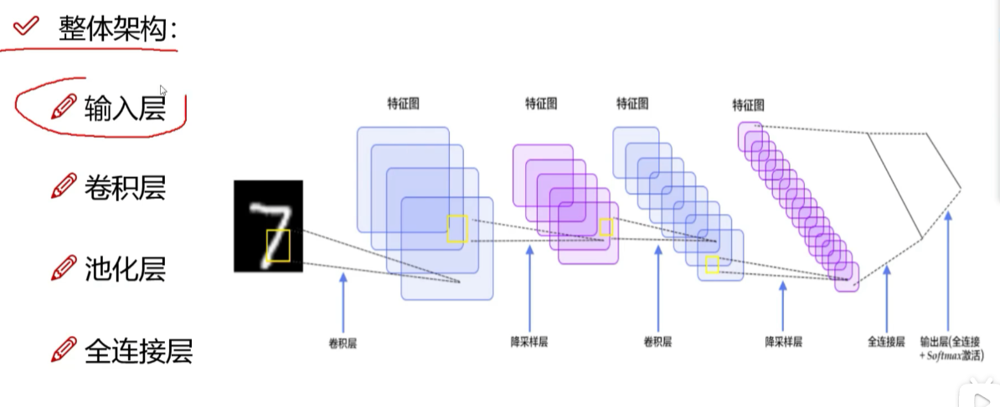

**卷积：**很明显一张图片的背景和内容的重要性是不一样的，卷积就是提取处其中比较重要的部分

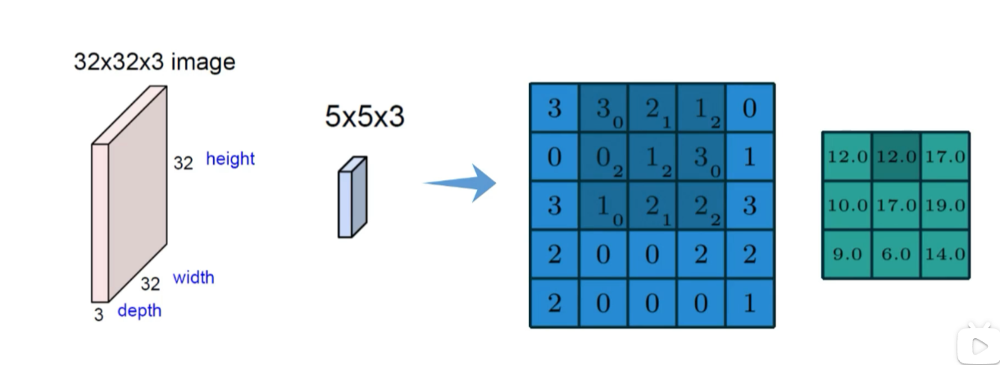

通过权重参数，得到特征图

### 1.2 图像的颜色通道

一般都有三种颜色通道

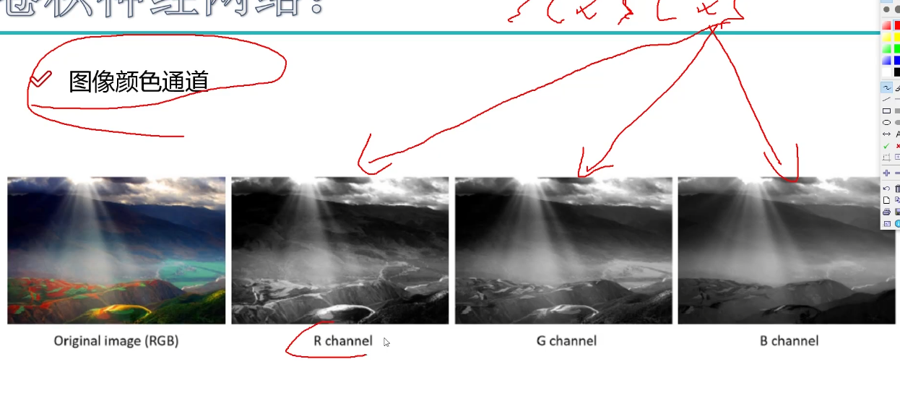

每个通道单独计算卷积，最后组合在一起

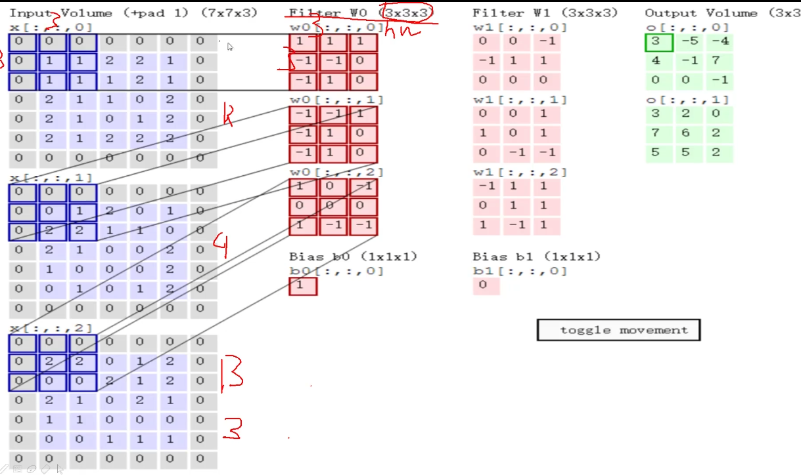

计算通道时不是矩阵计算而是内积计算，最后要有一个偏置项b

### 1.3 特征图表示

最后的特征图就是绿色的那个矩阵

特征图可以大于一张,也就是说可以使用不同的特征表示不同的特征图，以此来让特征丰富起来

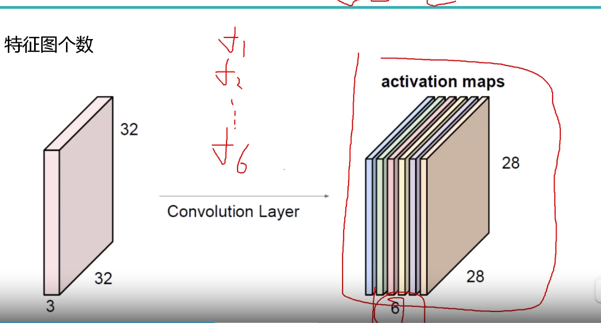

最后得到的特征图的shape为[num,num,depth],depth就是特征图的个数

### 1.4 步长和卷积核大小对结果的影响

有i时候做一次卷积是不够的，需要做多次卷积

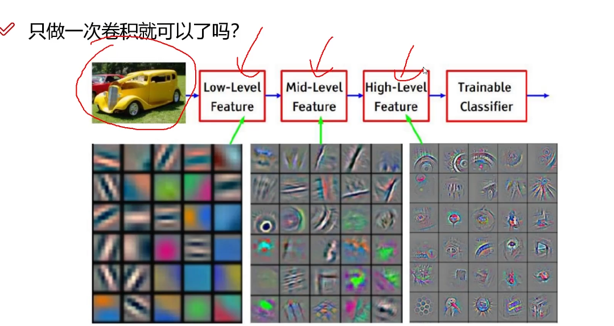

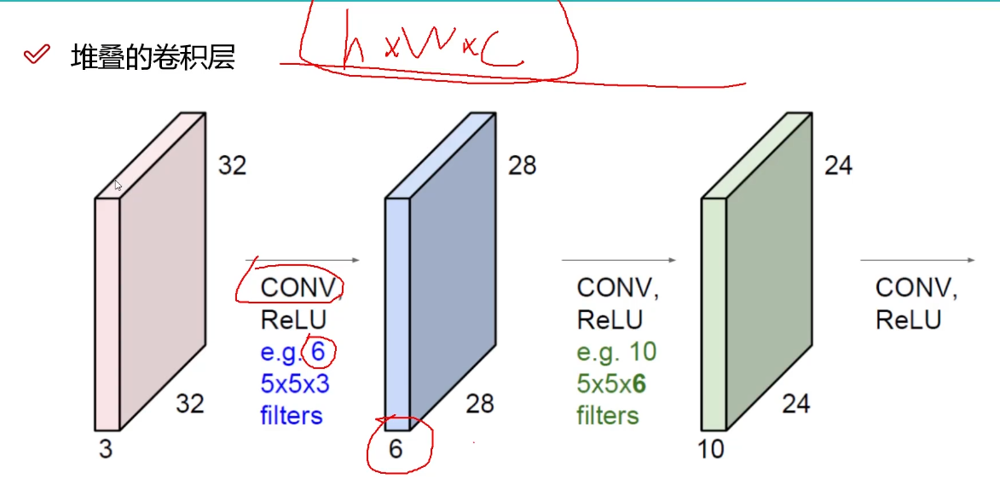

#### 卷积的参数

- 滑动窗口的步长：每次移动的距离

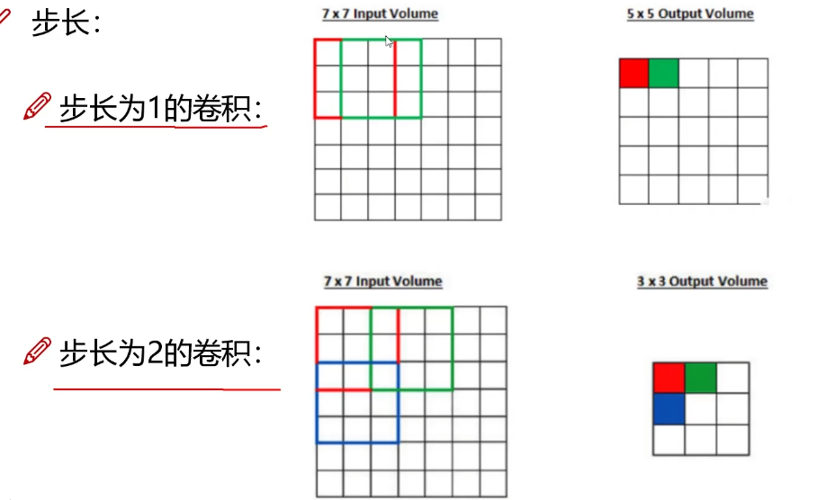

- 卷积核尺寸

就是卷积方框的大小，一般都是3*3

- 边缘填充

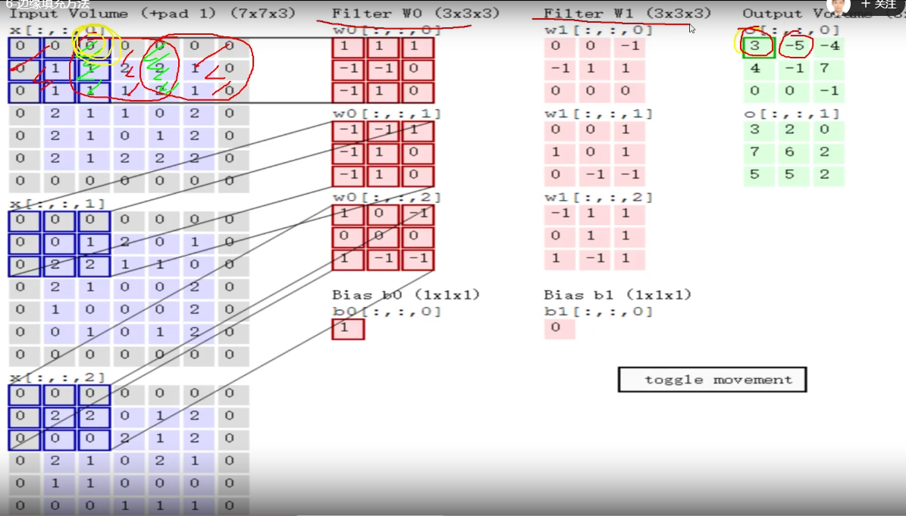

可以看见原本图像的方框四周为0，如果没有方框，内部就会比外部影响大（因为内部一般影响三个数值，二外部影响一个数值）

加0可以避免自身的影响

- 卷积核个数---特征图个数

卷积的结构计算

$H/W = {H - F + 2P \over S}+1$

#### 卷积参数共享

每一个位置使用相同的卷积核

10个`5*5*3`的卷积，总共需要`5*5*3*10+10=760`个参数

### 1.5 池化层

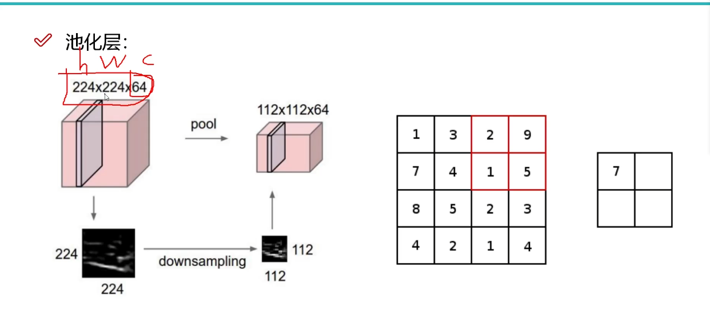

用来压缩特征

 池化方法：

- max pooling 最大池化

选择一个区域中最大的数值最为代表

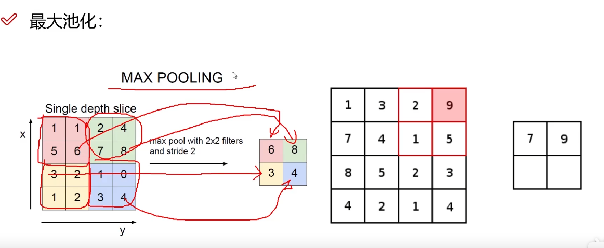

- 平均池化

### 1.6 整体架构

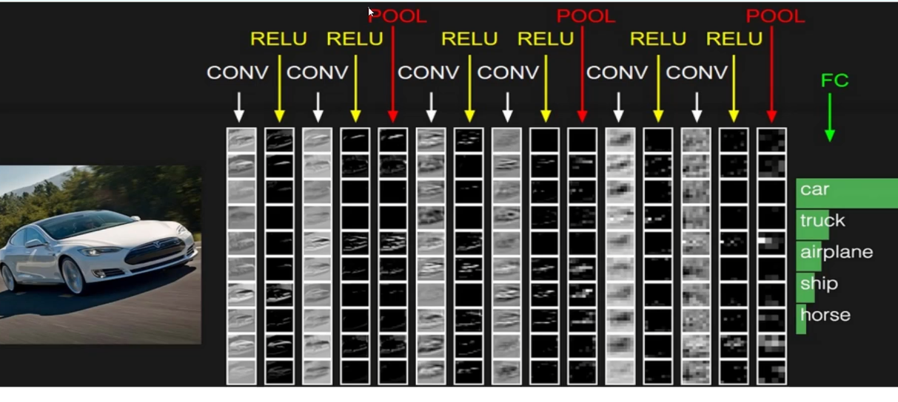

全连接层不能直接处理三维矩阵，需要将其转化为一维矩阵

## 2. 网络架构

经典网络：Alexnet(8)，VGG(16)卷积核较小

Resnet：深层网络遇到的问题：过了16层之后效果变差

解决方案：同等映射

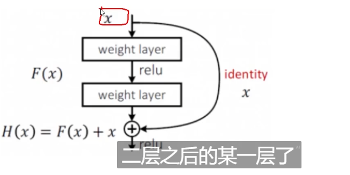

## 3. 感受野

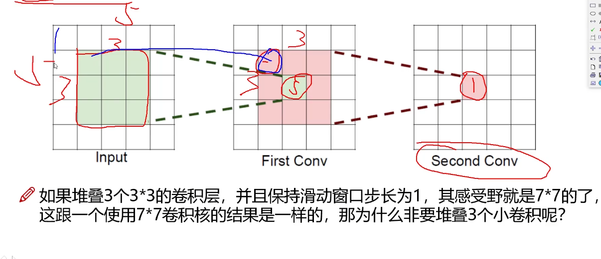

最后1*1的方格由之前`7*7`的方框的得来，这就是感受野

**为什么不直接使用`7*7`**

`一个7*7卷积核参数个数=C*(7*7*C)`

`三个3*3卷积核参数个数=3C*(3*3*C)`

参数更少，特征更加细致，非线性变化也更多

## 4. RNN递归神经网络

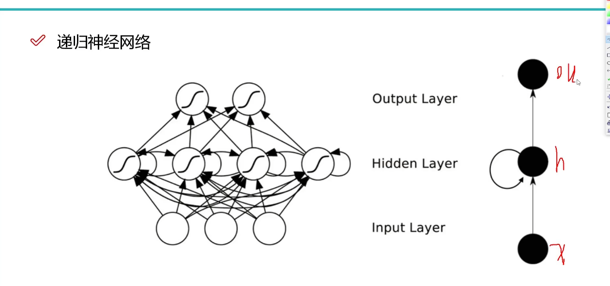

RNN考虑到时间，前一刻特征对后一时刻有影响，会把本次的运算结果保存下来和参与下一层一起运算

常用于NLP

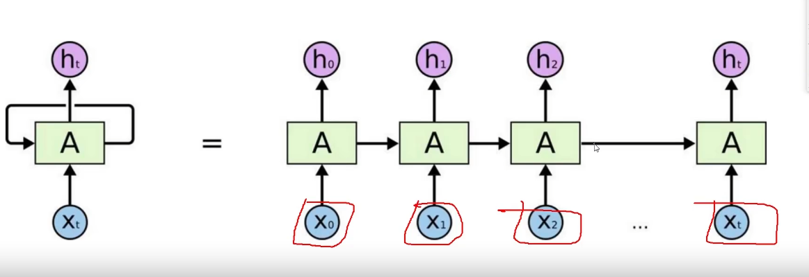

$h_0,h_1,....$是中间结果，最终结果为$h_t$

### LSTM网络

RNN对吧之前所有结果全部记录下来，LSTM会自动忘记一些特征

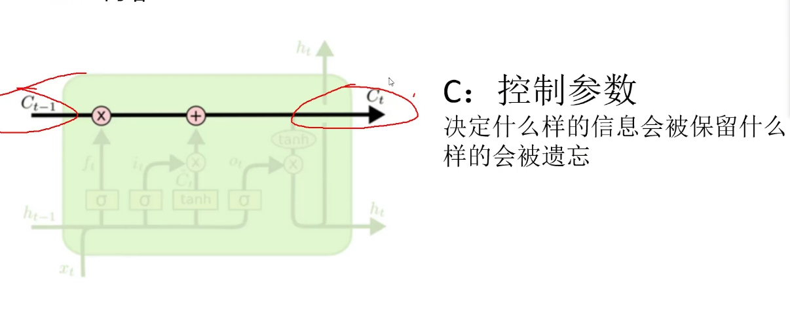

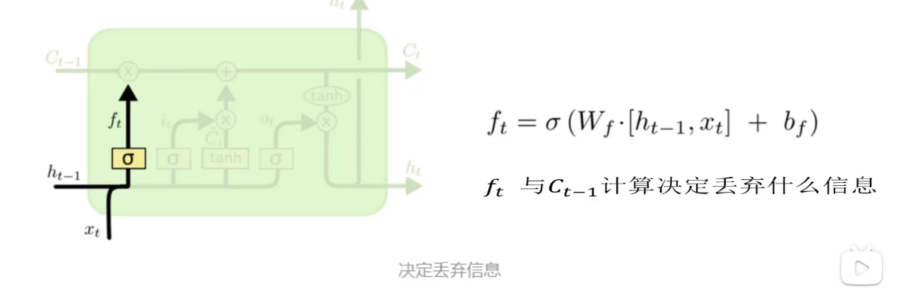

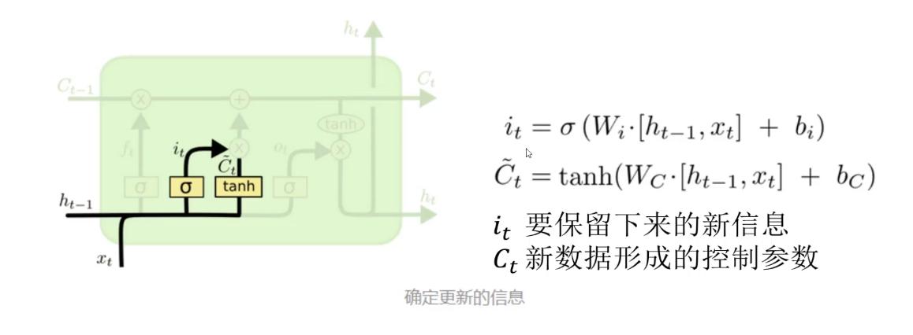

## 
