# 自然语言处理

$P(S)= P(w_1,w_2,.....,w_n)=P(w_1)P(w_2|w_1)......P(w_n|w_1,w_2,....,w_{n-1})$

P(S)被称为语言模型，可以用来计算一个句子概率的模型

`我 今天  下午  打  篮球`

问题：1.数据过于系数，2.参数空间太大

## 1. N-gram模型

假设下一个词的出现依赖它前面出现的词，那么可以化简为

$P(S) = P(w_1)P(w_2|w_1)P(w_3|w_2)......$

如果以来前两个单词

$P(S)= P(w_1)P(w_2|w_1)P(w_3|w_2,w_1).....$

$P(iwant chinese food) = P(want|i)P(chinese|want)P(food|chinese)$

假设大小为n则模型参数的数量级为$O(n^n)$

- n=1:$2*10^5$
- n=2:$4*10^{10}$ 
- n=3:$8*10^{15}$

## 2. 词向量

相似的词的词向量差距不大，

## 3. 神经网络模型

比如输入:今天下午打   预测打什么

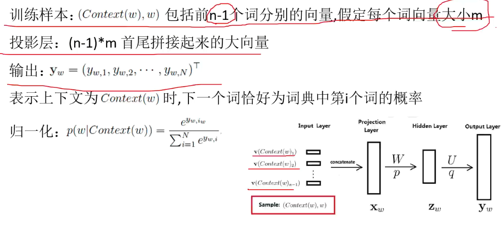

如果S1 = “今天去网吧” 1000次

S2 = “今天去网咖” 10次

N-gram模型  `P(S1)>>P(S2)`

神经网络模型：P(S1)和P(S2)差不多

## 4. Hierarchical Softmax

主要由两种模型

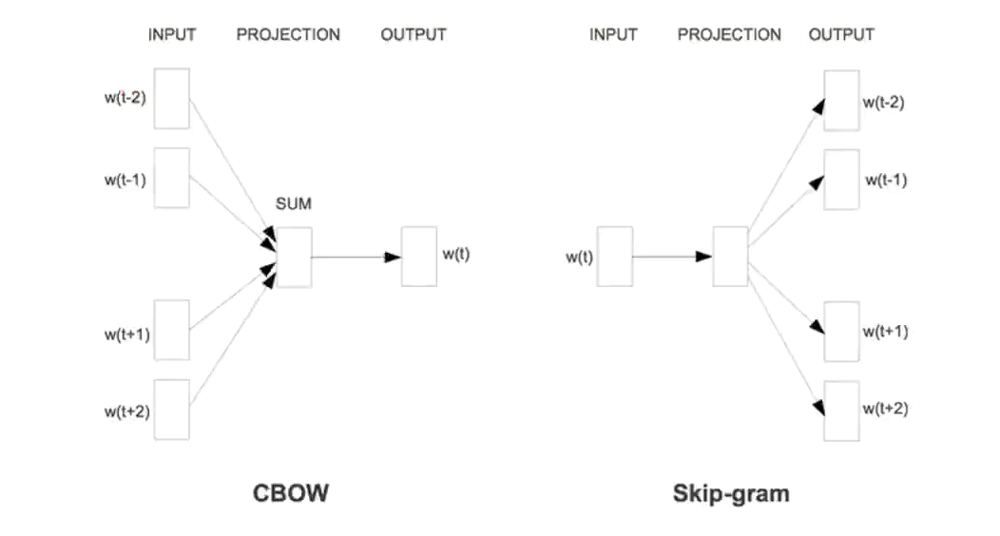

### CBOW

根据上下文预测当前词语出现的频率

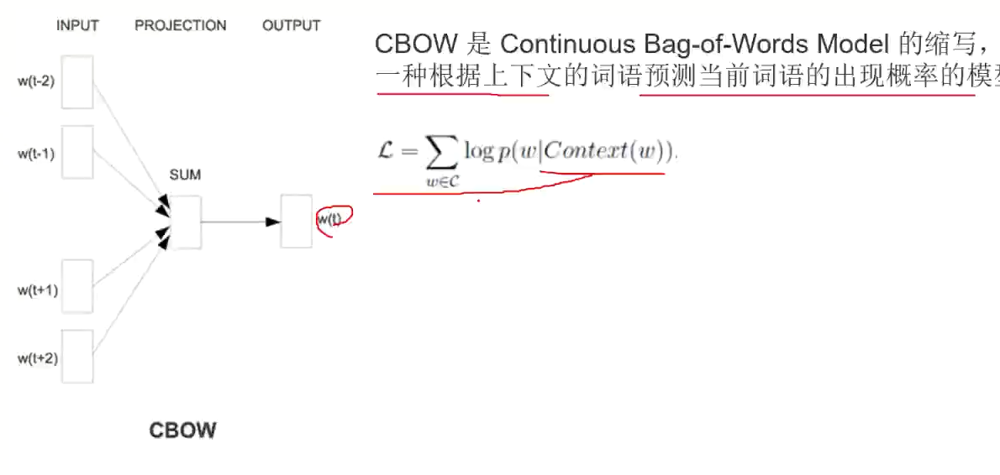

根据哈夫曼树，权值大小，将语料库中词语进行分类

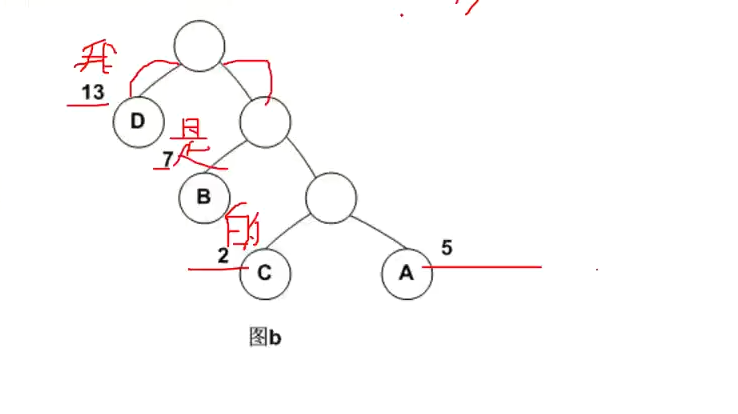

那如何选择左右呢？ 使用逻辑回归

$h_\theta(x)=g(\theta^Tx)={1 \over 1+e^{-\theta^Tx}}$

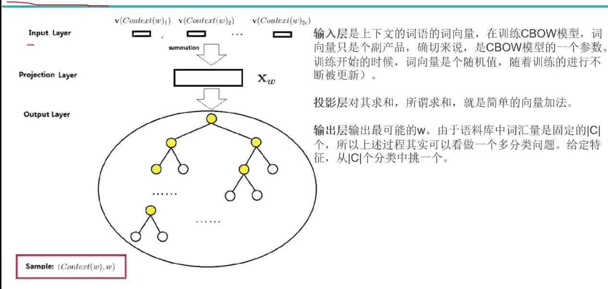

一些含义

1. $P^w$从根节点触发到达w对应叶子节点的路径
2. $l^w$路径中包含结点的个数
3. $P_1^w,P_2^w,P_3^w,...$路径$P^w$中的各个结点
4. $d_2^w,d_3^w,d_4^w,.....\in\lbrace0,1\rbrace$词w的编码，$d_j^w$表示路径$p^w$第j个节点对应的编码（根节点没有编码）
5. $\theta_1^w,\theta_2^w,\theta_3^w,.....\in R^m$路径$p^w$中非叶子节点对应的参数向量

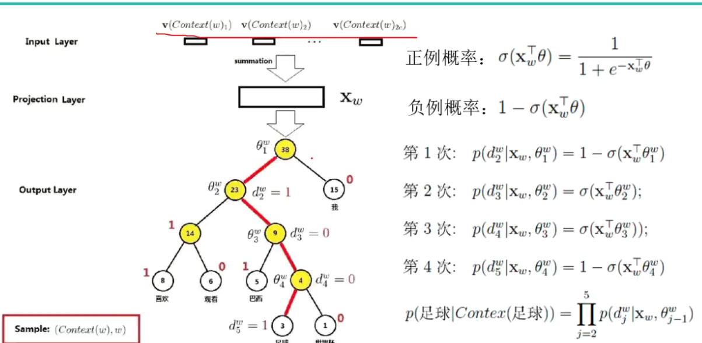

左走为负，右走为正

#### 求解

目标函数

$\zeta = \sum_{w\in C}logP(w|Context(w))$

$P(w|Context(w))$的含义上下文前提下，w值的概率，也就是该概率越大越好

$P(d_j^w|X_w,\theta_{j-1}^w)=[\sigma(X^T_w\theta_{j-1}^w)]^{1-d_j^w}*[1-\sigma(X^T_w\theta_{j-1}^w)]^{d_j^w}$左走$d_j^w=1$此时只有后半式子有意义，右走同理

改入

$\zeta = \sum_{w\in C}log\prod_{j=2}^{l^w}[\sigma(X^T_w\theta_{j-1}^w)]^{1-d_j^w}*[1-\sigma(X^T_w\theta_{j-1}^w)]^{d_j^w}$

$= \sum_{w\in C}\sum_{j=2}^{l^w}\lbrace (1-d_j^w)log[\sigma(X^T_w\theta_{j-1}^w)]+d_j^wlog[1-\sigma(X^T_w\theta_{j-1}^w)]$

要找最大值，就是梯度问题

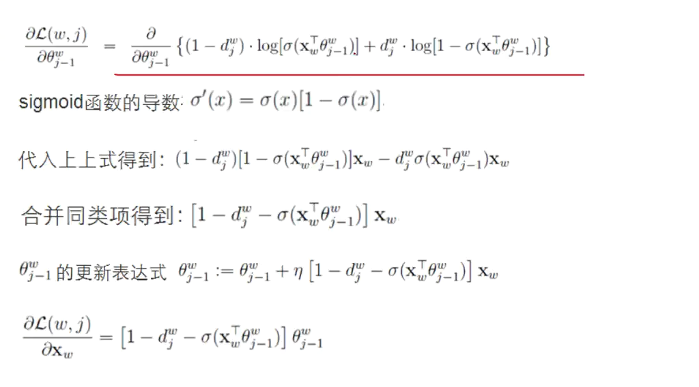

注意：$X_w$是上下文向量之和，不是上下文单个词的词向量，那如何把这个更新应用到单个词的词向量上呢？word2vec采用的是直接将$X_w$的更新量整个应用到每一个单词的词向量上去

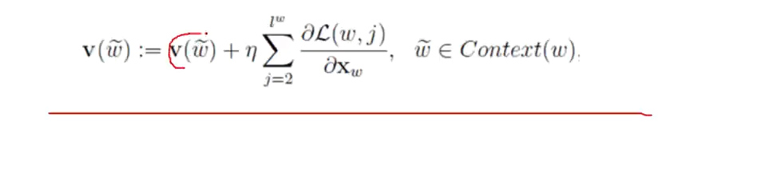

## 5. 负采样模型

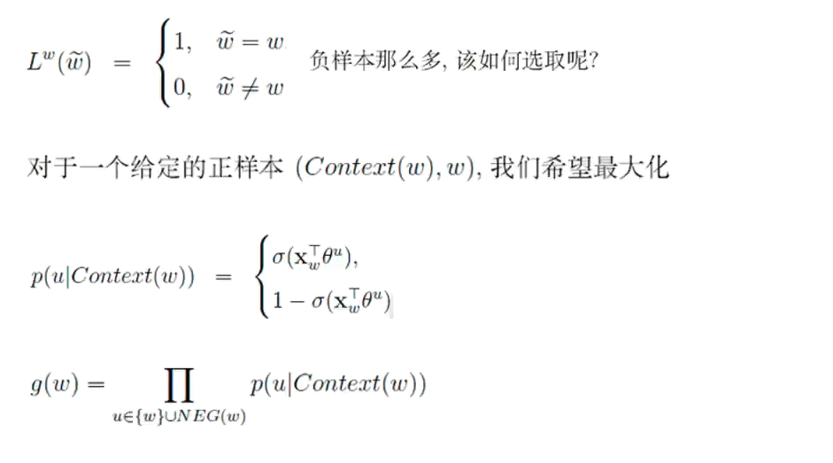

任何采样算法都应该保证频次越高的样本越容易被采样出来，基本的思路是对于长度为1的线段，根据词语的词频将其公平的分配给每个单词

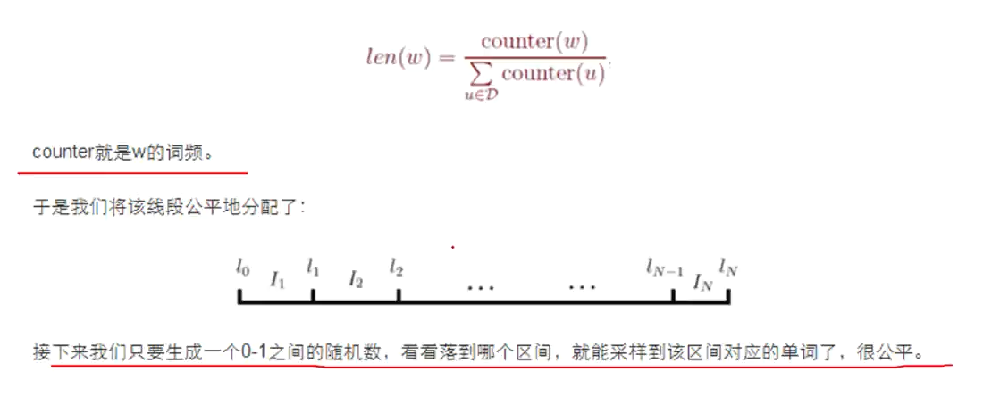

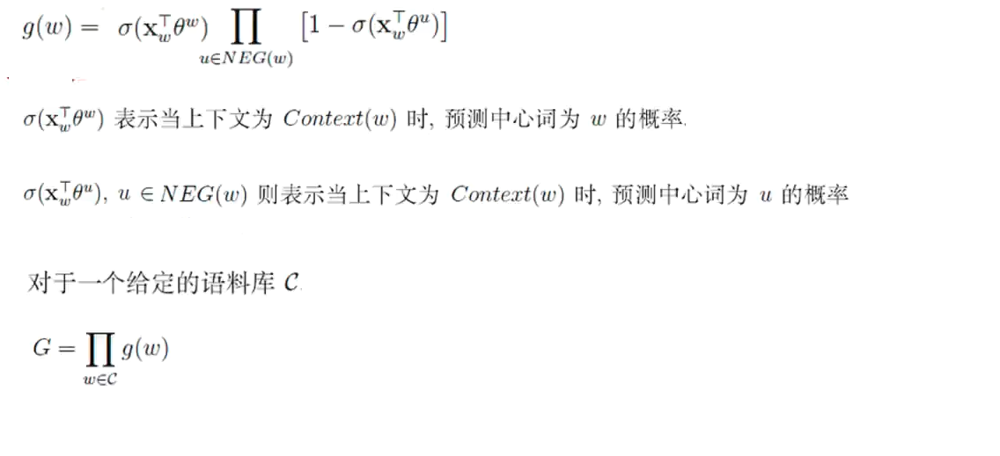

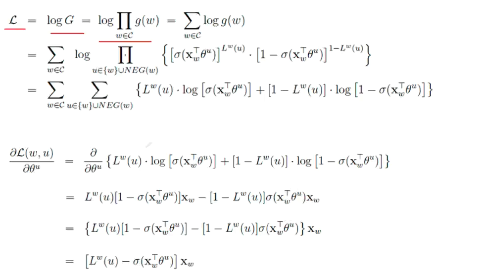

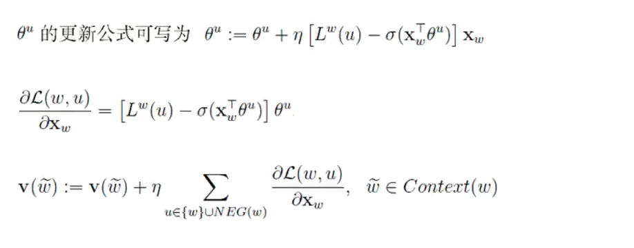
