# 全连接层

$out = relu(X@W+b)$

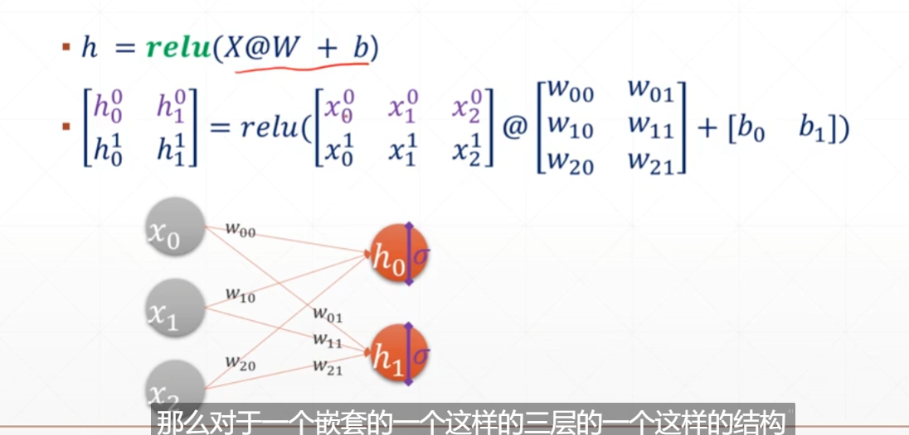

$h0 = relu(X@W_1+b)$

$h1 = relu(h0@W_1+b)$

$out = relu(h1@W_1+b)$

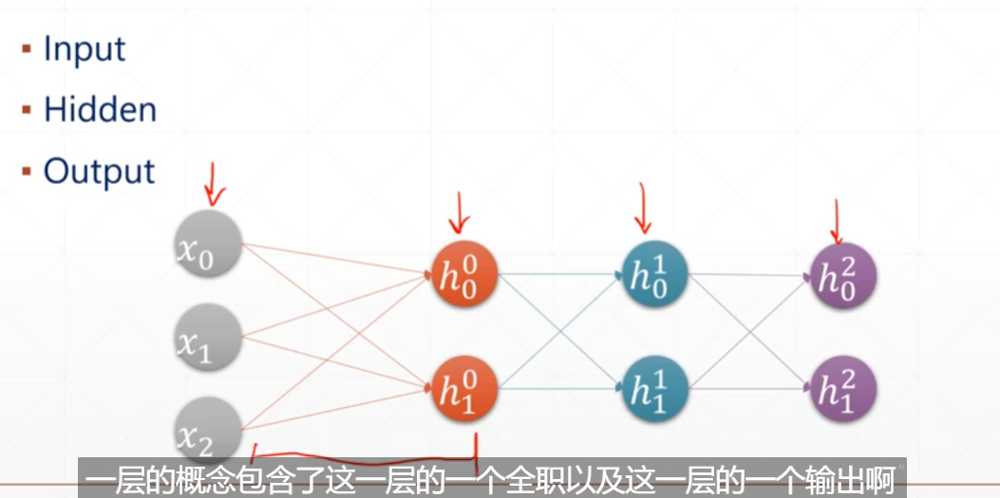

## 1. 创建全连接层

```python
x = tf.random.normal([4,784])

net = tf.keras.layers.Dense(512)
#只需要指定输出的维度，输入时的维度会自动计算！！！
out = net(x)
out.shape#TensorShape([4, 512])
net.kernel.shape,net.bias.shape
#(TensorShape([784, 512]), TensorShape([512]))
```

注意：第一次声明的时候是没有创建w，b，可以使用`net.build(input_shape = (None,4))`创建

```python
net = tf.keras.layers.Dense(10)
net.get_weights()#[]
net.build(input_shape=(None,4))
net.kernel.shape,net.bias.shape
#(TensorShape([4, 10]), TensorShape([10]))
```

可以build多次，但是一般都是创建一次，所以当我们没有创建的时候使用时会自动build

## 2. 创建多层

创建一个sequential容器，包含多个layer

`keras.Sequential([layer1,layer2,layer3])`

```python
x = tf.random.normal([2,3])

model = keras.Sequential([
    keras.layers.Dense(2,activation='relu'),
    keras.layers.Dense(2,activation='relu'),
    keras.layers.Dense(2),
])
model.build(input_shape=[None,3])#创建参数
model.summary()#查看网络结构

#手动查看
for p in model.trainable_variables:
    print(p.name,p.shape)
```

## 3. 输出方式

- [0,1]
- $R^d$
- [-1,1]

### 3.1 实数范围

$out = relu(X@W+b)$如果需要的话使用激活函数

### 3.2 [0,1]

- y>0.5 ; -> 1 
- y < 0.5 ; ->0

经常使用sigmod函数将数据拟合到[0,1]之间

### 3.3 $y_i \in [0,1],\sum y_i=1$

使用softmax函数

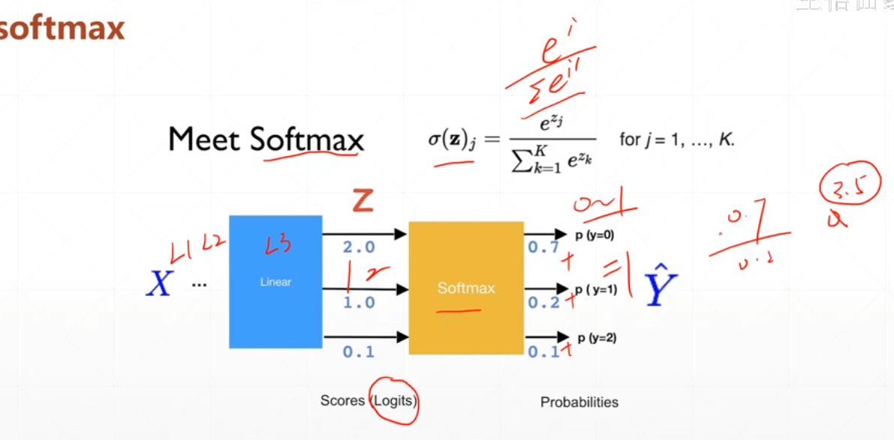

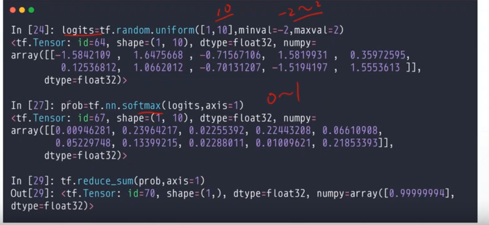

### 3.4 [-1,1]

- tanh函数`tf.tanh(a)`

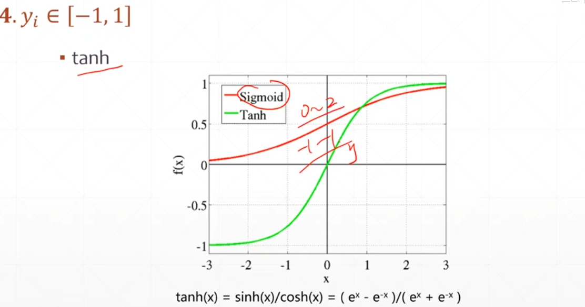

## 4. 损失函数的计算

- $loss = {1 \over N}\sum(y-out)^2$
- $L{2-norm}\sqrt{\sum(y-out)^2}$

```python
y = tf.constant([1,2,3,0,2])
y = tf.one_hot(y,depth=4)
y = tf.cast(y,tf.float32)

out = tf.random.normal([5,4])

loss1 = tf.reduce_mean(tf.square(y-out))
loss2 = tf.square(tf.norm(y-out))/20
loss3 = tf.reduce_mean(tf.losses.MSE(y,out))
loss1,loss2,loss3
'''
(<tf.Tensor: shape=(), dtype=float32, numpy=1.6195879>,
 <tf.Tensor: shape=(), dtype=float32, numpy=1.6195879>,
 <tf.Tensor: shape=(), dtype=float32, numpy=1.6195879>)
'''
```

#### 熵

$entropy = -\sum_iP(i)logP(i)$

```py
a = tf.fill([4],0.25)
a*tf.math.log(a)/tf.math.log(2.)
-tf.reduce_sum(a*tf.math.log(a)/tf.math.log(2.))#2.0
```

熵越大越稳定

```python
a = tf.constant([0.1,0.1,0.1,0.7])
a*tf.math.log(a)/tf.math.log(2.)
-tf.reduce_sum(a*tf.math.log(a)/tf.math.log(2.))#numpy=1.3567796
```

**交叉熵**

$H(p,q)=-\sum p(x)logq(x) = H(p)+D_{KL}(p|q)$

当p=q时得到最小值H(p)=0所以使用交叉熵作为损失函数是合理的

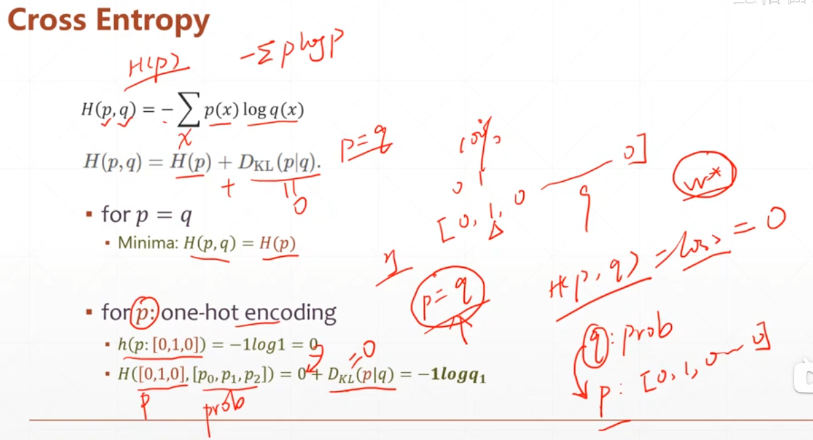

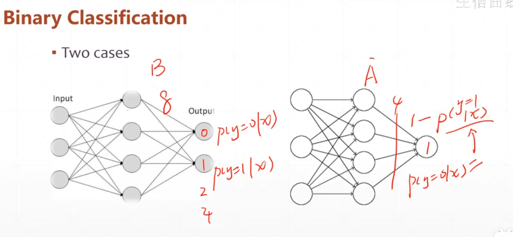

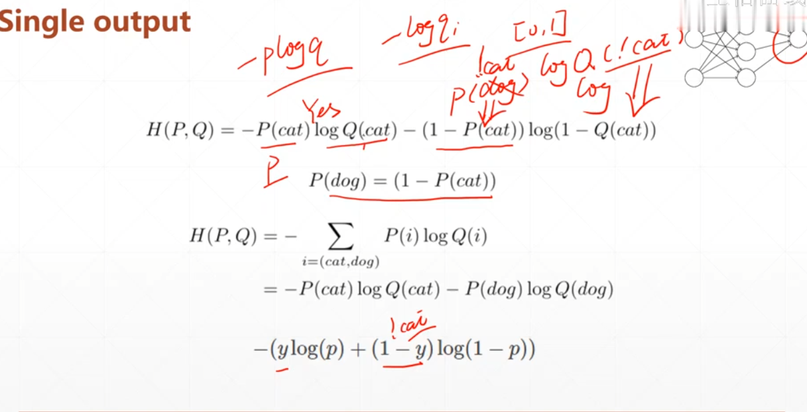

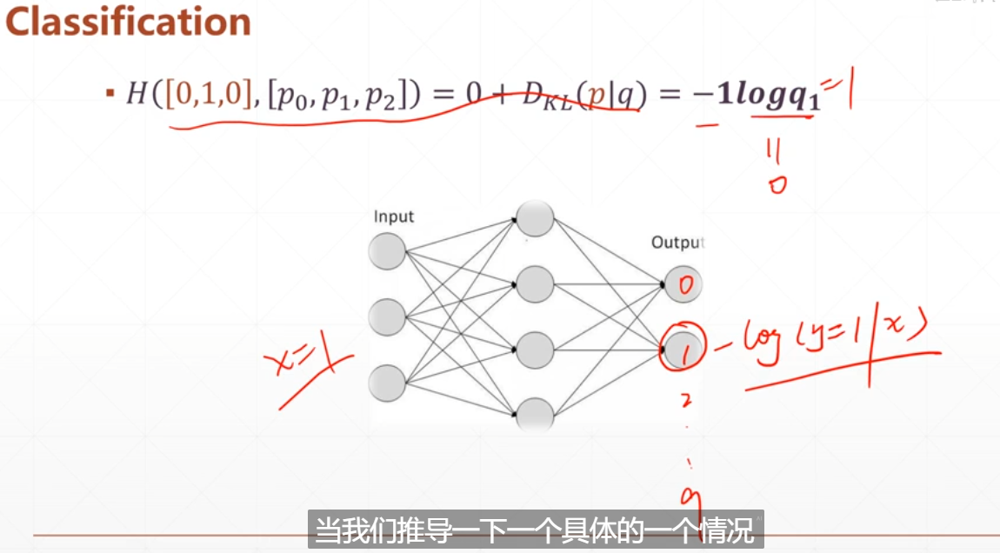

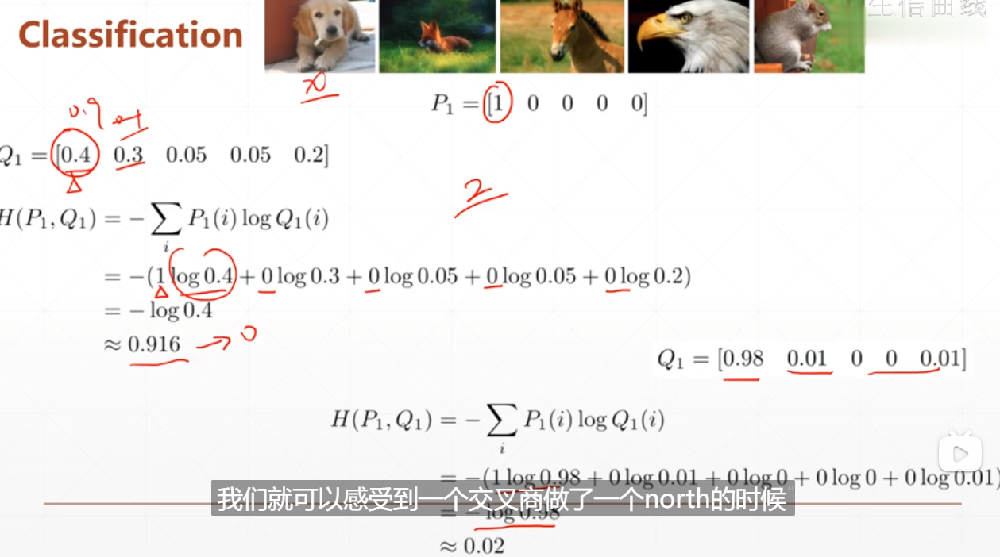

使用交叉熵

```python
tf.losses.categorical_crossentropy([0,1,0,0],[0.25,0.25,0.25,0.25])
#<tf.Tensor: shape=(), dtype=float32, numpy=1.3862944>
tf.losses.categorical_crossentropy([0,1,0,0],[0.1,0.8,0.1,0.1])
#<tf.Tensor: shape=(), dtype=float32, numpy=0.3184537>\
#类的形式
tf.losses.BinaryCrossentropy()([1],[0.1])
#<tf.Tensor: shape=(), dtype=float32, numpy=2.3025842>
```

> sigmod+mse: gradient vanish
>
> crossentropy：梯度稍微好点
>
> 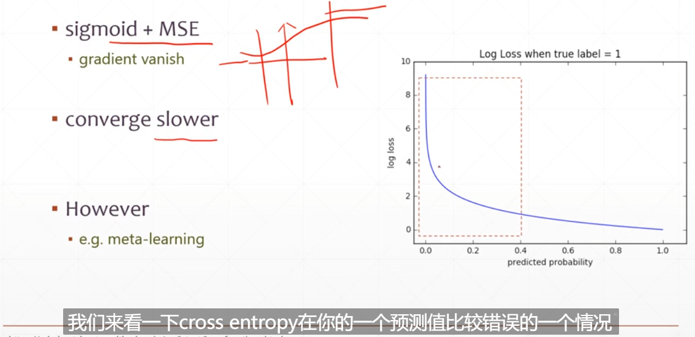

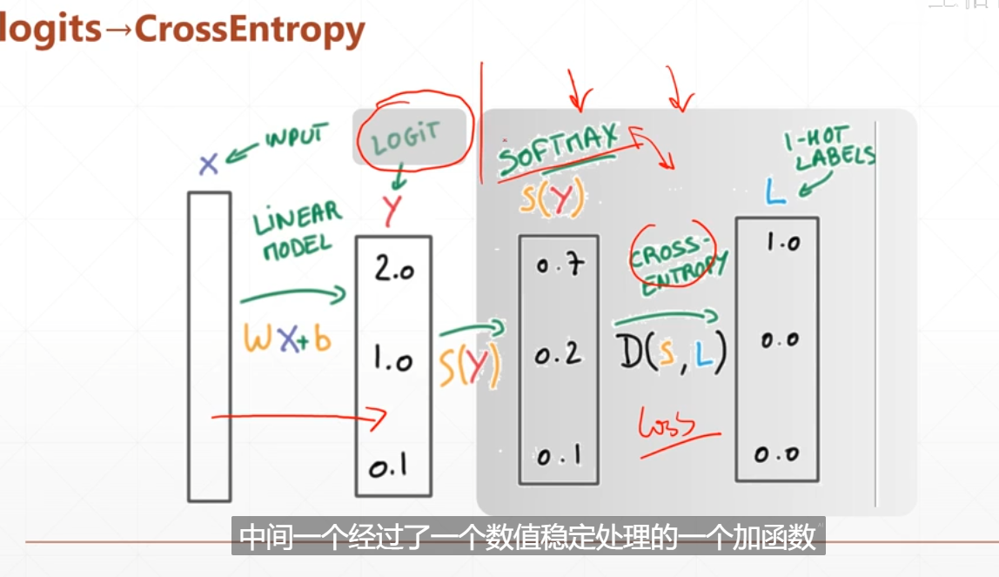

因为经过softmax之后再进行crossentropy可能出现数值不稳定的情况，因此我们需要加一个函数

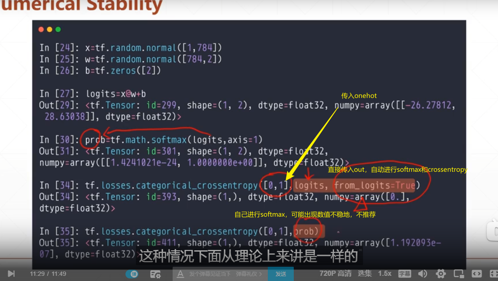