# 梯度下降

如何自动求解梯度

- `with tf.gradientTape() as tape:`
- `[w_grad]=tape.gradient(loss,[w])`
- 注意需要求解梯度的值需要时variable

```python
w = tf.constant(1.)
x = tf.constant(2.)
y = x*w
with tf.GradientTape() as tape:
    tape.watch([w])
    y2=x*w
grad1 = tape.gradient(y,[w])#[None]
grad1

with tf.GradientTape() as tape:
    tape.watch([w])
    y2=x*w
grad1 = tape.gradient(y2,[w])#[<tf.Tensor: shape=(), dtype=float32, numpy=2.0>]
grad1
```

这样梯度只能计算一次

**求二阶导**

```python
import tensorflow as tf

w = tf.Variable(1.0)
b = tf.Variable(2.0)
x = tf.Variable(3.0)

with tf.GradientTape() as t1:
    with tf.GradientTape() as t2:
        y = x*w+b
    dy_dw,dy_db = t2.gradient(y,[w,b])
d2y_fw2 = t1.gradient(dy_dw,w)

print(dy_dw,dy_db,d2y_fw2)
#tf.Tensor(3.0, shape=(), dtype=float32) tf.Tensor(1.0, shape=(), dtype=float32) None

```

## 1. 激活函数的梯度

### 1.1 激活函数

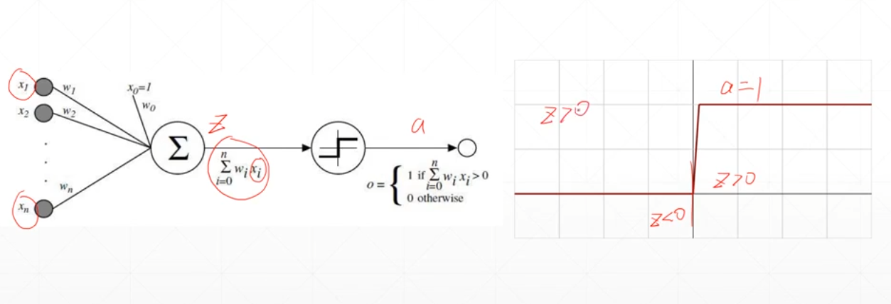

不可导，不能使用梯度下降

**Logistic**---sigmod

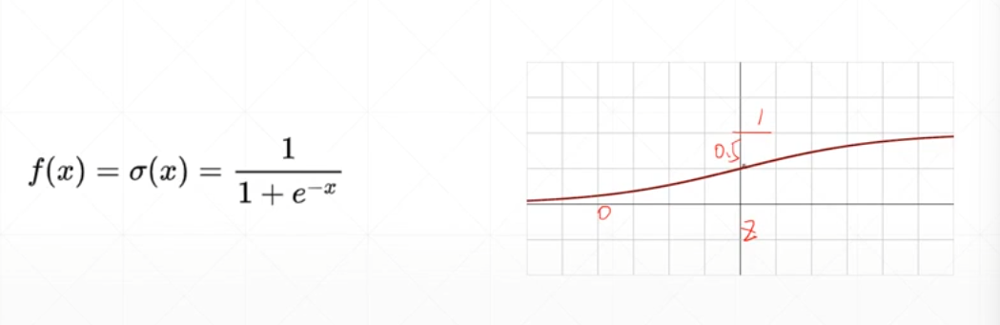

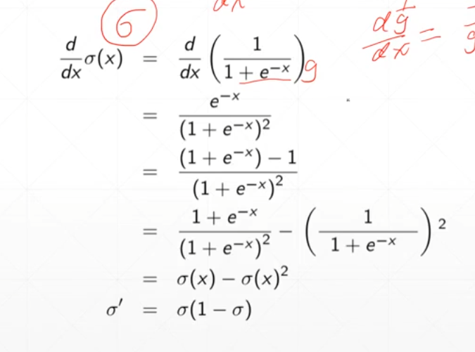

可能会出现梯度消失

```python
a = tf.linspace(-10,10,10)
with tf.GradientTape() as tape:
    #对于tf.constant类型的变量，也可以使用tape.watch加入自动求导记录里
    tape.watch(a)
    y = tf.sigmoid(a)
grads = tape.gradient(y,[a])
grads
'''
[<tf.Tensor: shape=(10,), dtype=float64, numpy=
 array([4.53958077e-05, 4.18591319e-04, 3.83620191e-03, 3.32587242e-02,
        1.86326443e-01, 1.86326443e-01, 3.32587242e-02, 3.83620191e-03,
        4.18591319e-04, 4.53958077e-05])>]
'''
```

### 1.2 tanh

$$
f(x) = tanh(x)={(e^x-e^{-x})\over(e^x+e^{-x}) }=2sigmod(2x)-1
$$

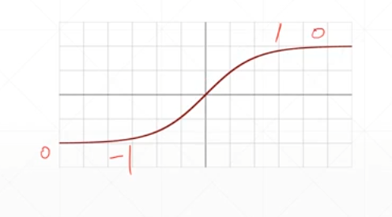

[-1,1]

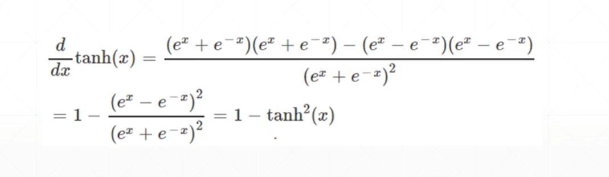

### 1.3 Relu

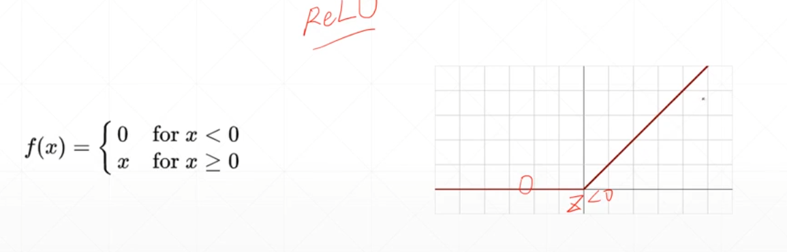

`tf.nn.relu(x)`

`tf.nn.leaky_relu(x)`

## 2. 损失函数及其梯度

- MSE：$\sum(y-y_i)^2$
- 交叉熵

**MSE**

$loss = \sum[y-(xw+b)]^2$

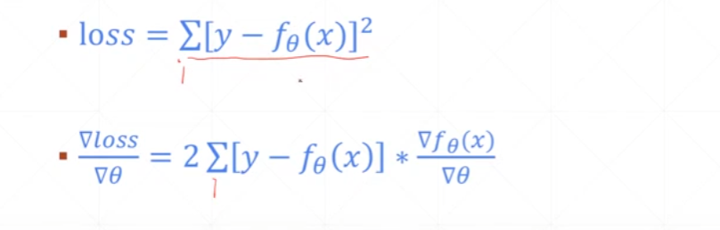

```python
x= tf.random.normal([2,4])
w=tf.random.normal([4,3])
b = tf.zeros([3])
y = tf.constant([2,0])

with tf.GradientTape() as tape:
    tape.watch([w,b])
    prob = tf.nn.softmax(x@w+b,axis=1)
    loss = tf.reduce_mean(tf.losses.MSE(tf.one_hot(y,depth=3),prob))
    
grads = tape.gradient(loss,[w,b])
grads[0]
```

**softmax**

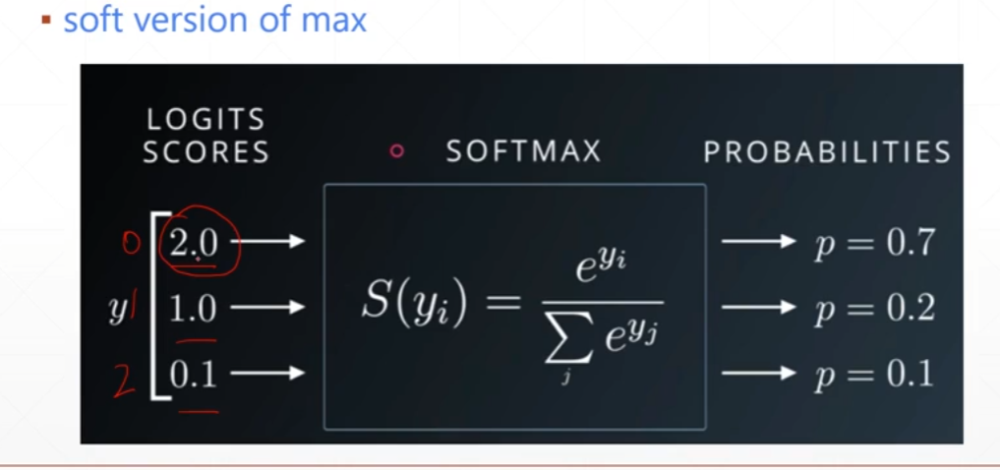

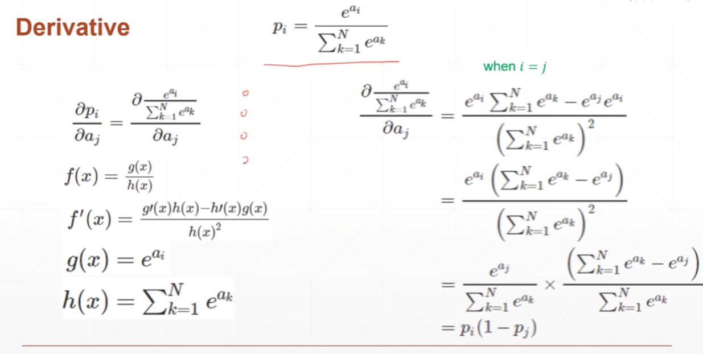

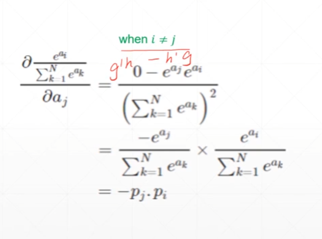

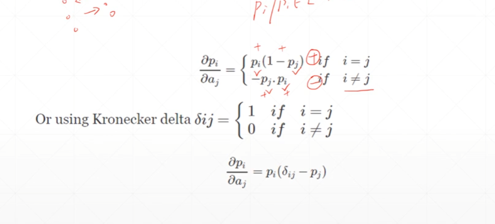

```python
x= tf.random.normal([2,4])
w=tf.random.normal([4,3])
b = tf.zeros([3])
y = tf.constant([2,0])

with tf.GradientTape() as tape:
    tape.watch([w,b])
    logits = x@w+b
    loss =  tf.reduce_mean(tf.losses.categorical_crossentropy(tf.one_hot(y,depth=3),logits,from_logits=True))
    
grads = tape.gradient(loss,[w,b])
grads[0]
```

> https://blog.csdn.net/qq_40661327/article/details/107034575

## 3. 单层感知机梯度下降

模型

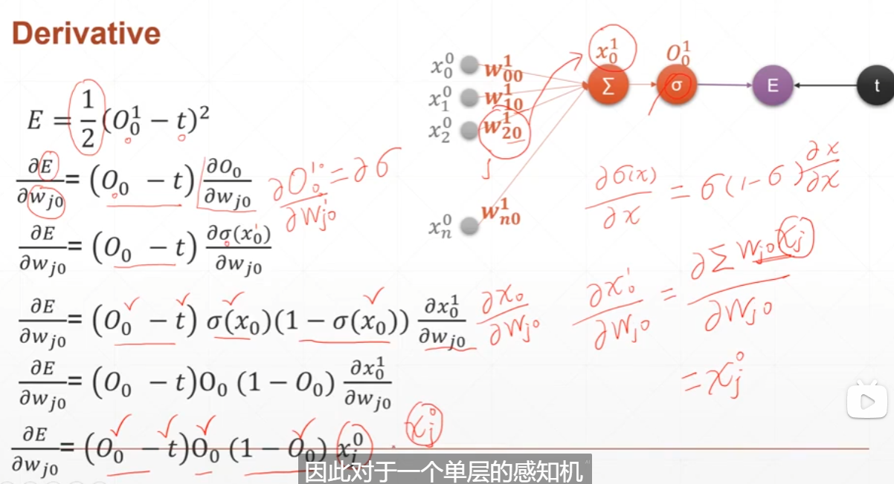

```python
x = tf.random.normal([1,3])
w = tf.ones([3,1])
b = tf.ones([1])
y = tf.constant([1])

with tf.GradientTape() as tape:
    tape.watch([w,b])
    prob = tf.sigmoid(x@w+b)
    loss = tf.reduce_mean(tf.losses.MSE(y,prob))
    
grads = tape.gradient(loss,[w,b])
grads[0]
```

## 4. 多输出感知机的梯度下降

模型样式

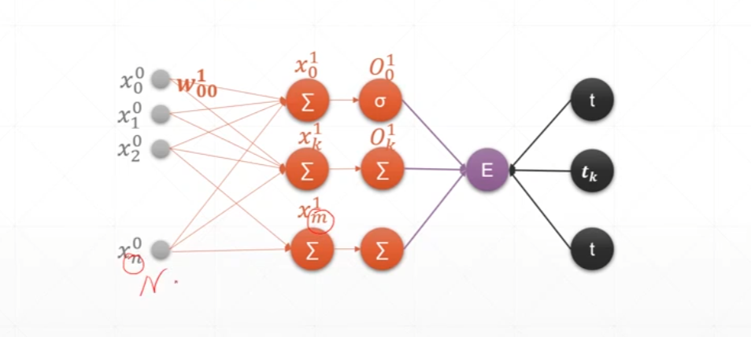

求导过程

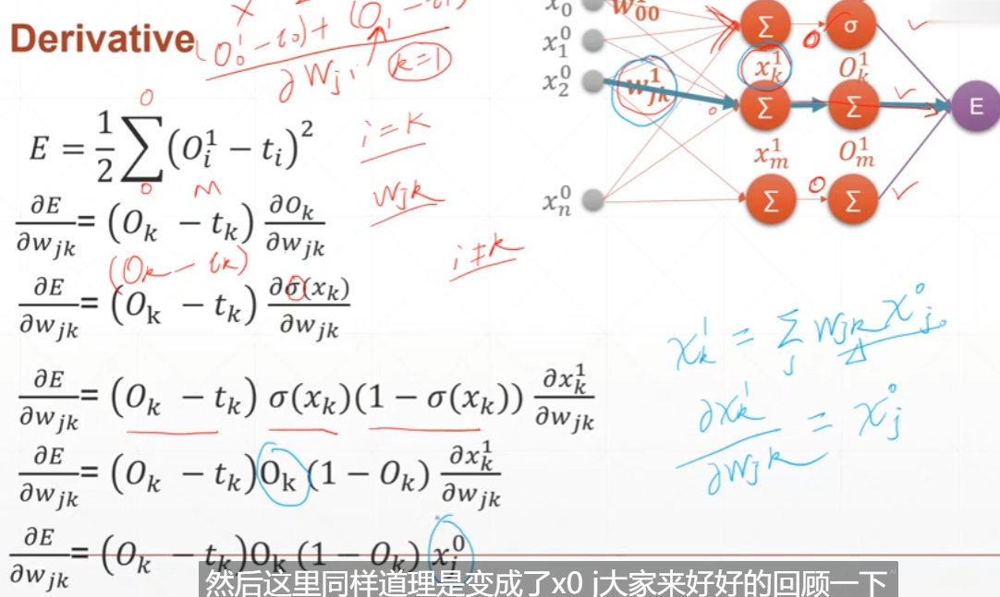

可以看出$O_k^1$对$w_{jk}^1$的梯度只与$O_k^1,x_j^0$有关，和其他无关，和单层相比只有$O$改变了

```python
x = tf.random.normal([2,4])
w = tf.random.normal([4,3])
b = tf.random.normal([3])
y = tf.constant([2,0])


with tf.GradientTape() as tape:
    tape.watch([w,b])
    prob = tf.nn.softmax(x@w+b,axis=1)
    loss  = tf.reduce_mean(tf.losses.MSE(tf.one_hot(y,depth=3),prob))
    
grads =tape.gradient(loss,[w,b])
grads[0],grads[1]
```

## 5. 链式求导

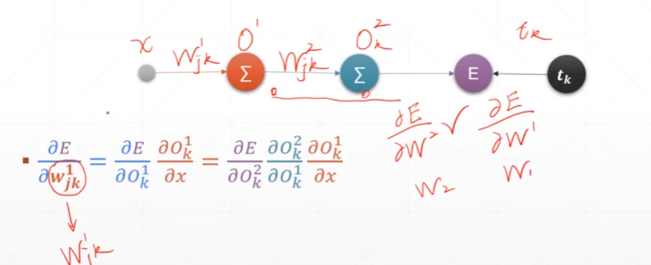

```python
x = tf.constant(1.)
w1 = tf.constant(2.)
b1 = tf.constant(1.)
w2 = tf.constant(2.)
b2 = tf.constant(1.)

#多次求导需要有persistent=True
with tf.GradientTape(persistent=True) as tape:
    tape.watch([w1,b1,w2,b2])
    y1 = x*w1+b1
    y2 = y1*w2+b2
    
dy2_dy1 = tape.gradient(y2,[y1])[0]
dy1_dw1 = tape.gradient(y1,[w1])[0]
dy2_dw1 = tape.gradient(y2,[w1])[0]


dy2_dy1,dy1_dw1,dy2_dw1
'''
(<tf.Tensor: shape=(), dtype=float32, numpy=2.0>,
 <tf.Tensor: shape=(), dtype=float32, numpy=1.0>,
 <tf.Tensor: shape=(), dtype=float32, numpy=2.0>)
'''
```

