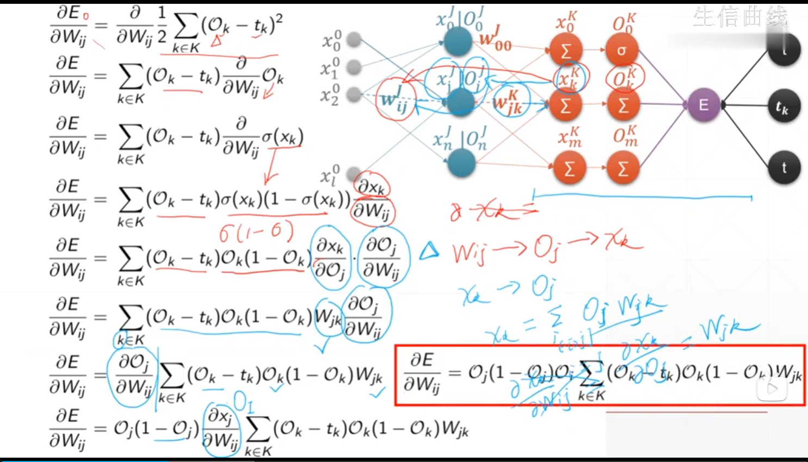
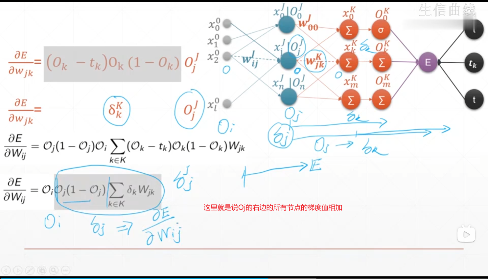
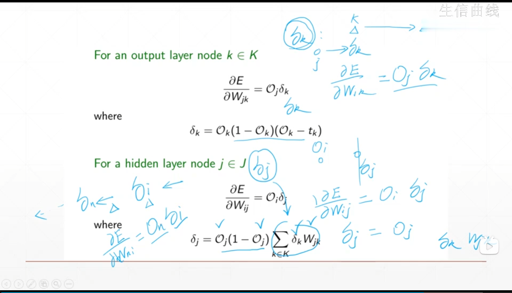
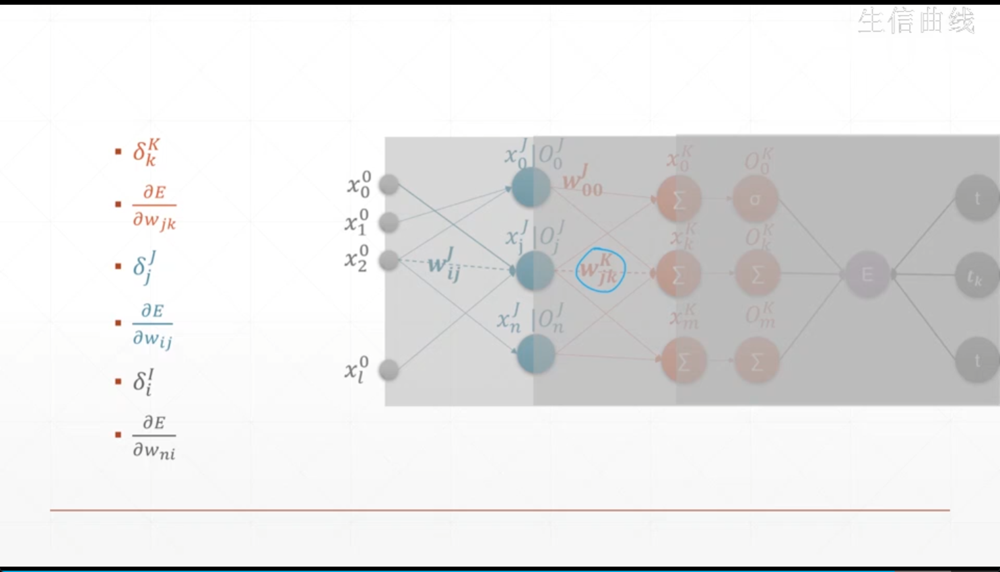
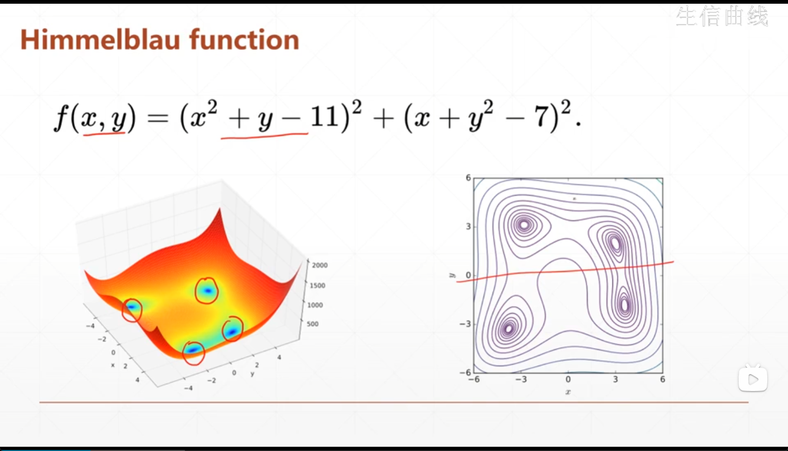

# 反向传播

多层感知机中链式求导

https://www.bilibili.com/video/BV1bv4y1P7nm?p=68









## 1. 函数优化



```python
def himmelbau(x):
    return (x[0]**2+x[1]-11)**2+(x[0]+x[1]**2-7)**2

x = np.arange(-6,6,0.1)
y = np.arange(-6,6,0.1)
X,Y = np.meshgrid(x,y)
Z = himmelbau([X,Y])

flg = plt.figure('himmelblau')
ax = flg.gca(projection='3d')
ax.plot_surface(X,Y,Z)
ax.view_init(60,-30)
ax.set_xlabel('x')
ax.set_ylabel('y')
plt.show()

x = tf.constant([-4,0.])
for step in range(1000):
    with tf.GradientTape() as tape:
        tape.watch([x])
        y = himmelbau(x)
    grads = tape.gradient(y,[x])[0]
    x -= 0.01*grads
    
    if step%20 == 0:
        print(f'step : {step}: x = {x.numpy()}  f(x)={y.numpy()}')
```

