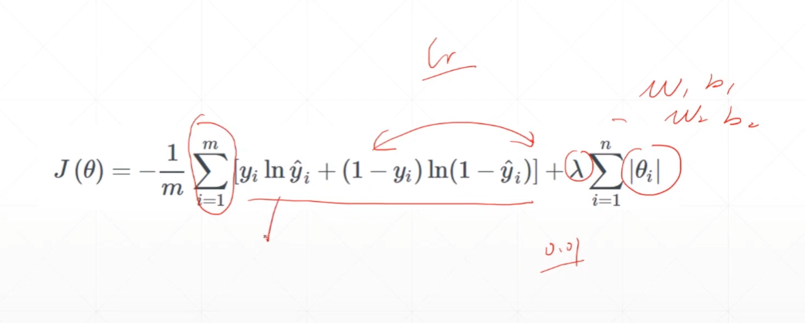
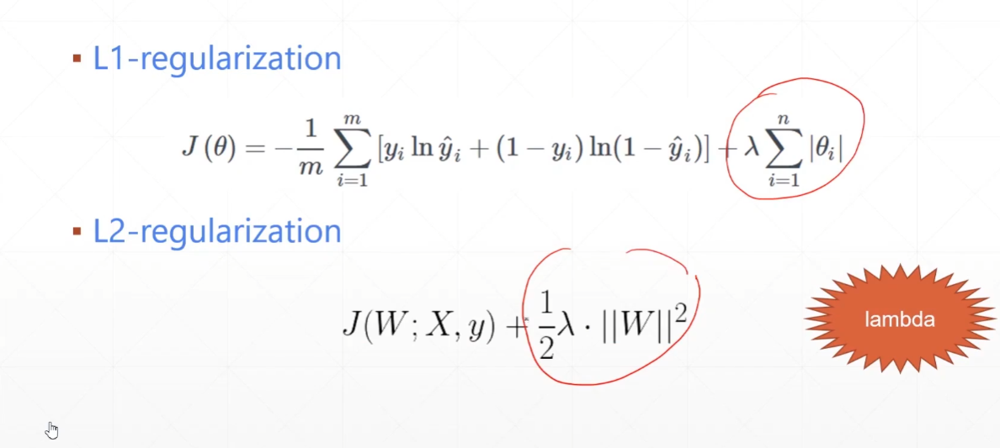
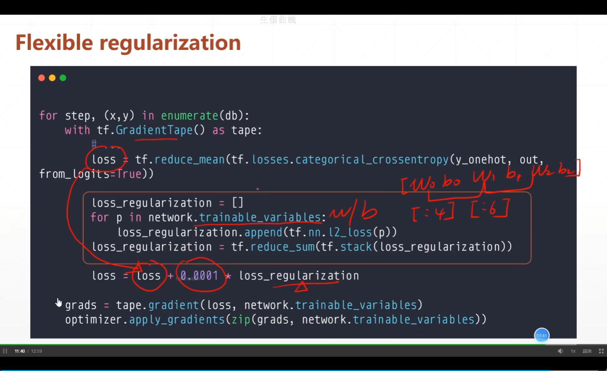
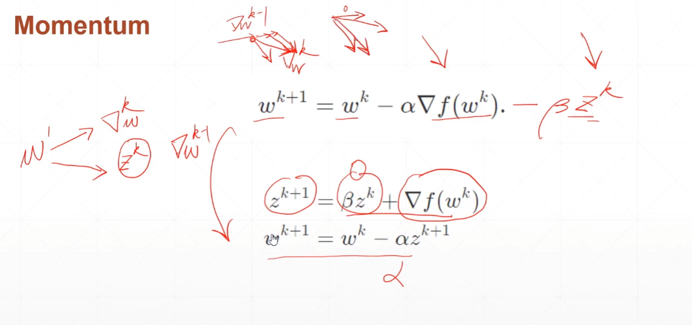
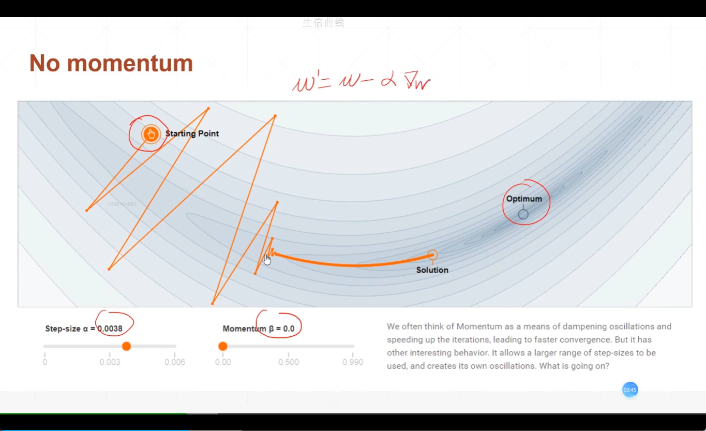
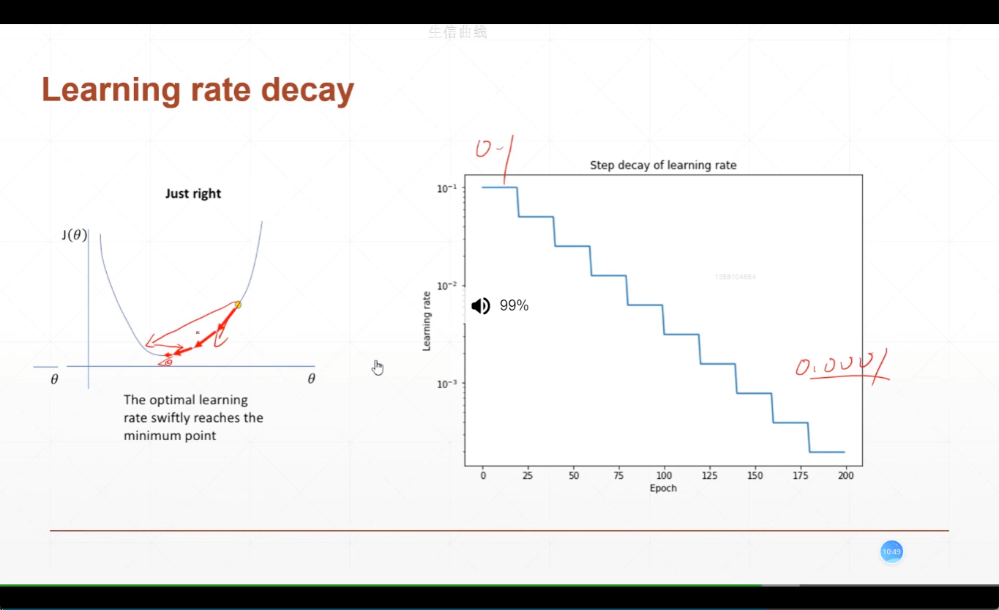
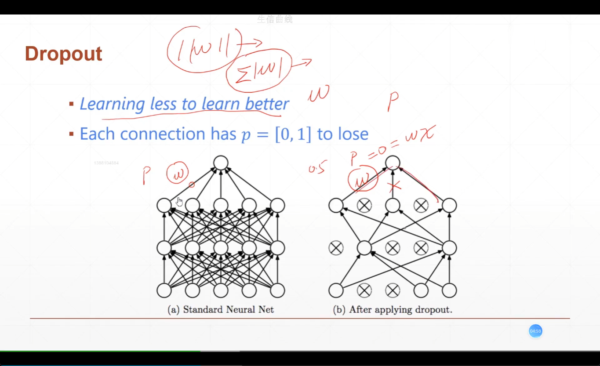
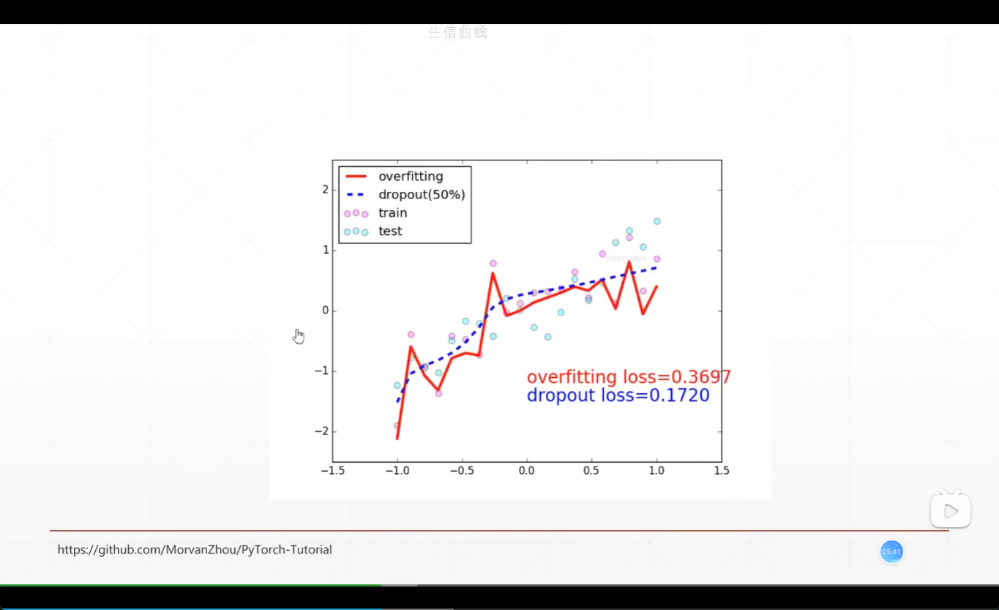
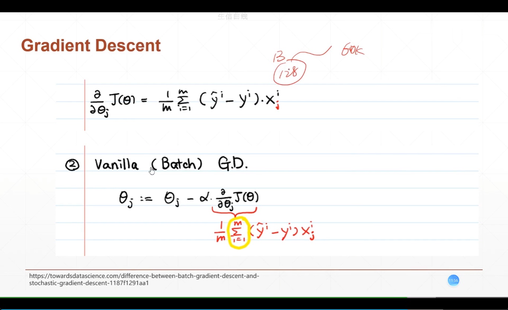
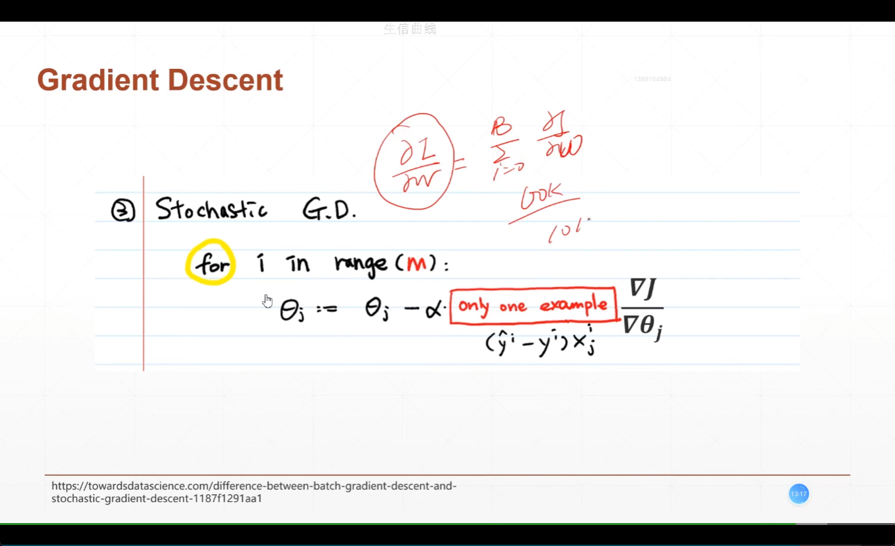

# 过拟合和欠拟合

## 1. 交叉验证

**train和test**

```python
(x, y), (x_test, y_test) = keras.datasets.cifar10.load_data()
train_db = tf.data.Dataset.from_tensor_slices((x, y))
train_db = train_db.map(preprocess).shuffle(10000).batch(batch_size)
test_db = tf.data.Dataset.from_tensor_slices((x_val, y_val))
test_db = test_db.map(preprocess).batch(batch_size)
```

**train,val,test**

```python
(x, y), (x_test, y_test) = keras.datasets.cifar10.load_data()
x_train,x_val = tf.split(x,num_or_size_splits=[50000,10000])
y_train,y_val = tf.split(x,num_or_size_splits=[50000,10000])
```

**数据集的使用**

```python
network.compile(optimizers.Adam(lr=0.001),loss=tf.lossed.CategoricalCrossentropy(from_logits=True),metrics=['accuracy'])

#validation_freq每两次进行一次评测
network.fit(db_train,epochs=5,validation_data=db_val,validation_freq=2)
network.evaluate(db_test)
```

**如何进行交叉验证**

每次打乱具体序号，然后进行划分就可以让每次训练的集合不同

```python
def preprocess(x, y):
    """
    x is a simple image, not a batch
    """
    x = tf.cast(x, dtype=tf.float32) / 255.
    x = tf.reshape(x, [28*28])
    y = tf.cast(y, dtype=tf.int32)
    y = tf.one_hot(y, depth=10)
    return x,y

for epoch in range(500):
    idx = tf.range(60000)
    idx = tf.random.shuffle(idx)
    x_train,y_train = tf.gather(x,idx[:50000]),tf.gather(y,idx[:50000])
    x_val,y_val = tf.gather(x,idx[-10000:]),tf.gather(y,idx[-10000:])
    
    db_train = tf.data.Dataset.from_tensor_slices((x_train,y_train))
    db_train = db_train.map(preprocess).shuffle(50000).batch(128)
    
    db_val = tf.data.Dataset.from_tensor_slices((x_val,y_val))
    db_val = db_val.map(preprocess).shuffle(10000).batch(128)
```

**简化过程**

```python
network.fit(db_train_val,epochs=6,validation_split=0.1,validation_freq=2)
```

## 2. regularization

- more data
- constraint model complexity
  - shallow
  - regularization
- dropout
- data argumentation
- early stopping



使范数接近与0



如何增加正则化

```python
model = keras.Model.Sequential([
    keras.layers.Dense(16,kernel_regilarizer=keras.regularizers.L2(0.001)
    ,activation=tf.nn.relu,input_shape=(NUM_WORDS,)),
    keras.layers.Dense(16,kernel_regilarizer=keras.regularizers.L2(0.001)
    ,activation=tf.nn.relu),
    keras.layers.Dense(1,activation=tf.nn.sigmoid),
    
])
```



## 3. 动量和学习率






**使用动量**

```python
optimizer = tf.keras.optimizers.SGD(learning_rate = 0.02,momentum=0.9)
optimizer = tf.keras.optimizers.Adam(learning_rate = 0.02,beta_1=0.9,beta_2=0.999)

```

### 动量优化器

https://www.bilibili.com/video/BV1B7411L7Qt?p=14

待优化函数w，损失函数loass，学习率lr

1. 计算相关的梯度:$g_t={\sigma loss \over \sigma (w_t)}$
2. 计算t时刻异界动量$m_t$和二阶动量$V_t$
3. 计算t时刻下下降的梯度$\eta_t=lr*m_t/\sqrt{V_t}$
4. 计算t+1时刻的参数$w_t+1=w_t-\eta_t = w_t-lr*m_t/\sqrt{V_t}$

一阶动量：与梯度相关的函数

二阶动量：与蹄冻平方相关的函数


**常用的优化器**

**1. SGD**

$m_t=g_t$  $V_t=1$

$\eta_t = lr*g_t$

$w_{t+1}=w_t-\eta_t=w_t-lr*g_t$

**2.SGDM**

$m_t = \beta*m_{t-1}+(1-\beta)*g_t$   $V_t=1$

$\eta_t = lr*(\beta*m_{t-1}+(1-\beta)*g_t)$

$\beta$在0.9周围

```python
m_w,m_b = 0,0
beta = 0.9

m_w = beta*m_w+(1-beta)*grads[0]
m_b = beta*m_b+(1-beta)*grads[1]
w1.assgin_sub(lr*m_w)
b1.assgin_sub(lr*m_b)
```

**3.Adagrad**

$m_t=g_t$   $V_t=\sum_{\alpha=1}^tg_\alpha^t$

$\eta_t = lr*g_t/(\sqrt{\sum_{\alpha=1}^tg_\alpha^t})$

```python
m_w,m_b = 0,0


v_w += tf.square(grads[0])
v_b += tf.square(grads[1])
w1.assgin_sub(lr*grads[0]/tf.sqrt(v_w))
b1.assgin_sub(lr*grads[1]/tf.sqrt(v_b))
```

**3.RMSProp**

$m_t=g_t$   $V_t=\beta*V_{t-1}+(1-\beta)*g_t^2$

$\eta_t = lr*g_t/(\sqrt{\beta*V_{t-1}+(1-\beta)*g_t^2})$

```python
v_w,v_b = 0,0


v_w += beta*v_w+(1-beta)*tf.square(grads[0])
v_b += beta*v_b+(1-beta)*tf.square(grads[1])
w1.assgin_sub(lr*grads[0]/tf.sqrt(v_w))
b1.assgin_sub(lr*grads[1]/tf.sqrt(v_b))
```

**4.Adam**

$m_t=\beta_1*m_{t-1}+(1-\beta_1)*g_t$

$V_t=\beta_2*V_{t-1}+(1-\beta_2)*g_t^2$

在计算梯度的时候使用偏差

$\eta_t = lr*\hat{m_t}/\sqrt{\hat{V_t}}=lr*{m_t \over 1-\beta_1^t}/\sqrt{{V_t \over 1-\beta_2^t} }$

```python
m_w,m_b = 0,0
v_w,v_b = 0,0

beta1,beta2=0.9,0.999
m_w = beta1*m_w+(1-beta1)*grads[0]
m_b = beta1*m_b+(1-beta1)*grads[1]
v_w = beta2*v_w+(1-beta2)*tf.square(grads[0])
v_b = beta2*v_b+(1-beta2)*tf.square(grads[1])

m_w_col = m_w/(1-tf.pow(beta1,int(global_step)))
m_b_col = m_b/(1-tf.pow(beta1,int(global_step)))
v_w_col = v_w/(1-tf.pow(beta2,int(global_step)))
v_b_col = v_b/(1-tf.pow(beta2,int(global_step)))

w1.assgin_sub(lr*m_w_col/tf.sqrt(v_w_col))
b1.assgin_sub(lr*m_b_col/tf.sqrt(v_b_col))
```

### 自适应的学习率



```python
optimizer = SGD(learning_rate = 0.2)
for epoch in range(100):
    optimizer.learning_rate = 0.2*(100-expoch)/100
```

## 4. early stopping，drop out

**early stopping**

- 如何设置参数
- 监控那些数值
- 如何在最高点停止

**drop out**

将某些神经元的w置为0





**添加dropout**

```python
model = Sequential([
    layers.Dense(256,activation=tf.nn.relu),# 784->256
    layers.Dropout(0.5),
    layers.Dense(128,activation=tf.nn.relu),
    layers.Dropout(0.5),
    layers.Dense(64,activation=tf.nn.relu),
    layers.Dense(32,activation=tf.nn.relu),
    layers.Dense(10),
])
```

> 注意，我们在使用train和val的时候需要区分是否做梯度
>
> ```python
> # train
> for step,(x,y) in enumerate(db):
>     with tf.gradientTape() as tape:
>         x = tf.reshape(x,(-1,28*28))
>         out = network(x,training=True)
> #test
> out = network(x,training = False)
> ```

## 5. 不同的梯度下降

- stochastic gradient  随机的
- Deterministic




