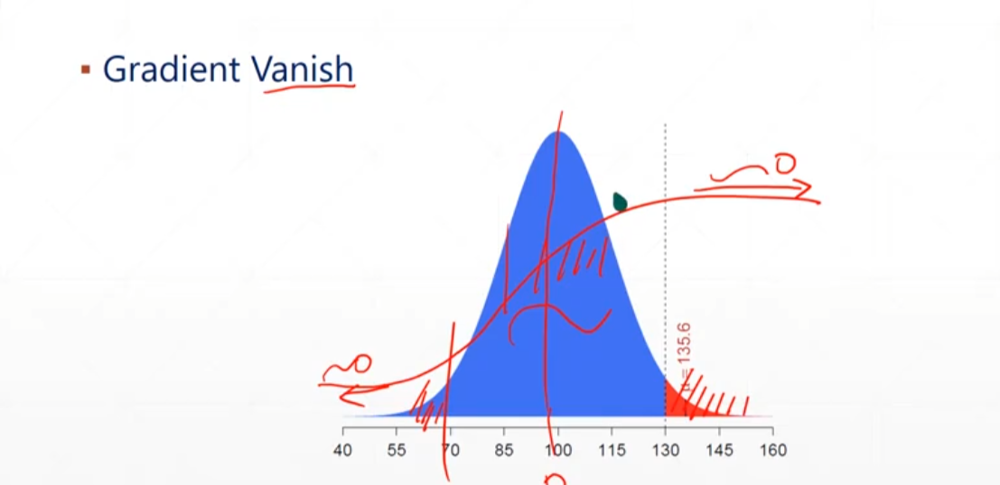
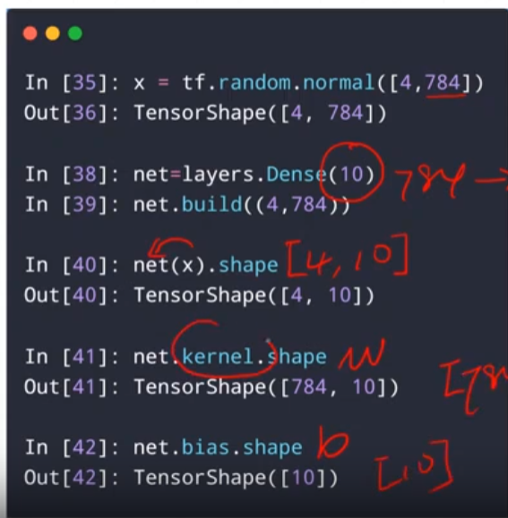
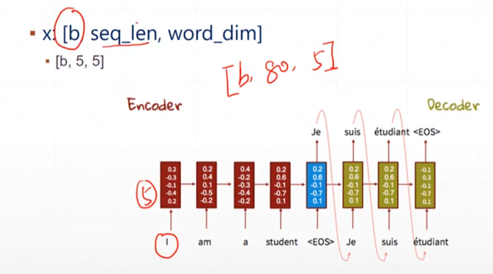
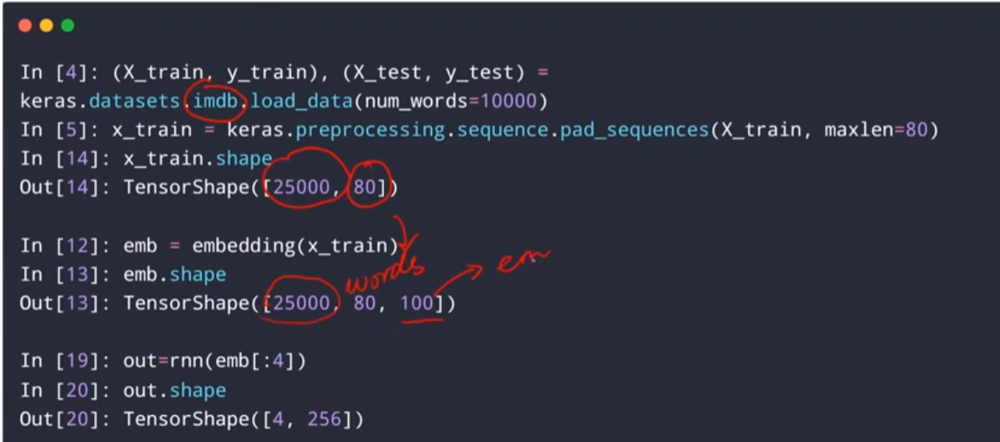
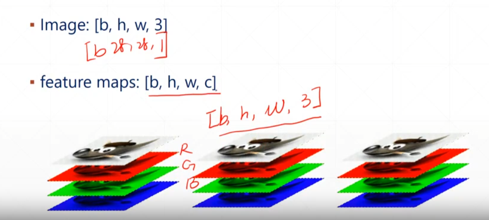
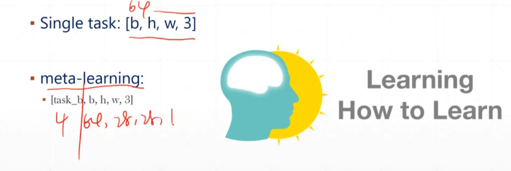

# Tensor

## 1. 创建

### 1.1 from numpy list

```python
import numpy as np
tf.convert_to_tensor(np.ones([2,3]))
#常用32的float和int
tf.convert_to_tensor([1,2])
#如果list中有int有float则转化为float
tf.convert_to_tensor([[1],[2]])
```

### 1.2 zeros,ones

传入一个shape不是数据

```python
tf.zeros([2,2])
tf.ones([3,3])
tf.ones([3,3,3])
```

**`zeros_like`**根据a矩阵shape相同的零矩阵

```python
tf.zeros_like(a)
```

### 1.3 Fill

填充任意值

```python
tf.fill([2,2],10)
'''
<tf.Tensor: shape=(2, 2), dtype=int32, numpy=
array([[10, 10],
       [10, 10]])>
'''
```

### 1.4 随机

**Normal**正态分布

```python
tf.random.normal([2,2],mean=1,stddev=1)
```

```python
#截断的正态分布
tf.random.truncated_normal([2,2],mean=0,stddev=1)
```



用来防止梯度消失

**Uniform**均匀分布

```python
tf.random.uniform([2,2],minval=0,maxval=1,dtype=tf.float32)
```

**随机打散**random Permutation

```python
idx = tf.range(10)
idx = tf.random.shuffle(idx)
idx#<tf.Tensor: shape=(10,), dtype=int32, numpy=array([8, 1, 4, 7, 0, 5, 9, 2, 6, 3])>
```

可以通过idx打散对应的样本如

```python
a = tf.random.normal([10,784])
b = tf.random.uniform([10],maxval=10,dtype=tf.float32)
print(b)
a = tf.gather(a,idx)
b = tf.gather(b,idx)
```

**constant**

类似convert_to_tensor

### 1.5 典型应用

- []标量

loss=mse(out,y)

accuracy

```python
out = tf.random.uniform([4,10])
y = tf.range(4)
y = tf.one_hot(y,depth=10)
'''
<tf.Tensor: shape=(4, 10), dtype=float32, numpy=
array([[1., 0., 0., 0., 0., 0., 0., 0., 0., 0.],
       [0., 1., 0., 0., 0., 0., 0., 0., 0., 0.],
       [0., 0., 1., 0., 0., 0., 0., 0., 0., 0.],
       [0., 0., 0., 1., 0., 0., 0., 0., 0., 0.]], dtype=float32)>
'''
loss = tf.keras.losses.mse(y,out)
loss#<tf.Tensor: shape=(4,), dtype=float32, numpy=array([0.23495364, 0.447443  , 0.32503885, 0.35922748], dtype=float32)>
loss =tf.reduce_mean(loss)
loss#<tf.Tensor: shape=(), dtype=float32, numpy=0.37056983>
#此时loss就是一个标量
```

- bias 向量

常见于Dense

`Dense` implements the operation: `output = activation(dot(input, kernel) + bias)` where `activation` is the element-wise activation function passed as the `activation` argument, `kernel` is a weights matrix

- Matrix 矩阵

input，weight



- Dim=3 三维

常用于句子向量





- Dim=4 4维

图片处理



image:[b,h,w,c] 

b为图片数量

- Dim=5 

meta-learning



## 2. 索引和切片

### 2.1 索引

- 基本方式：`a[0][0]`

```python
a = tf.ones([1,5,5,3])
a[0][0]
'''
<tf.Tensor: shape=(5, 3), dtype=float32, numpy=
array([[1., 1., 1.],
       [1., 1., 1.],
       [1., 1., 1.],
       [1., 1., 1.],
       [1., 1., 1.]], dtype=float32)>
'''
```

- numpy形式的index

```python
a = tf.random.normal([4,28,28,3])
'''
<tf.Tensor: shape=(4, 28, 28, 3), dtype=float32, numpy=
array([[[[ 1.849714  ,  1.2284323 ,  0.04485306],
         [ 2.2956514 ,  0.35943857,  0.2519111 ],
         [-0.01835384,  0.1643579 ,  0.10622463],
         ...,
         [-0.17835918,  1.3018773 , -0.01605045],
         [-0.71268964, -1.101328  ,  1.2618864 ],
         [ 0.8970053 , -2.046566  , -0.20253046]],

        [[ 0.21397819, -0.64789057, -0.09976543],
         [-1.4061688 ,  1.0436709 ,  0.67597896],
         [-1.3508385 ,  1.2387083 , -0.06840702],
         ...,
         [ 0.40120867,  2.0144656 , -1.7617717 ],
         [ 1.2061435 ,  0.11540242,  1.1239012 ],
         [-0.15004885, -0.0349007 ,  0.05212576]],
'''
a[1].shape#TensorShape([28, 28, 3])
a[1].shape
a[1,2]#以照片为例，就是第一张照片的第三行
```

### 2.2 切片

`a[x:y]`左包右不报，类似于python原生

有时候处理图片时，提取单通道的图片：

```python
a[:,:,:,0]
```

**step**

a[::step]类似python原生

step=-1时就是倒序

**`...`**

等于多个:

```python
a[1,...]
```

### 2.3 API

- `tf.gather`

根据索引收集数据

```python
data = tf.range(3000)
data = tf.reshape(data,[10,100,3])
#例子:data:[classes,students,subjects]
tf.gather(data,axis=0,indices=[4,0,1,3])#查看4,0,1,3班级的情况
data = tf.range(3000)
data = tf.reshape(data,[10,100,3])
#例子:data:[classes,students,subjects]
tf.gather(data,axis=1,indices=[9,16,30]).shape#TensorShape([10, 3, 3])
```

- `tf.gather_nd`

[class1_stduent1,class2_stduent2,class3_stduent3,class4_stduent4]

[4,8]

在多个维度指定index

```python
tf.gather_nd(data,[0])#0班的所有人的所有成绩
tf.gather_nd(data,[0,1])#0班的1号学生的所有成绩
a = tf.gather_nd(data,[[0,0,0],[0,0,1]])#<tf.Tensor: shape=(2,), dtype=int32, numpy=array([0, 1])>
```

