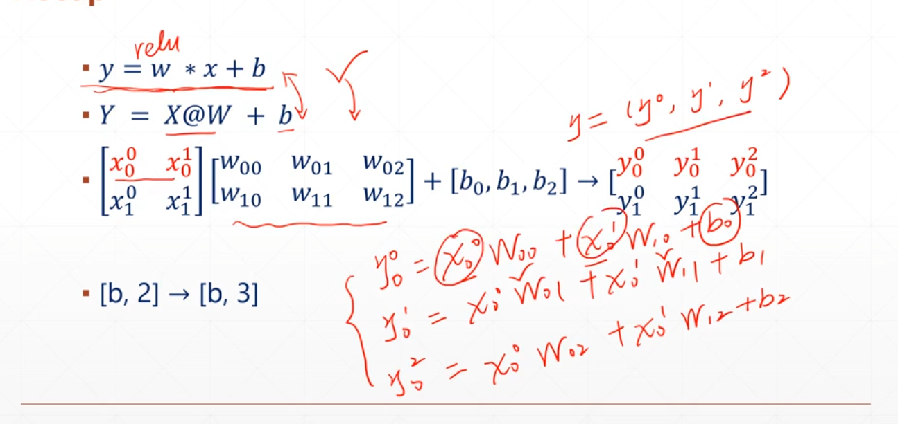

# Math

- `+-*/ // %`对应元素的计算
- 多次矩阵运算`@,matmul`

`[b,3,4]@[b,4,5]`多次进行`[3,4][4,5]`的矩阵运算

- 维度操作

`reduce_mean/max/min/sum`

- `tf.math.log(a)`,`tf.exp(a)`

对数和指数计算

- `tf.pow(a,3)`
- `tf.sqrt(b)`

```python
a = tf.ones([4,2,3])
b = tf.fill([4,3,5],2.)
(a@b).shape#TensorShape([4, 2, 5])
tf.matmul(a,b).shape#TensorShape([4, 2, 5])
```



```python
x = tf.ones([4,2])
w = tf.ones([2,1])
b = tf.constant(0.1)
out = x@w+b
'''
<tf.Tensor: shape=(4, 1), dtype=float32, numpy=
array([[2.1],
       [2.1],
       [2.1],
       [2.1]], dtype=float32)>
'''
out = tf.nn.relu(out)
out
```

