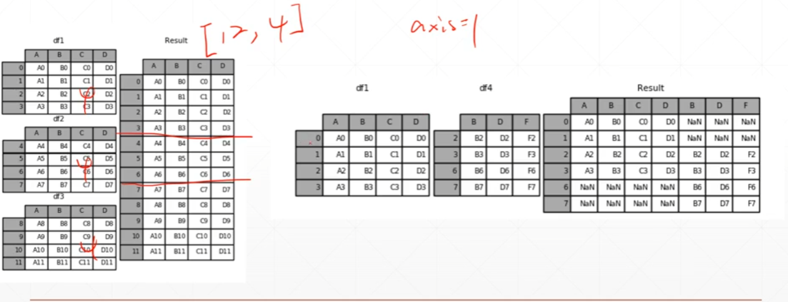
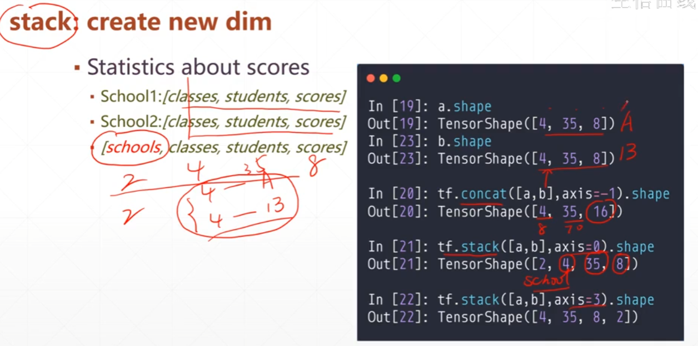

### concat--拼接

```py
a = tf.ones([4,35,8])
b = tf.ones([2,35,8])
c = tf.concat([a,b],axis=0)
c.shape#TensorShape([6, 35, 8])
```

 其他维度同理

注意：需要拼接的维度可以不同，但是其他的维度必须相同



### `stack`创建新的维度



stack：本身所有的维度必须相同

```python
a = tf.ones([4,35,8])
b = tf.ones([3,33,8])

tf.stack([a,b],axis=0)#err
```

### `unstack`切割数据

和stack相反的操作

```python
a = tf.ones([4,35,8])
b = tf.ones([4,35,8])

c = tf.stack([a,b],axis=0)
c.shape#TensorShape([2, 4, 35, 8])
aa,bb = tf.unstack(c,axis=0)
aa.shape,bb.shape#(TensorShape([4, 35, 8]), TensorShape([4, 35, 8]))
```

返回一个列表，数量的axis指定的维度

### `split`切割

按比例切割

```python
a = tf.ones([10,4,35,10])
res = tf.split(a,axis=0,num_or_size_splits=2)
len(res)#2
res = tf.split(a,axis=0,num_or_size_splits=[2,3,5])
res[0].shape,res[1].shape,res[2].shape
'''
(TensorShape([2, 4, 35, 10]),
 TensorShape([3, 4, 35, 10]),
 TensorShape([5, 4, 35, 10]))
'''
```

