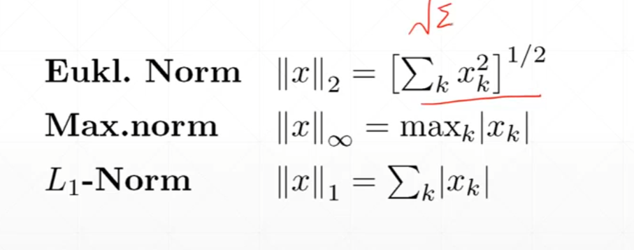
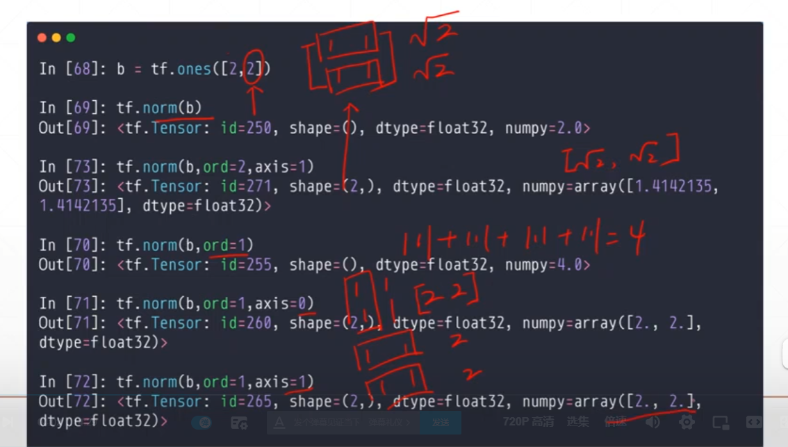

## 1. 数据统计



### norm

```python
a = tf.ones([2,2])
tf.norm(a)#<tf.Tensor: shape=(), dtype=float32, numpy=2.0>
```

指定范数，以及维度，默认范数为2



### 求min,max,mean

`reduce_min/max/mean`

### `argmax/argmin`

返回最大值对应位置

```python
a =tf.range(10)
a = tf.reshape(a,[2,5])
tf.argmax(a)#<tf.Tensor: shape=(5,), dtype=int64, numpy=array([1, 1, 1, 1, 1], dtype=int64)>
tf.argmax(a,axis=1)#<tf.Tensor: shape=(2,), dtype=int64, numpy=array([4, 4], dtype=int64)>
```

### `tf.equal`

```python
a = tf.constant([1,2,3,4,5])
b = tf.range(5)
tf.equal(a,b)
#<tf.Tensor: shape=(5,), dtype=bool, numpy=array([False, False, False, False, False])>
```

### `tf.unique`

返回不重复的索引和结果

```python
a = tf.constant([4,2,2,4,3])
tf.unique(a)
#Unique(y=<tf.Tensor: shape=(3,), dtype=int32, numpy=array([4, 2, 3])>, idx=<tf.Tensor: shape=(5,), dtype=int32, numpy=array([0, 1, 1, 0, 2])>)
```

## 2. 排序

- `sort/argsort`

`sort`直接排序，`argsort`返回排序后数值对应的序号

`direction: The direction in which to sort the values ('ASCENDING' or'DESCENDING').`

```python
a = tf.random.shuffle(tf.range(5))
tf.sort(a,direction='DESCENDING')#<tf.Tensor: shape=(5,), dtype=int32, numpy=array([4, 3, 2, 1, 0])>
#direction: The direction in which to sort the values ('ASCENDING' or'DESCENDING').
tf.argsort(a)#<tf.Tensor: shape=(5,), dtype=int32, numpy=array([0, 2, 3, 1, 4])>
```

- `Top_k`最大的前k个

```python
a = tf.constant([
    [4,6,8],
    [9,4,7],
    [4,5,1]
])
res = tf.math.top_k(a,2)
res.indices#返回索引
'''
<tf.Tensor: shape=(3, 2), dtype=int32, numpy=
array([[2, 1],
       [0, 2],
       [1, 0]])>
'''
res.values#返回值
'''
<tf.Tensor: shape=(3, 2), dtype=int32, numpy=
array([[8, 6],
       [9, 7],
       [5, 4]])>
'''
```

https://www.bilibili.com/video/BV1bv4y1P7nm?p=43

top_k的应用

