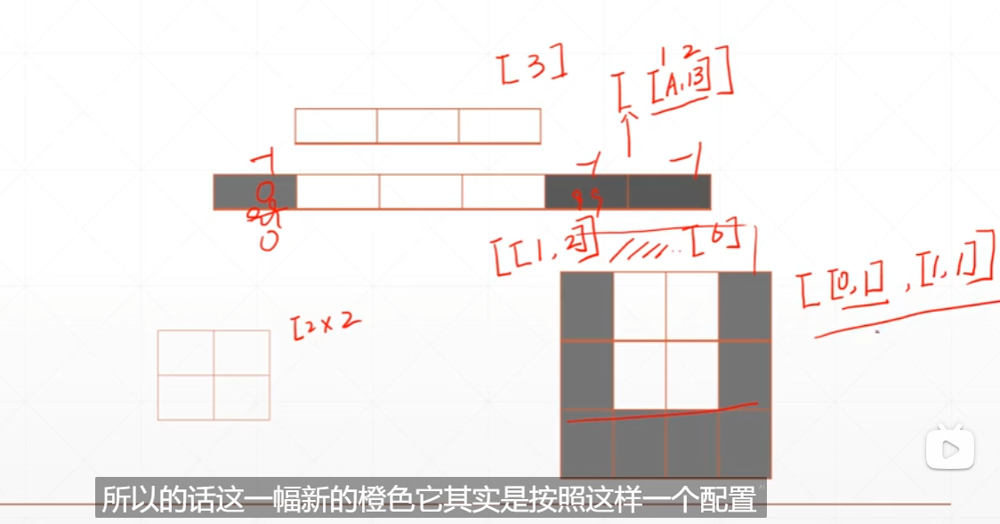
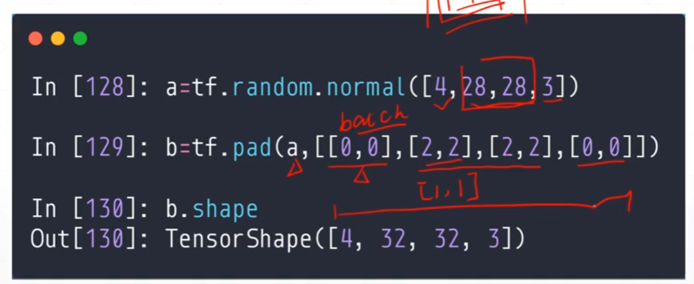

## 1. 数据的填充和复制

- `pad`



```python
a = tf.constant([
    [4,6,8],
    [9,4,7],
    [4,5,1]
])
tf.pad(a,[[0,0],[1,1]])
'''
<tf.Tensor: shape=(3, 5), dtype=int32, numpy=
array([[0, 4, 6, 8, 0],
       [0, 9, 4, 7, 0],
       [0, 4, 5, 1, 0]])>
'''
```

多维度同理

在神经网络中在外围添加0时



- `tile`

复制

- [a,b,c],2
- [a,b,c,a,b,c]

```py
a = tf.constant([
    [4,6,8],
    [9,4,7],
    [4,5,1]
])s
tf.tile(a,[1,2])#[1,2]1表示第一个维度复制的次数，2表示第二个维度复制1次
'''
<tf.Tensor: shape=(3, 6), dtype=int32, numpy=
array([[4, 6, 8, 4, 6, 8],
       [9, 4, 7, 9, 4, 7],
       [4, 5, 1, 4, 5, 1]])>
'''
```

